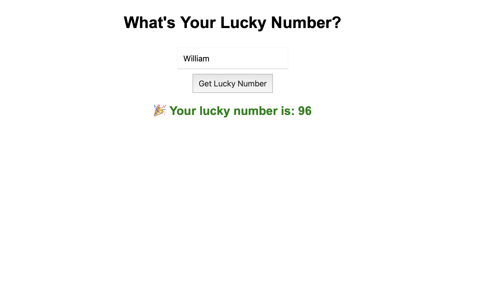
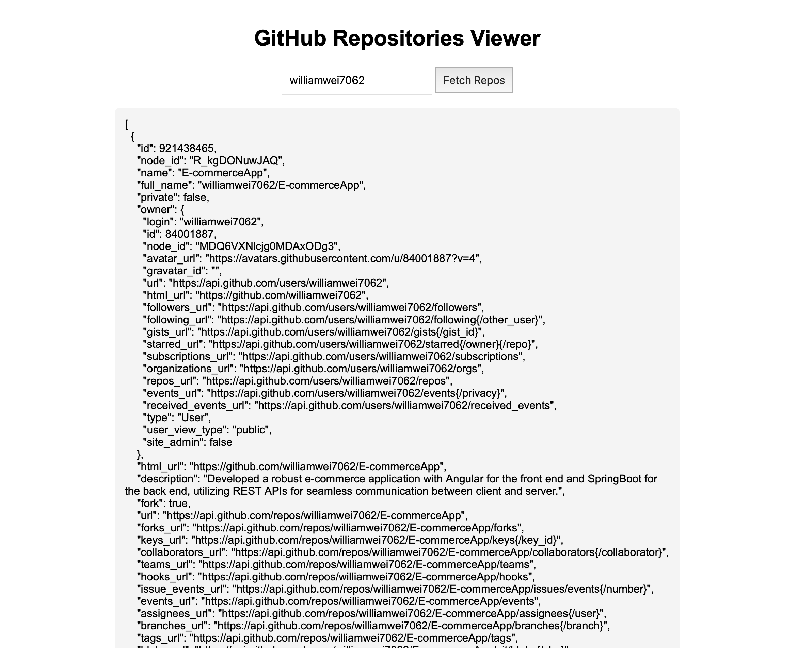

# Read and practice all sample codes from 71-Dom-Bom-JavaScript-Typescript-Node.md on your local browser or an online compiler.
✅
# Resolve 5 leetcode problems using Javascript.
- https://leetcode.com/problems/letter-combinations-of-a-phone-number/submissions/1626371831/
- https://leetcode.com/problems/k-closest-points-to-origin/submissions/1626375323/
- https://leetcode.com/problems/kth-largest-element-in-an-array/submissions/1626376076/
- https://leetcode.com/problems/kth-smallest-element-in-a-bst/submissions/1626379038/
- https://leetcode.com/problems/construct-binary-tree-from-preorder-and-inorder-traversal/submissions/1626380515/

# Compare `let` vs `var` , explain variable hosting with your own code examples.
| Feature              | `var`                                     | `let`                                                    |
|----------------------|--------------------------------------------|-----------------------------------------------------------|
| Scope                | Function-scoped                            | Block-scoped                                              |
| Hoisting             | Hoisted and initialized as `undefined`     | Hoisted but not initialized                              |
| Redeclaration        | Allowed in the same scope                  | Not allowed in the same scope                             |
| Temporal Dead Zone   | Not affected                               | Affected by TDZ (can’t use before declaration)            |

## What is Hoisting?
**Hoisting** means JavaScript moves declarations (not initializations) to the top of their scope during compilation. But how they’re initialized differs.

## Code Example: `var` (Hoisted & Initialized to undefined)
```javascript
console.log(a);  // undefined (not ReferenceError)
var a = 10;
```
- var a is hoisted to the top and initialized as undefined before the code runs.
- So the output is undefined, not an error.

## Code Example: `let` (Hoisted but in “Temporal Dead Zone”)
```javascript
console.log(b);  // ❌ ReferenceError: Cannot access 'b' before initialization
let b = 20;
```
- let b is hoisted, but not initialized, and it’s in the Temporal Dead Zone (TDZ) from the start of the block until the declaration line.
- Accessing it before declaration throws an error.

# Explain `closure` with code example
A **closure** is a function that remembers and has access to variables from its lexical scope, even when the function is executed outside that scope.

## Example of Closure:
```javascript
function outer() {
  let counter = 0;

  function inner() {
    counter++;
    console.log(counter);
  }

  return inner;
}

const myCounter = outer(); // outer() returns inner

myCounter(); // 1
myCounter(); // 2
myCounter(); // 3
```
- outer() defines a local variable counter and a function inner().
- inner() closes over counter, meaning it keeps a reference to it.
- Even though outer() has finished execution, inner() remembers counter and keeps updating it.
- This is possible because of the closure formed when inner() is returned.

# Explain `Callback Hell` with code example
**Callback Hell** (also known as the “Pyramid of Doom”) happens when multiple asynchronous operations are nested inside each other using callbacks, leading to:
- Deep indentation
- Hard-to-read and hard-to-maintain code
- Difficult error handling

## Example Code:
```javascript
doTask1(function(result1) {
  console.log(result1);
  doTask2(function(result2) {
    console.log(result2);
    doTask3(function(result3) {
      console.log(result3);
      doTask4(function(result4) {
        console.log(result4);
        // And so on...
      });
    });
  });
});
```
Each callback depends on the result of the previous one, creating deeply nested code.
- Hard to read
- Difficult to debug
- Tough to scale
- Error handling becomes messy

# Explain `Promise`, `Async`, `Await` with code examples.
## What is a Promise?
A **Promise** is an object representing the **eventual completion (or failure)** of an asynchronous operation.
```javascript
function fetchData() {
  return new Promise((resolve, reject) => {
    setTimeout(() => {
      resolve("Data loaded");
    }, 1000);
  });
}

fetchData()
  .then(result => console.log(result))     // ✅ Data loaded
  .catch(error => console.error(error));
```
## What is async/await?
async and await are syntactic sugar over Promises that make asynchronous code look synchronous and more readable.

- **async:** Declares a function that returns a Promise.

- **await:** Pauses the function execution until the Promise is resolved/rejected.
```javascript
async function loadData() {
  try {
    const result = await fetchData(); // waits for Promise to resolve
    console.log(result);              // ✅ Data loaded
  } catch (error) {
    console.error(error);
  }
}

loadData();
```

# Write an HTML page that generates a lucky number based on the date, time, and user inputs. Users should be able to get their random lucky numbers by clicking a button or using the enter key after typing the input.
```html
<!DOCTYPE html>
<html lang="en">
<head>
  <meta charset="UTF-8">
  <title>Lucky Number Generator</title>
  <style>
    body {
      font-family: Arial, sans-serif;
      text-align: center;
      margin-top: 100px;
    }
    input, button {
      padding: 10px;
      font-size: 1rem;
      margin-top: 10px;
    }
    #luckyNumber {
      margin-top: 20px;
      font-size: 1.5rem;
      font-weight: bold;
      color: green;
    }
  </style>
</head>
<body>

  <h1>What's Your Lucky Number?</h1>
  <input type="text" id="nameInput" placeholder="Enter your name" />
  <br />
  <button onclick="generateLuckyNumber()">Get Lucky Number</button>

  <div id="luckyNumber"></div>

  <script>
    function generateLuckyNumber() {
      const name = document.getElementById('nameInput').value.trim();
      if (!name) {
        alert("Please enter your name.");
        return;
      }

      const date = new Date();
      const seed = name + date.toISOString();

      let hash = 0;
      for (let i = 0; i < seed.length; i++) {
        hash = (hash << 5) - hash + seed.charCodeAt(i);
        hash |= 0; // Convert to 32bit integer
      }

      const lucky = Math.abs(hash) % 100 + 1; // Lucky number between 1–100

      document.getElementById('luckyNumber').textContent = `🎉 Your lucky number is: ${lucky}`;
    }

    // Allow "Enter" key to trigger generation
    document.getElementById("nameInput").addEventListener("keydown", function(event) {
      if (event.key === "Enter") {
        generateLuckyNumber();
      }
    });
  </script>

</body>
</html>
```



# Write an HTML page that returns a user's GitHub repos (https://api.github.com/users/{user_id}/repos) in JSON format. The web page should have a text box and a submit button where users can provide the GitHub user ID. The fetch call should be asynchronous. If the call to the above API fails for any reason, you should return a customized, user-friendly error message. If you know more than one approach to implement the asynchronous call, please do it using different approaches.
```html
<!DOCTYPE html>
<html lang="en">
<head>
  <meta charset="UTF-8">
  <title>GitHub Repositories Viewer</title>
  <style>
    body {
      font-family: Arial, sans-serif;
      text-align: center;
      margin-top: 50px;
    }
    input, button {
      padding: 10px;
      font-size: 1rem;
    }
    #output {
      margin-top: 20px;
      white-space: pre-wrap;
      text-align: left;
      max-width: 800px;
      margin-left: auto;
      margin-right: auto;
      background-color: #f4f4f4;
      padding: 15px;
      border-radius: 8px;
      overflow-x: auto;
    }
    .error {
      color: red;
      font-weight: bold;
    }
  </style>
</head>
<body>

  <h1>GitHub Repositories Viewer</h1>
  <input type="text" id="userId" placeholder="Enter GitHub username" />
  <button onclick="getRepos()">Fetch Repos</button>

  <div id="output"></div>

  <script>
    async function getRepos() {
      const userId = document.getElementById('userId').value.trim();
      const outputDiv = document.getElementById('output');
      outputDiv.innerHTML = ''; // clear previous output

      if (!userId) {
        outputDiv.innerHTML = '<p class="error">Please enter a GitHub username.</p>';
        return;
      }

      const url = `https://api.github.com/users/${userId}/repos`;

      try {
        const response = await fetch(url);

        if (!response.ok) {
          if (response.status === 404) {
            throw new Error(`User "${userId}" not found.`);
          } else {
            throw new Error(`Failed to fetch data (status: ${response.status}).`);
          }
        }

        const data = await response.json();

        if (data.length === 0) {
          outputDiv.innerHTML = `<p>No public repositories found for "${userId}".</p>`;
        } else {
          outputDiv.textContent = JSON.stringify(data, null, 2);
        }

      } catch (error) {
        outputDiv.innerHTML = `<p class="error">Error: ${error.message}</p>`;
      }
    }

    // Handle Enter key
    document.getElementById('userId').addEventListener('keydown', function(e) {
      if (e.key === 'Enter') {
        getRepos();
      }
    });
  </script>

</body>
</html>
```



# Explain how Javascript implement asynchronous non-blocking feature, Particularly: Event Loop, Macrotask, and Microtask with code samples.
JavaScript achieves asynchronous, non-blocking behavior using a system of:
- The Event Loop
- Macrotasks (e.g., setTimeout, setInterval)
- Microtasks (e.g., Promise.then, queueMicrotask)

## Event Loop
The event loop is a mechanism that continuously:

	1.	Picks tasks from the call stack
	2.	Executes them
	3.	After the stack is empty, it checks for microtasks, runs them
	4.	Then executes macrotasks
	5.	Repeats

## Microtask vs Macrotask Queue
| Type       | Examples                              | Priority  |
|------------|----------------------------------------|-----------|
| Microtask  | `Promise.then`, `queueMicrotask`       |Higher |
| Macrotask  | `setTimeout`, `setInterval`, `setImmediate` |Lower  |

After every synchronous code execution, all microtasks are run before the next macrotask.
## Code Example
```javascript
console.log('Start');

setTimeout(() => {
  console.log('Macrotask: setTimeout');
}, 0);

Promise.resolve().then(() => {
  console.log('Microtask: Promise.then');
});

queueMicrotask(() => {
  console.log('Microtask: queueMicrotask');
});

console.log('End');
```
```
Start
End
Microtask: Promise.then
Microtask: queueMicrotask
Macrotask: setTimeout
```