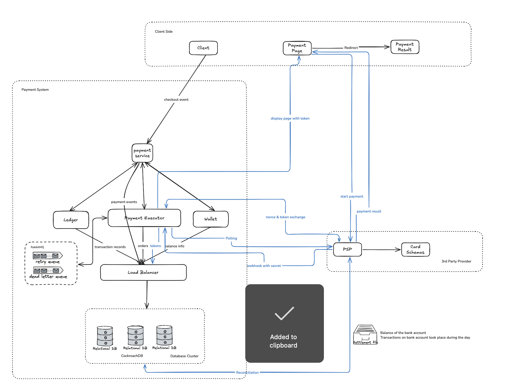

## Payment System (Stripe)
Functional:

- Handle everything relate to money movement
- Accept money from buyer/sender
- Send money to seller/accepter

No-Functional:

- Supported payment methods: credit cards, deposit cards, paypal …
- Security(Data Encryption): won’t save credit card info, use third-party payment processors to handle sensitive card information and credit card payment processing.
- Fault Tolerance: Failed payments carefully handled
- Consistency/Reconciliation: verify payment information across diff systems is consistent

Back-of-the-envelope estimation/calculation

- Assumptions: 1 Million/Day ⇒ 11.6 transactions/s - 10TPS

High-Level Design

- Architectural diagrams / Data Flow / User Flow
  

    
- API/Contract Design
    
    ```json
    // checkout orders
    POST /api/v1/payments
    {
    	"buyer_id": 
    	"checkout_id":
    	"payment_orders": [
    		{
    			"payment_order_id":
    			"seller_id": 
    			"amount":
    		},
    		{
    			"payment_order_id":
    			"seller_id": 
    			"amount":
    		}
    		...
    }
    
    // Get Payment info by ID
    GET /api/v1/payments/{payment_order_id}
    
    // Post payment result
    POST /api/v1/webhook
    {
    	"payment_id":
    	"payment_order_status":
    	"secret":
    }
    ```
    
- Schema/DB Design
    
    DB: need ACID ⇒ CP(Consistency + Partition Tolerance) 
    
    **Payment Event Table**
    
    | String(PK) | String | Boolean | Date |
    | --- | --- | --- | --- |
    | checkout_id | buyer_id | is_payment_done | created_time |
    
    **Payment Order Table**
    
    | String(PK) | String | String | String(FK) | String | Double | Boolean | Boolean | Date |
    | --- | --- | --- | --- | --- | --- | --- | --- | --- |
    | payment_order_id | buyer_id | seller_id | checkout_id | payment_order_status | amount | wallet_updated | ledger_updated | created_time |
    
    payment_order_status: ENUM(not_started, executing, success, failed)
    
    **Wallet Balance Table:** Realtime Balance Per Owner
    
    | String(PK) | String | Double | String |
    | --- | --- | --- | --- |
    | wallet_id | owner_id | amount | owner_type |
    
    owner_type: ENUM(MERCHANT, PLATFORM, USER)
    
    **Ledger Table**: keep financial records of payment transactions
    
    | String(PK) | String | Double |
    | --- | --- | --- |
    | owner_id | type | amount |
    
    type: ENUM(credit, debit)