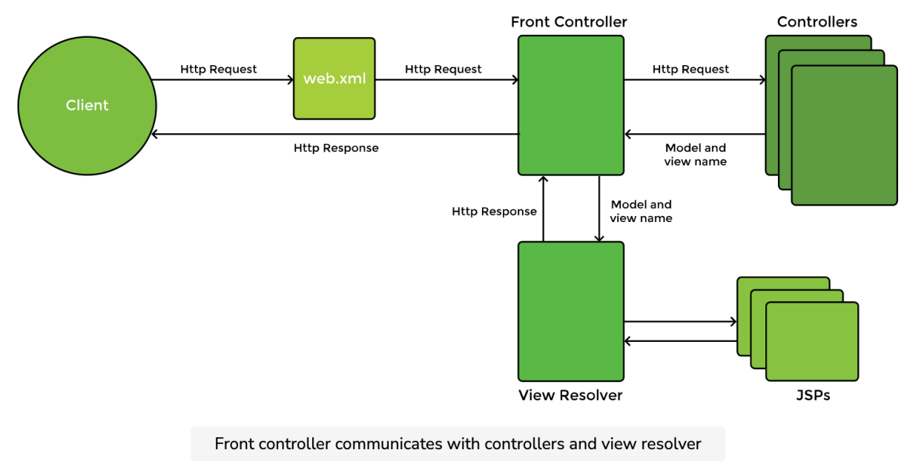
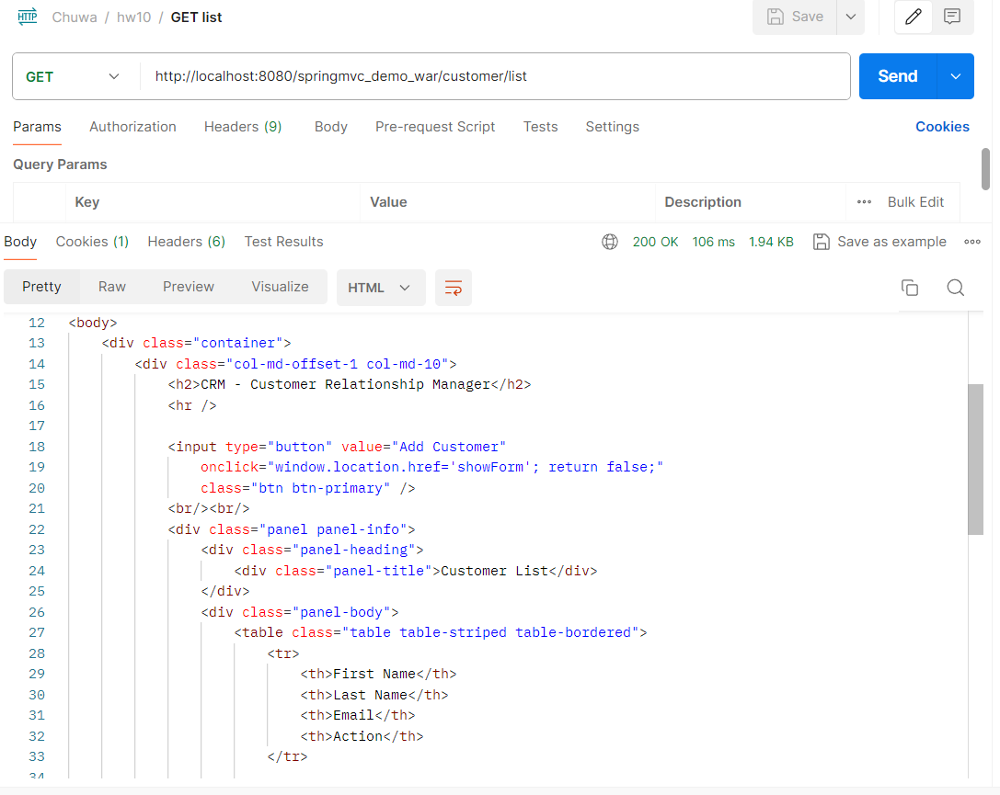
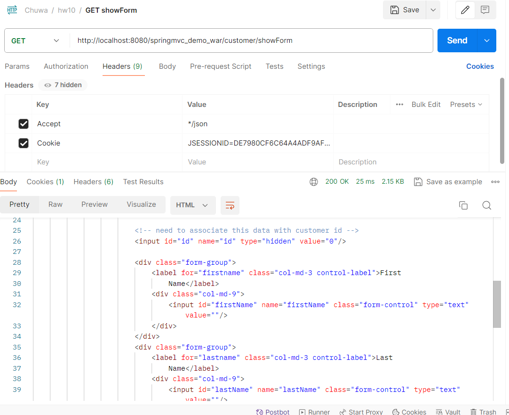
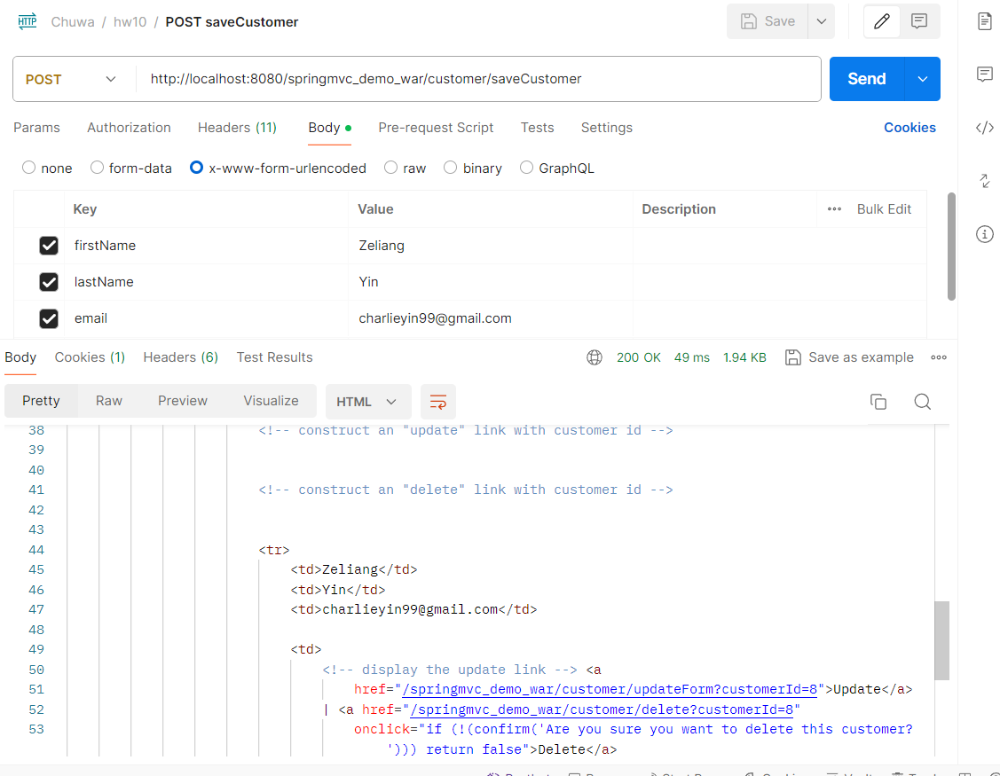
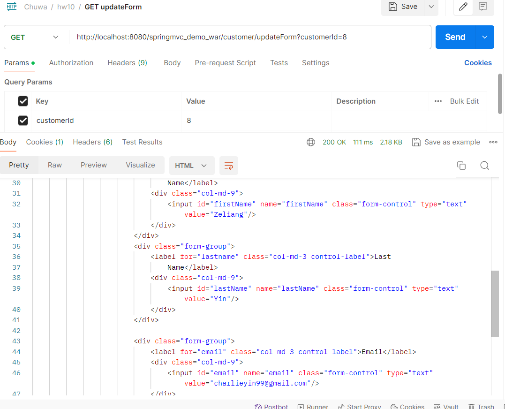
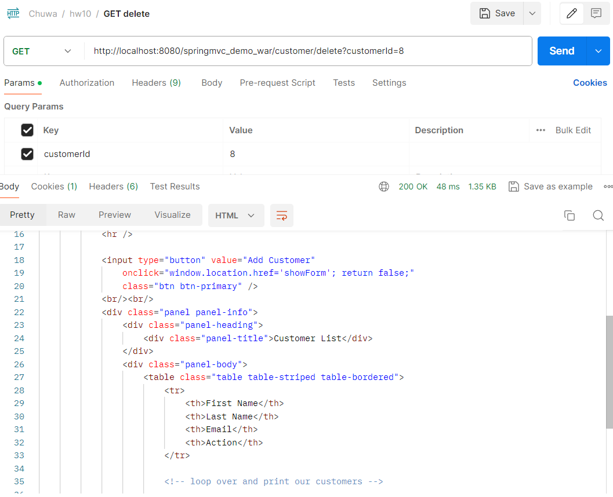

# hw10
### 1. List all of the annotations you learned from this class session.
- `@Controller`: Marks a class as a web controller. It is typically used in Spring MVC applications where the methods return view names instead of raw data.
    ```java
    @Controller
    public class HomeController {

        @GetMapping("/home")
        public String home(Model model) {
            model.addAttribute("message", "Welcome to Spring MVC!");
            return "home";
        }
    }
    ```
- `@ResponseBody`: Tells Spring that the return value of the method should be bound to the web response body (typically as JSON), instead of being interpreted as a view name.
    ```java
    @Controller
    public class UserController {

        @GetMapping("/user")
        @ResponseBody
        public User getUser() {
            return new User("John", 30);
        }
    }
    ```
### 2. Explain tight coupling vs loose coupling and what does Spring IOC do?
- Tight coupling: Tightly coupling means one class depends directly on another specific class (one instance is created inside another class). If one changes, the other might break. It's hard to test, reuse, or extend.
    ```java
    public class Car {
        private Engine engine = new Engine(); // directly creating the dependency

        public void start() {
            engine.run();
        }
    }
    ```
- Loose coupling: Loose coupling means classes depend on abstractions, not concrete implementations. The dependencies are injected, not created internally.
    ```java
    @Component
    public class Car {
        private final Engine engine;

        @Autowired
        public Car(Engine engine) {
            this.engine = engine;
        }

        public void start() {
            engine.run();
        }
    }

    @Component
    public class Engine {
        public void run() {
            System.out.println("Engine running...");
        }
    }
    ```
- What does Spring IOC do:
    - Objects do not create their own dependencies
    - Dependencies are provided by the Spring IOC container
### 3. What is MVC pattern?
MVC is a design pattern that separates an application into 3 interconnected components:
- **Model**: Represents data and business logic
- **View**: Responsible for the UI
- **Controller**: Handles user input (HTTP requests), processes it (with model), and returns a view.
### 4. What is Front-Controller?
A Front Controller is a single entry point for handling all incoming web requests in a web application.  
It maps the incoming request to a controller.  
Spring's DispatcherServlet is the Front Controller.
### 5. Explain `DispatcherServlet` and how it works.
- `DispatcherServlet` is the Front Controller in the Spring MVC architecture. It handles **all incoming HTTP requests** and routes them to the correct components.
- Workflow of `DispatcherServlet`:
    1. Client sends a request
    2. `DispatcherServlet` receives the request
    3. Handler Mapping is used to find the right controller
    4. Calls the matched Controller method
    5. Model data is returned
    6. ViewResolver finds the correct view
    7. `DispatcherServlet` returns the final response

    
### 6. What is JSP and What is Model And View?
- **JSP**: JSP stands for JavaServer Pages. It's a view technology used to build dynamic web pages that can include Java code.
- **Model**: The Model represents the data or business logic of the application. In a Spring controller, it's usually a Java object or a map of attributes that you want to pass to the view.
- **View**: The View is responsible for displaying the data provided by the Model to the user. In Spring, common views are: JSP, Thymeleaf, HTML templates or even JSON/XML (in REST APIs).
### 7. Explain `servlet` and `servlet container`, name some servlet implementations and servlet containers other than tomcat.
- A `Servlet` is a Java class that handles HTTP requests and responses on a server. It runs on a Servlet Container
- A `Servlet Container` is a part of a web server or application server that: manages the lifecycle of servlets, maps URLs to servlets, handles multi-threading, security, session, and more.
- Servlet implementations: Jetty, Undertow, GlassFish, WebLogic
### 8. clone this repo, and run it on you local,
1. https://github.com/CTYue/springmvc5-demo
2. Notice that you need to configure the Tomcat by yourself.
3. find out the APIs in controlelr and call some APIs, In slides, I also list some API.
4. remeber to setup mysql database for this project
5. Test APIs (controllers) in postman  

Test APIs:  
1. `GET` `/customer/list`
    
2. `GET` `/customer/showForm`
    
3. `POST` `/customer/saveCustomer`
    
4. `GET` `/customer/updateForm`
    
5. `GET` `/customer/delete`
    