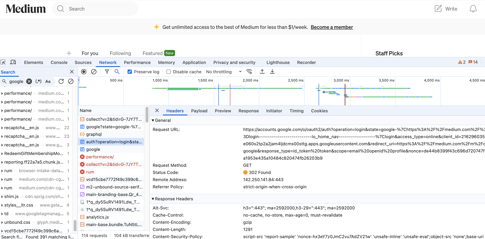
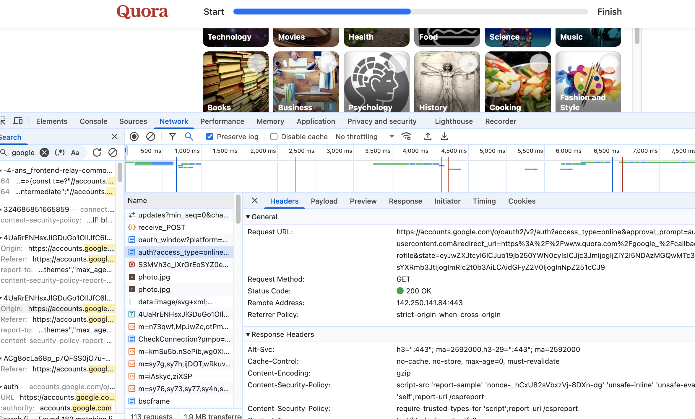

# 1. List all of the annotations you learned from class and homework to annotaitons.md

# 2. Explain TLS, PKI, certificate, public key, private key, and signature.

- TLS: Transport Layer Security. A security protocol that protects data by encryption when it’s sent over a network.
- PKI: PUblic Key Infrastructure. Create, manage, distribute, use, store and revoke **certificates** and manage public-key encryption.
- Certificate: Like a digital ID card for the server. It ensures the public key belongs to the organization.
- Public/Private Key: Come in pairs.
- | Key Type    | Description                                                                          |
  | ----------- | ------------------------------------------------------------------------------------ |
  | Public Key  | Shared with anyone. Used to**encrypt** data or **verify** signatures.    |
  | Private Key | Kept**secret**. Used to **decrypt** data or **create** signatures. |
- Signature: We take hash of the original data and encrypt it with sender's **private** key. Signature is sent with the original message. Once the receiver received the message, the receiver will hash the received message and decrypt the signature with sender's **public** key. By comparing the decrypted hash with original message hash, we can tell if the signature is actually encrypted with private key.

# 3. Write a Spring security based application, which provides https APIs (one simple get controller with empty response is good enough) instead of http, please generate a self-signed certificate to make your https TLS verfication work.

1. Pack your self-signed certificate in the form of jks file, as part of your application, name it properly
2. Test if you can verify your HTTPs api without importing the self-signed certificate to your local certificate chain, if not, explain why.
   - No. An `SSL Error: Self signed certificate` will show. Self signed certificates are not issued by a trusted CA. We need to manually import to certificate.
3. Explain what did you do to make https call work, do NOT bypass TLS/SSL verfication in Postman (this is cheating)!
   - I generated a certificate with keytool an imported it into Postman.

**Tutorial:** https://www.baeldung.com/spring-channel-security-https

# 4. list all http status codes that related to authentication and authorization failures.

| Status Code                                 | Name                                  | Description                                                                                                                      |
| ------------------------------------------- | ------------------------------------- | -------------------------------------------------------------------------------------------------------------------------------- |
| **401 Unauthorized**                  | Unauthorized                          | The request requires user authentication. Usually returned when authentication credentials are missing or invalid.               |
| **403 Forbidden**                     | Forbidden                             | The server understood the request but refuses to authorize it. Authentication will not help; the user does not have permission.  |
| **407 Proxy Authentication Required** | Proxy Authentication Required         | Similar to 401, but used for authentication with a proxy server instead of the origin server.                                    |
| **419 Authentication Timeout**        | Authentication Timeout (Non-standard) | Some frameworks (e.g., Laravel) use this unofficial code to indicate a session timeout. Not part of the official HTTP spec.      |
| **451 Unavailable For Legal Reasons** | Unavailable For Legal Reasons         | Although not strictly an authentication error, it can occur when access is denied due to legal reasons (e.g., censored content). |

# 5. Compare authentication and authorization? Name and explain important components in Spring security that undertake authentication and authorization

| Aspect                         | Authentication                            | Authorization                               |
| ------------------------------ | ----------------------------------------- | ------------------------------------------- |
| **Purpose**              | Verifying*who* the user is              | Deciding*what* the user can do            |
| **Question Asked**       | "Are you really who you say you are?"     | "Are you allowed to do this?"               |
| **Data Used**            | Username/password, biometric data, tokens | Roles, permissions, policies                |
| **When Happens**         | Always*before* authorization            | *After* authentication succeeds           |
| **Example**              | Login form checks password                | Checking if user can access `/admin` page |
| **Spring Security Role** | Handled via `AuthenticationManager`     | Handled via `AccessDecisionManager`       |

## 🔥 Key Components in Spring Security

### 1. **AuthenticationManager**

- **What it does**: Core interface that *performs authentication* (verifying credentials).
- **How it works**: Takes an `Authentication` object (like username/password) and returns an authenticated one if successful.
- **Common implementation**: `ProviderManager`, which delegates to multiple `AuthenticationProvider`s.

### 2. **AuthenticationProvider**

- **What it does**: *Actual logic* for checking credentials.
- **Example**: `DaoAuthenticationProvider` checks username and password against a database via `UserDetailsService`.

### 3. **UserDetailsService**

- **What it does**: Loads *user-specific data* from a data source.
- **Purpose**: Given a username, returns a `UserDetails` object that Spring Security uses to authenticate.

### 4. **SecurityContext & SecurityContextHolder**

- **What it does**: Store *current user's authentication* info throughout the request.
- `SecurityContextHolder` holds the `SecurityContext`, which contains the `Authentication`.

### 5. **AccessDecisionManager**

- **What it does**: *Authorizes* user access based on their roles or permissions.
- **How it works**: Makes decisions by evaluating the `Authentication` against the required access attributes.

### 6. **GrantedAuthority**

- **What it does**: Represents a *permission* or *role* assigned to the authenticated user.
- **Examples**: `"ROLE_USER"`, `"ROLE_ADMIN"`

### 7. **FilterChainProxy and Security Filters**

- **What it does**: *Intercepts requests* and applies security logic.
- **Important filters include**:
  - `UsernamePasswordAuthenticationFilter`: Handles form login.
  - `BasicAuthenticationFilter`: Handles HTTP Basic auth.
  - `ExceptionTranslationFilter`: Handles security exceptions like Access Denied.
  - `FilterSecurityInterceptor`: Final authorization check before accessing resources.

# 6. Explain HTTP Session?

HTTP session is how a server remembers a user across multiple requests. Per first request, the server creates a session object and sends the sesion id back. Then when the user makes a request, the browser sends the session id to the server and the server will find related data according to the session id.

# 7. Explain Cookie?

A cookie is a small piece of data the browser receives from the server and stores locally. Server sends a `Set-Cookie` header in the HTTP response. On every new request to the same domain, the browser sends the cookie in the `Cookie` header. Cookie can store session id, user preferences and tracking info.

# 8. Compare Session and Cookie?

| Aspect                         | Session                                                                   | Cookie                                                            |
| ------------------------------ | ------------------------------------------------------------------------- | ----------------------------------------------------------------- |
| **Where Data is Stored** | On the**server**                                                    | On the**client** (browser)                                  |
| **Stored Data Size**     | Larger — can store complex objects (limited by server memory or storage) | Smaller — usually under**4KB**                             |
| **Who Manages the Data** | Server keeps and manages session data                                     | Browser stores and sends cookies with every request               |
| **Security**             | More secure — user can’t directly see or edit session data              | Less secure — users can view and potentially modify cookies      |
| **Usage Example**        | User login, shopping cart, temporary user data during visit               | Remember login, site preferences (theme, language), tracking info |
| **Lifetime**             | Can expire after inactivity or logout                                     | Can expire based on a set time or when browser closes             |
| **Performance Impact**   | Server-side — consumes server resources (memory/database)                | Client-side — minimal server load but can increase request size  |
| **Dependency**           | Needs session ID to be shared via cookie or URL parameter                 | Cookie itself is self-contained (data travels back and forth)     |
| **Typical Size Limit**   | Depends on server, but usually no hard limit                              | Around**4096 bytes (4KB)** per cookie                       |
| **Setup**                | Server creates and tracks session, client holds session ID                | Server sends cookies, browser stores and attaches automatically   |

# 9. Find at least TWO websites who can be logged in using your Google Account, explain in detail on how Google SSO works with screenshots like below, find SSO-related Rest calls in Chrome developer tool:





In the screenshot, the browser redirects the user to google oauth service and in the URL, it includes parameters like:

* `client_id` (which identifies the website to Google)
* `redirect_uri` (where to send the user after login)
* `scope` (what information the website wants, like email, profile)
* `response_type=code` (asking for an authorization code)

After the user signs in with google, google redirects the user to `redirect_uri` and with a parameter authorization code. The website will send a post request to google to exchange the code for:

* **ID Token** (JWT that contains user's info, like email)
* **Access Token** (for API access)

And the website can use ID Token to authenticate user and log them in.

# 10. How do we use session and cookie to keep user information across the the application?

1. User logs in → Server creates session → Sends back session ID in a cookie.
2. Browser sends cookie with every request.
3. Server reads session ID from cookie → Loads user info.

# 11. What is the spring security filter?

A chain of filters that intercepts HTTP requests to handle authentication, authorization, CSRF, CORS, session management, and security exceptions before reaching your controllers.

 **Key component** :

* `FilterChainProxy` manages the filter chain.
* Filters like `UsernamePasswordAuthenticationFilter`, `CsrfFilter`, `ExceptionTranslationFilter` handle different security tasks.

Request → Security Filter Chain → Controller (if allowed)

# 12. Explain bearer token and how JWT works.

Bearer Token

- Sent in HTTP header:
- `Authorization: Bearer <token>`
- If you have it, you're trusted (no extra steps).

JWT (JSON Web Token) - One type of bearer token

- A self-contained token: `<header>.<payload>.<signature>`
- **Header**: Algorithm info.
- **Payload**: User data (e.g., user ID, roles).
- **Signature**: Verifies data integrity.

JWT Flow

1. Client logs in → receives JWT.
2. Client sends JWT with requests (`Authorization: Bearer <token>`).
3. Server verifies the signature.
4. If valid → trusts user info inside the JWT.

# 13. Explain how do we store sensitive user information such as password and credit card number in DB?

Password: Never store plain text password. We only store password hash.

Credit card number: Do not store unless absolutely necessary. If absolutely necessary, encrypt the credit card number (two-way) using strong encryption and store encrypted data and securely manage encryption keys.

# 14. Compare UserDetailService, AuthenticationProvider, AuthenticationManager, AuthenticationFilter?

| Concept                          | What it Does                                                                                                           | Key Role                                       | Example                    |
| -------------------------------- | ---------------------------------------------------------------------------------------------------------------------- | ---------------------------------------------- | -------------------------- |
| **UserDetailsService**     | Loads user**details** (username, password, roles) from DB or memory                                              | **Provides user data**for authentication | Fetch user info from MySQL |
| **AuthenticationProvider** | **Verifies credentials** (e.g., compares password hashes)                                                        | **Does authentication logic**            | Check password matches     |
| **AuthenticationManager**  | **Coordinates** authentication by calling AuthenticationProvider(s)                                              | **Manages the auth process**             | Tries multiple providers   |
| **AuthenticationFilter**   | **Intercepts HTTP request** to  **start authentication** (e.g., extract username/password or bearer token) | **Triggers the authentication**          | Reads JWT from header      |

Workflow:

[HTTP Request]
  -> hits AuthenticationFilter
     -> calls AuthenticationManager
         -> calls AuthenticationProvider
             -> uses UserDetailsService (to load user info)

# 15. What is the disadvantage of Session? how to overcome the disadvantage?

| Disadvantage of Session | Why It's a Problem                                              | How to Overcome                                                       |
| ----------------------- | --------------------------------------------------------------- | --------------------------------------------------------------------- |
| Not scalable            | Session stored in server memory; more users = more memory usage | Store sessions in external storage (e.g., Redis, DB)                  |
| Sticky sessions         | Load balancer must send user to the same server                 | Use shared session store (Redis) or stateless auth (JWT)              |
| Stateful                | Harder to scale horizontally (adding more servers)              | Switch to stateless authentication (JWT)                              |
| Session loss            | If server crashes, session data lost                            | Persist sessions externally (Redis, DB)                               |
| Security risks          | Session hijacking if session ID is stolen                       | Use short session timeouts, secure cookies, HTTPS, and refresh tokens |

# 16. How to get value from application.properties in Spring security?

| Method                       | How It Works                                          | Best For                                    |
| ---------------------------- | ----------------------------------------------------- | ------------------------------------------- |
| `@Value`                   | Injects a single property value directly into a field | Simple single properties like secret keys   |
| `@ConfigurationProperties` | Binds a group of related properties into a POJO class | Managing multiple related settings together |
| `Environment`              | Programmatically fetches property by key name         | Dynamic or conditional property fetching    |

```java
@Value("${myapp.secret-key}")
private String secretKey;

@Component
@ConfigurationProperties(prefix = "myapp")
public class MyAppProperties {
    private String secretKey;
    // getters and setters
}

@Autowired
private Environment env;

String secretKey = env.getProperty("myapp.secret-key");

```

# 17. What is the role of configure(HttpSecurity http) and configure(AuthenticationManagerBuilder auth)?

1. configure(HttpSecurity http)
   Controls what resources are secured and how.
   Example:

```java
@Override
protected void configure(HttpSecurity http) throws Exception {
    http
        .authorizeRequests()
            .antMatchers("/admin/**").hasRole("ADMIN")  // only ADMIN can access /admin/**
            .anyRequest().authenticated()              // others must be logged in
        .and()
        .formLogin()   // use form-based login
        .and()
        .logout();     // enable logout
}
```

2. configure(AuthenticationManagerBuilder auth)
   Controls how users are authenticated.
   Example:

```java
@Override
protected void configure(AuthenticationManagerBuilder auth) throws Exception {
    auth
        .inMemoryAuthentication()
            .withUser("user").password("{noop}password").roles("USER")
        .and()
            .withUser("admin").password("{noop}admin").roles("ADMIN");
}
```

# 18. Reading, 泛读⼀下即可，⾃⼰觉得是重点的，可以多看两眼。https://www.interviewbit.com/spring-security-interview-questions/#is-security-a-cross-cutting-concern

1. 1-12
2. 17 - 30

# 19. Explain best practices to securely store secrets in applications.


| Best Practice                  | Key Points                                      |
| ------------------------------ | ----------------------------------------------- |
| Never hardcode secrets         | Use env vars or secret managers                 |
| Use a Secrets Manager          | Centralized, secure storage                     |
| Encrypt at rest and in transit | Protect secrets during storage and transmission |
| Environment variables          | Don't commit `.env` files                     |
| Least privilege                | Limit access to only what's needed              |
| Rotate secrets                 | Regularly change secrets                        |
| Audit access                   | Monitor secret usage                            |
| Handle leaks fast              | Revoke and rotate                               |
| Secure build and deploy        | Inject secrets safely                           |
| Secret scanning tools          | Auto-detect leaks                               |
