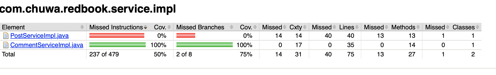

# 1. Explain and compare following concepts, provide specific examples when doing comparison:

# Testing Concepts

| Testing Type | What it is | Example | Comparison |
|:---|:---|:---|:---|
| **1. Unit Testing** | Test *smallest pieces* of code (e.g., functions, methods) in isolation. | Testing a function `add(a, b)` returns correct sum. | Smallest scope. Doesn't check how different parts interact. |
| **2. Functional Testing** | Test *features/functions* against business requirements. | Test if clicking "Login" with correct credentials redirects to Dashboard. | Broader than unit tests, tests real **user functionality**. |
| **3. Integration Testing** | Test how *multiple modules or services* work together. | Test if the frontend sends login data to backend and gets the right token back. | Focuses on **interactions** between components. |
| **4. Regression Testing** | Re-run tests after changes to ensure *old features still work*. | After adding a "Forgot Password" feature, test that "Login" still works fine. | Goal: **Detect unintended side effects** from code changes. |
| **5. Smoke Testing** | *Quick, basic tests* to check if the app is stable enough for deeper testing. | After deploying a build, check if homepage loads and login/signup buttons work. | High-level, **shallow** check before detailed testing. |
| **6. Performance Testing** | Test how fast/efficient the system is under normal load. | Test if the web page loads in under 2 seconds when 100 users access it. | Measures **speed, response time, scalability**. |
| **7. Stress Testing** | Test limits by putting *extreme load* on the system. | Flood the server with 10,000 simultaneous requests and see if it crashes gracefully. | Pushes beyond normal capacity; **finds breaking points**. |
| **8. A/B Testing** | Compare two versions (A and B) to see which one performs better with users. | Show version A with a green "Buy" button and version B with a red button. See which gets more clicks. | Directly measures **user behavior/preferences**. |
| **9. End-to-End (E2E) Testing** | Test *complete workflows* from start to finish like a real user. | Register -> Login -> Search for product -> Add to cart -> Checkout. | Long flow across multiple systems. **Highest coverage**. |
| **10. User Acceptance Testing (UAT)** | Test by *actual users* to validate if the product meets their needs. | Client reviews the new invoicing system to confirm it meets requirements before launch. | Business-focused. Final approval step before release. |

# Environment Concepts

| Environment | What it is | Example | Comparison |
|:---|:---|:---|:---|
| **1. Development** | Where developers code and test **locally** or on dev servers. | You build new APIs for profile editing here and run unit tests. | Most **unstable** environment. Fast iteration. |
| **2. QA (Quality Assurance)** | Dedicated environment where testers validate builds. | QA team runs functional and regression tests here after a developer finishes a feature. | More **stable** than dev. Focused on **finding bugs**. |
| **3. Pre-prod/Staging** | Replica of production where final testing happens. | A completed app version is deployed here to simulate real user conditions before going live. | **Almost identical to production**, but not customer-facing. |
| **4. Production** | Live environment where **real users** access the app. | Your ecommerce site where customers buy products. | **Most stable**, highest risk. Changes need to be careful and deliberate. |


```
Dev (coding) → QA (testing) → Pre-prod (final testing) → Prod (live for real users)
```

# Unite Test Report

