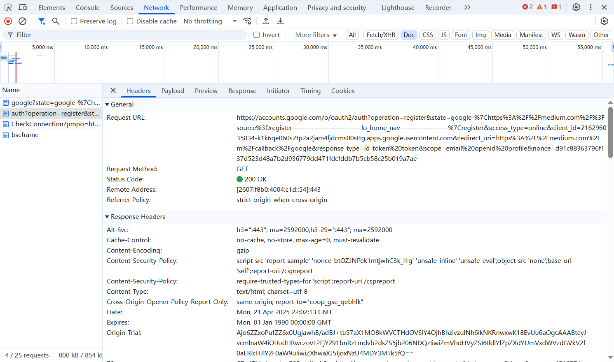

1. List all of the annotations you learned from class and homework to annotations.md

   Already updated and written in `Short Questions/annotations.md`

   

2. Explain TLS, PKI, certificate, public key, private key, and signature.

   **TLS (Transport Layer Security)**

   TLS is a cryptographic protocol that provides secure communication over a network. It ensures privacy, data integrity, and authentication between client and server applications.

   **PKI (Public Key Infrastructure)**

   PKI is a framework of roles, policies, and procedures needed to create, manage, distribute, use, store, and revoke digital certificates and manage public-key encryption.

   **Certificate**

   A digital certificate is an electronic document that proves the ownership of a public key. It contains information about the key, the identity of its owner, and the digital signature of a Certificate Authority.

   ```java
   public X509Certificate loadCertificate(String filePath) throws Exception {
       FileInputStream fis = new FileInputStream(filePath);
       CertificateFactory cf = CertificateFactory.getInstance("X.509");
       X509Certificate cert = (X509Certificate)cf.generateCertificate(fis);
       fis.close();
       return cert;
   }
   ```

   **Public Key**

   A public key is a cryptographic key that can be shared with anyone. It is used to encrypt messages or verify digital signatures.

   **Private Key**

   A private key is a cryptographic key that must be kept secret. It is used to decrypt messages encrypted with the corresponding public key or to create digital signatures.

   ```java
   public KeyPair generateKeyPair() throws Exception {
       KeyPairGenerator generator = KeyPairGenerator.getInstance("RSA");
       generator.initialize(2048);
       return generator.generateKeyPair();
   }
   ```

   **Signature**

   A digital signature is a mathematical scheme for verifying the authenticity of digital messages or documents. It provides authentication, non-repudiation, and integrity.

   ```java
   public byte[] sign(PrivateKey privateKey, byte[] data) throws Exception {
       Signature signature = Signature.getInstance("SHA256withRSA");
       signature.initSign(privateKey);
       signature.update(data);
       return signature.sign();
   }
   ```

   

3. Write a Spring security based application, which provides HTTPS APIs (one simple get controller with empty  response is good enough )instead of HTTP, please generate a self-signed certificate to make your HTTPS TLS verification work.

   1. Pack your self-signed certificate in the form of JKS file, as part of your application, name it properly

   2. Test if you can verify your HTTPS API without importing the self-signed certificate to your local  certificate chain, if not, explain why.

   3. Explain what you did to make the HTTPS call work. Do NOT bypass TLS/SSL verification in Postman (this is cheating)!

      Tutorial:  <https://www.baeldung.com/spring-channel-security-https>

   I have completed the Spring Security HTTPS application with a self-signed certificate. All project files are available in the `Project/https-demo` directory.

   1. **Self-signed certificate**: Created and packaged a JKS file (https-demo.jks) in the application's resources folder.

   2. **Verification without importing**: HTTPS verification fails without importing the certificate because self-signed certificates aren't trusted by default. Clients verify certificates against their trust store, and self-signed certificates aren't in that store.

   3. **Making HTTPS work**: Exported the certificate from the JKS file and imported it into the client's (Postman's) CA certificate store. This properly establishes trust without disabling TLS verification.

      

4. List all HTTP status codes that relate to authentication and authorization failures.

   **4xx Client Error Codes**

   - 401 Unauthorized: Authentication failed or credentials were not provided

   - 403 Forbidden: Authentication succeeded but the authenticated user does not have access to the requested resource

   - 407 Proxy Authentication Required: Client must authenticate with the proxy server

   - 419 Authentication Timeout: Authentication has expired (non-standard)

   **5xx Server Error Codes**

   - 511 Network Authentication Required: The client needs to authenticate to gain network access

   **Related Status Codes**

   - 400 Bad Request: Sometimes used for malformed authentication requests

   - 405 Method Not Allowed: Can indicate authentication method not supported

   - 429 Too Many Requests: Used for rate limiting, often related to authentication attempts

     

5. Compare authentication and authorization. Name and explain important components in Spring Security that undertake authentication and authorization.

   **Authentication**:

   - Verifies WHO you are
   - Involves credentials (username/password, tokens, certificates)
   - Happens before authorization
   - Results in principal identity and authorities

   **Authorization**:

   - Determines WHAT you can access
   - Based on permissions, roles, or other access control rules
   - Uses the authenticated identity
   - Determines if a request is allowed

   **Authentication Components**

   1. **AuthenticationManager**

      - Central interface for authentication
      - Default implementation: ProviderManager
      - Processes authentication requests

      ```java
      @Bean
      public AuthenticationManager authManager(AuthenticationConfiguration config) throws Exception {
          return config.getAuthenticationManager();
      }
      ```

   2. **AuthenticationProvider**

      - Performs specific types of authentication
      - Examples: DaoAuthenticationProvider (database), JwtAuthenticationProvider

      ```java
      @Bean
      public DaoAuthenticationProvider authProvider() {
          DaoAuthenticationProvider provider = new DaoAuthenticationProvider();
          provider.setUserDetailsService(userDetailsService);
          provider.setPasswordEncoder(passwordEncoder());
          return provider;
      }
      ```

   3. **UserDetailsService**

      - Loads user-specific data
      - Bridges your user data store to Spring Security

      ```java
      @Bean
      public UserDetailsService userDetailsService() {
          return username -> repository.findByUsername(username)
              .orElseThrow(() -> new UsernameNotFoundException("User not found"));
      }
      ```

   **Authorization Components**

   1. **AccessDecisionManager**

      - Makes authorization decisions
      - Uses voters to determine access

   2. **SecurityFilterChain**

      - Configures authorization rules
      - Defines who can access what resources

      ```java
      @Bean
      public SecurityFilterChain filterChain(HttpSecurity http) throws Exception {
          http.authorizeHttpRequests(auth -> auth
              .requestMatchers("/public/**").permitAll()
              .requestMatchers("/admin/**").hasRole("ADMIN")
              .anyRequest().authenticated()
          );
          return http.build();
      }
      ```

   3. **Method Security**

      - Enables annotation-based security
      - Examples: @PreAuthorize, @Secured

      ```java
      @PreAuthorize("hasRole('ADMIN')")
      public void adminOnlyMethod() {
          // Only admins can access
      }
      ```

      

6. Explain HTTP Session.

   HTTP Session is a server-side mechanism to maintain state across multiple HTTP requests. It works by:

   1. Creating a unique session ID when a user first connects
   2. Storing this ID on the client (usually via cookies)
   3. Maintaining the actual session data on the server
   4. Using the session ID to identify returning users
   5. Automatically expiring the session after inactivity

   ```java
   @Configuration
   public class SecurityConfig {
       @Bean
       public SecurityFilterChain filterChain(HttpSecurity http) throws Exception {
           http.sessionManagement(session -> session
               .sessionCreationPolicy(SessionCreationPolicy.IF_REQUIRED) // Create only when needed
               .maximumSessions(1)                                       // Limit to one session per user
               .expiredUrl("/login?expired")                             // Redirect when expired
           );
           return http.build();
       }
   }
   ```

   ```java
   @PostMapping("/login")
   public String login(HttpSession session) {
       session.setAttribute("userId", user.getId());
       session.setMaxInactiveInterval(1800); // 30mins expired
       return "redirect:/dashboard";
   }
   ```

   

7. Explain Cookie.

   A cookie is a small piece of data stored by the web browser on the client's device. Key characteristics:

   1. Set by the server using HTTP headers (Set-Cookie)
   2. Automatically sent with each subsequent request to the same domain
   3. Has properties like domain, path, expiry, and security flags
   4. Limited to ~4KB in size

   ```java
   @GetMapping("/remember")
   public String rememberUser(HttpServletResponse response) {
       Cookie cookie = new Cookie("username", user.getUsername());
       cookie.setMaxAge(7 * 24 * 60 * 60); // 1 week
       cookie.setHttpOnly(true);           // Not accessible via JavaScript
       cookie.setSecure(true);             // Send only over HTTPS
       response.addCookie(cookie);
       return "preferences-saved";
   }
   ```

   

8. Compare Session and Cookie.

   | Aspect           | Session                              | Cookie                                    |
   | ---------------- | ------------------------------------ | ----------------------------------------- |
   | Storage location | Server-side                          | Client-side                               |
   | Security         | More secure (data on server)         | Less secure (data on client)              |
   | Capacity         | Unlimited (server memory)            | Limited (~4KB per cookie)                 |
   | Lifespan         | Until timeout or browser close       | Can be persistent across browser restarts |
   | Transmission     | Only session ID travels over network | All cookie data sent with each request    |
   | Configuration    | Managed by server                    | Can be managed by both server and client  |
   | Use cases        | Sensitive user data, shopping carts  | User preferences, tracking, session IDs   |

9. Find at least TWO websites who can be logged in using your Google Account, explain in detail on how  Google SSO works, find SSO-related REST calls in Chrome developer tool.

   **Two Websites Using Google SSO**

   1. **Spotify** - allows login via Google account

   2. **Airbnb** - allows login via Google account

   **How Google SSO Works**

   Google SSO implements the OAuth 2.0 and OpenID Connect protocols to authenticate users across multiple websites without requiring separate credentials. Here's the workflow:

   1. **User clicks "Sign in with Google" on a website**
   2. **Website redirects to Google's authentication server**
   3. **User authenticates with Google (if not already logged in)**
   4. **Google sends an authorization code to the website**
   5. **Website exchanges the code for access and ID tokens**
   6. **Website validates tokens and creates a session for the user**

   **SSO-Related REST Calls in Chrome Developer Tool**

   1. **Authorization Request**: In the Network tab, there's a call to `accounts.google.com` with a GET method
   2. **Token Exchange**: The path shows `/oauth2/auth/` operations
   3. **State Parameter**: Note the `login&state=google` parameter in the URL, which maintains state during the OAuth flow
   4. **Redirect URI**: There's a redirect_uri parameter that sends the user back to Medium after authentication
   5. **Response Type**: The `response_type=id_token` indicates this is using OpenID Connect flow

   

   **The specific REST calls involved in Google SSO typically include**:

   - Authorization endpoint: <https://accounts.google.com/o/oauth2/auth>

   - Token endpoint: <https://oauth2.googleapis.com/token>

   - UserInfo endpoint: <https://openidconnect.googleapis.com/v1/userinfo>

     

10. How do we use session and cookie to keep user information across the the application?

    **Session Management**

    Sessions store user data on the server side with only a session ID stored on the client.

    ```java
    @Configuration
    public class SessionConfig {
        @Bean
        public HttpSessionListener httpSessionListener() {
            return new HttpSessionListener() {
                @Override
                public void sessionCreated(HttpSessionEvent se) {
                    se.getSession().setMaxInactiveInterval(30*60); // 30 minutes
                }
            };
        }
    }
    
    // Using session in a controller
    @Controller
    public class UserController {
        @PostMapping("/login")
        public String login(HttpSession session, @RequestParam String username) {
            session.setAttribute("username", username);
            return "redirect:/dashboard";
        }
        
        @GetMapping("/dashboard")
        public String dashboard(HttpSession session, Model model) {
            String username = (String) session.getAttribute("username");
            if (username == null) {
                return "redirect:/login";
            }
            model.addAttribute("username", username);
            return "dashboard";
        }
    }
    ```

    Cookie Management

    Cookies store data directly on the client side and are sent with every request.

    ```java
    @Controller
    public class CookieController {
        @PostMapping("/setPreference")
        public String setPreference(HttpServletResponse response, 
                                  @RequestParam String theme) {
            Cookie cookie = new Cookie("theme", theme);
            cookie.setMaxAge(30 * 24 * 60 * 60); // 30 days
            cookie.setPath("/");
            cookie.setHttpOnly(true);  // Prevents JavaScript access
            cookie.setSecure(true);    // Requires HTTPS
            response.addCookie(cookie);
            return "redirect:/home";
        }
        
        @GetMapping("/home")
        public String home(@CookieValue(name = "theme", required = false) 
                          String theme, Model model) {
            if (theme != null) {
                model.addAttribute("theme", theme);
            } else {
                model.addAttribute("theme", "default");
            }
            return "home";
        }
    }
    ```

    

11. What is the Spring Security filter?

    Spring Security uses a chain of filters to manage security aspects of web applications. These filters intercept HTTP requests before they reach your controllers.

    ```java
    @Configuration
    @EnableWebSecurity
    public class SecurityConfig {
        @Bean
        public SecurityFilterChain filterChain(HttpSecurity http) throws Exception {
            http
                .authorizeHttpRequests(authorize -> authorize
                    .requestMatchers("/public/**").permitAll()
                    .requestMatchers("/admin/**").hasRole("ADMIN")
                    .anyRequest().authenticated()
                )
                .formLogin(form -> form
                    .loginPage("/login")
                    .permitAll()
                )
                .logout(logout -> logout
                    .logoutSuccessUrl("/login?logout")
                );
            return http.build();
        }
    }
    ```

    The typical filter chain includes:

    1. **SecurityContextPersistenceFilter** - Restores security context from session
    2. **UsernamePasswordAuthenticationFilter** - Processes login attempts
    3. **ExceptionTranslationFilter** - Handles security exceptions
    4. **FilterSecurityInterceptor** - Makes final access control decisions

    Each filter has a specific responsibility in the authentication and authorization flow, and they execute in a predefined order.

    

12. Explain bearer token and how JWT works.

    **Bearer Token Authentication**

    Bearer tokens are simple security tokens that grant the bearer access to protected resources. The token is sent in the HTTP Authorization header:

    ```json
    Authorization: Bearer <token>
    ```

    Key characteristics:

    - Self-contained (contains all necessary authentication information)
    - Stateless (server doesn't need to store session data)
    - Can be validated without database lookups

    ```java
    @RestController
    public class ResourceController {
        @GetMapping("/api/resource")
        public Resource getResource(@RequestHeader("Authorization") String authHeader) {
            // Extract token from "Bearer <token>"
            String token = authHeader.substring(7);
            
            // Validate token and return resource
            if (tokenService.validateToken(token)) {
                return resourceService.getResource();
            }
            throw new UnauthorizedException();
        }
    }
    ```

    **JWT (JSON Web Token)**

    JWT is a standard format for bearer tokens that encodes claims as a JSON object. A JWT consists of three parts:

    1. **Header** - Contains metadata (algorithm, token type)
    2. **Payload** - Contains claims (user ID, roles, expiration)
    3. **Signature** - Verifies token integrity

    ```java
    // Creating a JWT
    @Service
    public class JwtService {
        private final String SECRET_KEY = "your-secret-key";
        
        public String generateToken(UserDetails userDetails) {
            return Jwts.builder()
                .setSubject(userDetails.getUsername())
                .claim("roles", userDetails.getAuthorities().stream()
                    .map(GrantedAuthority::getAuthority)
                    .collect(Collectors.toList()))
                .setIssuedAt(new Date())
                .setExpiration(new Date(System.currentTimeMillis() + 1000 * 60 * 60))
                .signWith(SignatureAlgorithm.HS256, SECRET_KEY)
                .compact();
        }
        
        public boolean validateToken(String token, UserDetails userDetails) {
            final String username = extractUsername(token);
            return (username.equals(userDetails.getUsername()) && !isTokenExpired(token));
        }
    }
    ```

    

13. Explain how we store sensitive user information such as passwords and credit card numbers in the database.

    **Password Storage**

    Passwords should never be stored in plaintext. Instead, they must be stored using secure cryptographic hashing algorithms:

    ```java
    @Service
    public class PasswordService {
        @Autowired
        private PasswordEncoder passwordEncoder;
        
        public String encodePassword(String rawPassword) {
            return passwordEncoder.encode(rawPassword);
        }
        
        public boolean verifyPassword(String rawPassword, String encodedPassword) {
            return passwordEncoder.matches(rawPassword, encodedPassword);
        }
    }
    
    // Configuration for BCrypt password encoder
    @Configuration
    public class SecurityConfig {
        @Bean
        public PasswordEncoder passwordEncoder() {
            return new BCryptPasswordEncoder(12); // Work factor of 12
        }
    }
    ```

    **Credit Card Information Storage**

    Credit card information requires compliance with PCI DSS (Payment Card Industry Data Security Standard):

    ```java
    @Entity
    public class PaymentInfo {
        @Id
        @GeneratedValue(strategy = GenerationType.IDENTITY)
        private Long id;
        
        // Only store last 4 digits
        private String cardLast4Digits;
        
        // Encrypted card number (if absolutely needed)
        @Convert(converter = EncryptedStringConverter.class)
        private String encryptedCardNumber;
        
        // Expiration date, also encrypted if stored
        @Convert(converter = EncryptedStringConverter.class)
        private String encryptedExpiryDate;
        
        // Use a payment token from payment processor instead
        private String paymentToken;
    }
    
    // Encryption converter
    public class EncryptedStringConverter implements AttributeConverter<String, String> {
        private static final String SECRET_KEY = "..."; // Store in secure vault
        
        @Override
        public String convertToDatabaseColumn(String attribute) {
            // Encrypt data before storing
            return encrypt(attribute, SECRET_KEY);
        }
        
        @Override
        public String convertToEntityAttribute(String dbData) {
            // Decrypt data when retrieving
            return decrypt(dbData, SECRET_KEY);
        }
    }
    ```

    **Best Practices**

    **Password Storage:**

    - Use strong adaptive hashing algorithms (BCrypt, Argon2, PBKDF2)
    - Implement proper salt handling
    - Regularly upgrade hashing algorithms as needed

    **Credit Card Storage:**

    - Avoid storing full card numbers whenever possible
    - Use tokenization through payment processors
    - Encrypt any sensitive data that must be stored
    - Maintain strict access controls

    **General Security:**

    - Use Hardware Security Modules (HSMs) for cryptographic operations

    - Implement proper key management

    - Log all access to sensitive data

    - Conduct regular security audits

      

14. Compare `UserDetailsService`, `AuthenticationProvider`, `AuthenticationManager`, and `AuthenticationFilter`.

    | Component              | Responsibility                              | Position in Flow                       |
    | ---------------------- | ------------------------------------------- | -------------------------------------- |
    | UserDetailsService     | Loads user data from the database           | Used by AuthenticationProvider         |
    | AuthenticationProvider | Validates credentials against user data     | Used by AuthenticationManager          |
    | AuthenticationManager  | Coordinates authentication process          | Used by AuthenticationFilter           |
    | AuthenticationFilter   | Intercepts HTTP requests for authentication | First point of contact in request flow |

15. What is the disadvantage of Session? how to overcome the disadvantage?

    **Disadvantages of Session-Based Authentication**:

    1. **Scalability Issues**:

       - Server must store session data for each user

       - Difficult to scale horizontally in distributed systems

    2. **Performance Overhead**:

       - Session validation requires database/memory lookups

       - Increases server load with high traffic

    3. **Single Point of Failure**:
       - If session store fails, all users get logged out

    4. **Cross-Domain Limitations**:

       - Sessions typically work only within a single domain

       - Problematic for microservices architectures

    **Solutions to Overcome Session Disadvantages**

    1. **Using JWT (JSON Web Tokens)**

       ```java
       @Configuration
       public class JwtConfig {
           @Bean
           public JwtEncoder jwtEncoder() {
               return new NimbusJwtEncoder(new ImmutableSecret<>(getSecretKey()));
           }
           
           @Bean
           public JwtDecoder jwtDecoder() {
               return NimbusJwtDecoder.withSecretKey(getSecretKey()).build();
           }
           
           private SecretKey getSecretKey() {
               byte[] keyBytes = Base64.getDecoder().decode("yourSecretKeyBase64Encoded");
               return new SecretKeySpec(keyBytes, "HmacSHA256");
           }
       }
       ```

    2. **Implementing Distributed Session Storage**

       ```java
       @Configuration
       @EnableRedisHttpSession
       public class SessionConfig {
           @Bean
           public LettuceConnectionFactory connectionFactory() {
               return new LettuceConnectionFactory(new RedisStandaloneConfiguration("localhost", 6379));
           }
       }
       ```

    3. **Using Stateless Authentication**

       ```java
       @Configuration
       @EnableWebSecurity
       public class SecurityConfig {
           @Bean
           public SecurityFilterChain filterChain(HttpSecurity http) throws Exception {
               http
                   .sessionManagement(session -> session
                       .sessionCreationPolicy(SessionCreationPolicy.STATELESS)
                   )
                   // Other configurations
                   ;
               return http.build();
           }
       }
       ```

    | Solution            | Pros                                      | Cons                                   |
    | ------------------- | ----------------------------------------- | -------------------------------------- |
    | JWT                 | Stateless, scalable, cross-domain support | Token size, can't invalidate instantly |
    | Distributed Session | Maintains session benefits, scalable      | Additional infrastructure, complexity  |
    | Stateless Auth      | Simple, highly scalable                   | Requires token management solution     |

16. How to get a value from `application.properties` in Spring Security?

    **Using @Value Annotation**

    The most common way to access properties in Spring Security config:

    ```java
    @Configuration
    @EnableWebSecurity
    public class SecurityConfig {
    
        @Value("${app.jwt.secret}")
        private String jwtSecret;
        
        @Value("${app.jwt.expiration:86400000}")
        private long jwtExpiration; // Default to 24 hours if not specified
        
        @Bean
        public SecurityFilterChain filterChain(HttpSecurity http) throws Exception {
            // Use the properties
            return http
                // Configuration using jwtSecret and jwtExpiration
                .build();
        }
    }
    ```

    **Using Environment**

    ```java
    @Configuration
    @EnableWebSecurity
    public class SecurityConfig {
    
        @Autowired
        private Environment env;
        
        @Bean
        public SecurityFilterChain filterChain(HttpSecurity http) throws Exception {
            String jwtSecret = env.getProperty("app.jwt.secret");
            long jwtExpiration = env.getProperty("app.jwt.expiration", Long.class, 86400000L);
            
            // Use the properties
            return http
                // Configuration using jwtSecret and jwtExpiration
                .build();
        }
    }
    ```

    **Using @ConfigurationProperties**

    For more complex property sets:

    ```java
    @Configuration
    @ConfigurationProperties(prefix = "app.security")
    public class SecurityProperties {
        private String jwtSecret;
        private long jwtExpiration;
        private List<String> allowedOrigins;
        
        // Getters and setters
        public String getJwtSecret() { return jwtSecret; }
        public void setJwtSecret(String jwtSecret) { this.jwtSecret = jwtSecret; }
        public long getJwtExpiration() { return jwtExpiration; }
        public void setJwtExpiration(long jwtExpiration) { this.jwtExpiration = jwtExpiration; }
        public List<String> getAllowedOrigins() { return allowedOrigins; }
        public void setAllowedOrigins(List<String> allowedOrigins) { this.allowedOrigins = allowedOrigins; }
    }
    
    @Configuration
    @EnableWebSecurity
    public class SecurityConfig {
    
        @Autowired
        private SecurityProperties securityProperties;
        
        @Bean
        public SecurityFilterChain filterChain(HttpSecurity http) throws Exception {
            // Use the properties
            return http
                // Configuration using securityProperties.getJwtSecret() etc.
                .build();
        }
    }
    ```

    ```properties
    # JWT Configuration
    app.jwt.secret=your-secret-key-here
    app.jwt.expiration=3600000
    
    # CORS Configuration
    app.security.allowedOrigins=http://localhost:3000,https://example.com
    ```

    

17. What is the role of `configure(HttpSecurity http)` and `configure(AuthenticationManagerBuilder auth)`?

    **configure(HttpSecurity http)**

    This method configures web-based security for specific HTTP requests. It allows you to define:

    ```java
    @Override
    protected void configure(HttpSecurity http) throws Exception {
        http
            .authorizeRequests(authorize -> authorize
                .antMatchers("/public/**").permitAll()
                .antMatchers("/admin/**").hasRole("ADMIN")
                .anyRequest().authenticated()
            )
            .formLogin(form -> form
                .loginPage("/login")
                .defaultSuccessUrl("/dashboard")
                .failureUrl("/login?error=true")
                .permitAll()
            )
            .logout(logout -> logout
                .logoutUrl("/logout")
                .logoutSuccessUrl("/login?logout=true")
                .invalidateHttpSession(true)
                .deleteCookies("JSESSIONID")
            )
            .csrf()
            .and()
            .exceptionHandling(exceptions -> exceptions
                .accessDeniedPage("/access-denied")
            );
    }
    ```

    Key responsibilities:

    - URL-based security (which URLs require which roles)
    - Login configuration (custom login pages, success/failure URLs)
    - Logout handling
    - CSRF protection
    - Session management
    - Exception handling

    **configure(AuthenticationManagerBuilder auth)**

    This method configures the AuthenticationManager, which handles user authentication:

    ```java
    @Autowired
    private UserDetailsService userDetailsService;
    
    @Autowired
    private PasswordEncoder passwordEncoder;
    
    @Override
    protected void configure(AuthenticationManagerBuilder auth) throws Exception {
        auth
            .userDetailsService(userDetailsService)
            .passwordEncoder(passwordEncoder);
        
        // Alternatively, for in-memory authentication:
        /*
        auth
            .inMemoryAuthentication()
            .withUser("user")
            .password(passwordEncoder.encode("password"))
            .roles("USER")
            .and()
            .withUser("admin")
            .password(passwordEncoder.encode("admin"))
            .roles("ADMIN");
        */
    }
    ```

    Key responsibilities:

    - Specifies the data source for user credentials
    - Configures authentication providers
    - Sets up password encoders
    - Can configure in-memory, JDBC, LDAP, or custom authentication

    **Note on Newer Spring Security Versions**

    In Spring Security 5.7.0+ these methods are deprecated in favor of component-based configuration using `SecurityFilterChain` beans:

    ```java
    @Configuration
    @EnableWebSecurity
    public class SecurityConfig {
        
        @Autowired
        private UserDetailsService userDetailsService;
        
        @Bean
        public SecurityFilterChain filterChain(HttpSecurity http) throws Exception {
            // Same configuration as configure(HttpSecurity http)
            return http.build();
        }
        
        @Bean
        public UserDetailsService userDetailsService() {
            // Define your UserDetailsService
        }
        
        @Bean
        public PasswordEncoder passwordEncoder() {
            return new BCryptPasswordEncoder();
        }
    }
    ```

    

18. Explain best practices to securely store secrets in applications.

    **Environment Variables**

    ```java
    @Value("${DB_PASSWORD}")
    private String dbPassword;
    
    // Access with fallback
    @Value("${API_KEY:default-key-for-dev}")
    private String apiKey;
    ```

    **Encrypted Configuration Files**

    ```java
    @Configuration
    @PropertySource("classpath:encrypted.properties")
    public class AppConfig {
        @Bean
        public static EnvironmentDecrypt propertyConfigurer() {
            EnvironmentDecrypt configurer = new EnvironmentDecrypt();
            configurer.setPasswordProvider(() -> "master-password");
            return configurer;
        }
    }
    ```

    **Secret Management Services**

    ```java
    @Configuration
    public class AWSSecretsConfig {
        @Bean
        public SecretsManager secretsManager() {
            return AWSSecretsManagerClientBuilder.standard()
                    .withRegion("us-east-1")
                    .build();
        }
        
        @Bean
        public String databasePassword(SecretsManager secretsManager) {
            GetSecretValueRequest request = new GetSecretValueRequest()
                    .withSecretId("production/db/credentials");
            GetSecretValueResult result = secretsManager.getSecretValue(request);
            return parseSecret(result.getSecretString()).get("password");
        }
    }
    ```

    **Vault-based Solutions**

    ```java
    @Configuration
    @EnableVaultClient
    public class VaultConfig {
        @Value("${vault.uri}")
        private String vaultUri;
        
        @Bean
        public VaultTemplate vaultTemplate() {
            VaultEndpoint endpoint = VaultEndpoint.from(vaultUri);
            ClientAuthentication authentication = new TokenAuthentication("vault-token");
            return new VaultTemplate(endpoint, authentication);
        }
    }
    ```

    Best Practices

    1. **Never hardcode secrets** in source code or config files

    2. **Use different secrets** for development, testing, and production
    3. **Encrypt secrets at rest** using strong encryption
    4. **Limit access** to secrets using IAM or RBAC
    5. **Rotate secrets regularly** and automatically
    6. **Use secrets managers** like HashiCorp Vault, AWS Secrets Manager, or Azure Key Vault
    7. **Audit access** to sensitive credentials
    8. **Consider runtime injection** of secrets (e.g., Kubernetes secrets)
    9. **Use secure backends** for storage (e.g., HSMs for encryption keys)
    10. **Implement least privilege** principles for secret access

    
