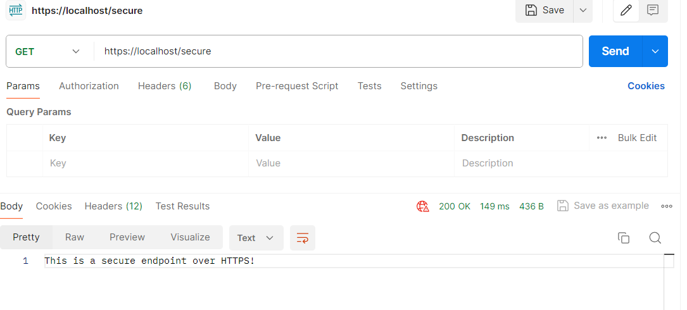
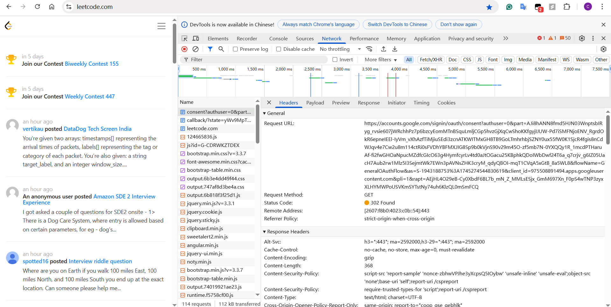
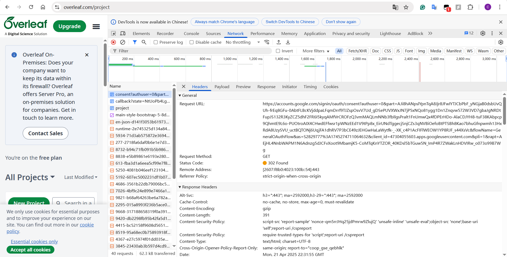

# hw11
### 1. List all of the annotations you learned from class and homework to annotaitons.md
### 2. Explain TLS, PKI, certificate, public key, private key, and signature.
1. **TLS (Transport Layer Security)**: the protocol used to secure communication between clients and servers over a network. Encrypts data in transit to prevent snooping. Ensures data integrity and authenticity.
2. **PKI (Public Key Infrastructure)**: the framework that manages public and private keys, along with certificates. It includes: Certificate Authorities (CAs) who issue certificates, standards for trust and key and certificate management.
3. **Certificate**: A digital certificate binds an identity to a public key.
Includes: Owner info (like domain name), public key, expiration date, issuer, digital signature from the CA.
4. **Public Key**: Shared openly; used to encrypt or verify a signature.
5. **Private Key**: Kept secret; used to decrypt or sign.
6. **Signature**: A signature proves the authenticity and integrity of a message or certificate. How it works:
    1. Data is hashed.
    2. Hash is encrypted with private key -> signature.
    3. Verifier decrypts with public key and checks the hash.
### 3. Write a Spring security based application, which provides https APIs (one simple get controller with empty response is good enough) instead of http, please generate a self-signed certificate to make your https TLS verfication work.
1. Pack your self-signed certificate in the form of jks file, as part of your application, name it properly
2. Test if you can verify your HTTPs api without importing the self-signed certificate to your local certificate chain, if not, explain why.
3. Explain what did you do to make https call work, do NOT bypass TLS/SSL verfication in Postman (this is cheating)!  
Tutorial: https://www.baeldung.com/spring-channel-security-https  

I can't access it without importing the certificate, unless you manually trust the self-signed certificate. The self-signed certificate is not issued by a trusted Certificate Authority (CA). The client (browser/Postman) will not trust the server by default.  

### 4. list all http status codes that related to authentication and authorization failures.
Status Code | Description | Use Case
--- | --- | ---
401 | Unauthorized | Not logged in / invalid credentials
403 | Forbidden | No permission even if logged in
407 | Proxy Authentication Required | Needs proxy credentials
419 | Authentication Timeout (non-standard) | Session expired
422 | Unprocessable Entity | Invalid input during auth flow
426 | Upgrade Required | May require new auth mechanism
451 | Unavailable For Legal Reasons | Legal restriction on access
### 5. Compare authentication and authorization? Name and explain important components in Spring security that undertake authentication and authorization
Feature | Authentication | Authorization
--- | --- | ---
Definition | Verifying who the user is | Checking what the user is allowed to do
Purpose | Ensure the user is genuine | Control access to resources
Happens when | Usually occurs before authorization | Happens after authentication
Examples | Login via username/password, OAuth, JWT | Access control: Admin vs User, resource roles
Failure code | 401 Unauthorized | 403 Forbidden
1. Authentication  
An interface representing the token for an authentication request or for an authenticated user.
2. AuthenticationManager  
Responsible for authenticating a user. It receives an Authentication object and returns a fully authenticated one (with roles, etc.) if successful.
    ```java
    Authentication authResult = authenticationManager.authenticate(authRequest);
    ```
3. UserDetails & UserDetailsService  
UserDetails: Interface for user-specific data (username, password, roles)  
UserDetailsService: Used to load user information by username during authentication.
    ```java
    public class MyUserDetailsService implements UserDetailsService {
        public UserDetails loadUserByUsername(String username) {
            // return UserDetails object from DB
        }
    }
    ```
### 6. Explain HTTP Session?
An HTTP session is a mechanism used by web servers to maintain state across multiple requests from the same user.
1. User sends a request (e.g., login form).
2. Server creates a session and assigns it a unique ID (sessionId).
3. This sessionId is sent to the client, usually via a cookie
    ```http
    Set-Cookie: JSESSIONID=xyz123; Path=/; HttpOnly
    ```
4. On the next request, the client automatically sends back the cookie:
    ```http
    Cookie: JSESSIONID=xyz123
    ```
5. The server uses this ID to retrieve the user's session data from memory or a session store.
### 7. Explain Cookie? 
A cookie is a small piece of data stored on the client-side (browser) that a server can use to store and retrieve information between HTTP requests. Since HTTP is stateless, cookies help maintain user-related information like login status, preferences, and tracking data across requests.
### 8. Compare Session and Cookie?
Aspect | Session | Cookie
--- | --- | ---
Storage Location | Stored server-side (e.g., in memory, database) | Stored client-side (in the browser)
Size Limit | Can store large amounts of data (depends on server configuration) | Typically limited to around 4KB per cookie
Lifespan | Managed by the server, can expire after a period of inactivity or a predefined time | Can be persistent (set an expiry date) or session-based (deleted on browser close)
Access | Only accessible by the server via session ID (not visible to the client) | Accessible by both the client and server (via document.cookie in JavaScript or HTTP headers)
Security | More secure (data is not exposed to the client) | Less secure; can be stolen or tampered with by malicious users if not properly secured
Use Cases | Authentication, user data storage, CSRF tokens | Storing user preferences, authentication tokens (like JWT), tracking, analytics
Transmission | Identified via a session ID (sent in a cookie or URL parameter) | Automatically sent with every HTTP request that matches the domain/path of the cookie
Performance | Slower access (depends on the server and session store) | Faster access (client-side, no server round trip needed)
Reliability | More reliable for storing sensitive data (because it's on the server) | Can be deleted by the user, leading to loss of data
### 9. Find at least TWO websites who can be logged in using your Google Account, explain in detail on how Google SSO works with screenshots like below, find SSO-related Rest calls in Chrome developer tool.


1. Initial Login Request:  
On the website, click the "Sign in" button. The website redirects you to Google's login page.
2. Login Form:  
You are prompted to enter your Google credentials (email and password). Once entered, Google verifies the credentials. If successful, Google issues an authentication token.
3. Redirection Back:  
After successful authentication, Google redirects you back to the original site along with an authentication token (like an id_token or access_token).
4. Token Verification:  
The website verifies the token on the backend with Google's OAuth 2.0 authorization server to ensure it's valid.
### 10. How do we use session and cookie to keep user information across the the application? 
1. User Logs In  
The user submits their login credentials via a form. The server checks the credentials and confirms they're valid.
2. Session is Created (Server-side)  
The server creates a session object that stores user-related data (like userId, role, etc.). This session data is saved on the server (in memory, file store, Redis, database, etc.).
    ```js
    session["userId"] = 1234;
    ```
3. Session ID is Sent to the Client (via Cookie)  
The server responds with a Set-Cookie header. The client's browser stores this sessionId as a cookie.
    ```http
    Set-Cookie: sessionId=abc123; HttpOnly; Path=/;
    ```
4. User Navigates to Other Pages  
Every time the user visits a new page, the browser automatically includes the session cookie in the request. The server reads the session ID from the cookie, finds the corresponding session data, and knows who the user is.
    ```http
    Cookie: sessionId=abc123
    ```
5. Server Uses Session Data  
The server uses the data stored in the session to: authenticate the user, display user-specific content and authorize access to pages/resources.
### 11. What is the spring security filter?
A Spring Security Filter is part of the filter chain in a Spring Boot application that intercepts HTTP requests before they reach your controllers. It allows Spring Security to:  
1. Authenticate users (e.g., login, token verification)
2. Authorize access to resources (e.g., check roles/permissions)
3. Handle security logic like CSRF protection, headers, etc.
### 12. Explain bearer token and how JWT works.
- A Bearer Token is a type of access token that is sent in the Authorization header of an HTTP request. Whoever holds the token can access the resource - no password required, just the token.
- How JWT Works:
    1. User Logs In  
    The client sends login credentials (e.g., username & password). The server authenticates the user and creates a JWT. The JWT is sent back to the client.
    2. Token Stored on Client  
    The JWT is stored in localStorage, sessionStorage, or a cookie
    3. Client Makes Authenticated Requests  
    On every request to a protected resource, the client includes the JWT
    4. Server Verifies JWT  
    The server verifies the signature using the secret key. If valid and not expired, it uses the payload (claims) to identify the user.
### 13. Explain how do we store sensitive user information such as password and credit card number in DB? 
Use hashing with salt.
1. User creates account -> password is hashed using a secure algorithm.
2. Hash is stored in DB, not the actual password.
3. During login, the provided password is hashed again and compared with the stored hash.
### 14. Compare UserDetailService, AuthenticationProvider, AuthenticationManager, AuthenticationFilter?
Component | Responsibility | Who Calls It | Used For
--- | --- | --- | ---
AuthenticationFilter | Intercepts incoming HTTP requests and extracts credentials (like username/password or token). | Called by Spring Security filter chain | Entry point (HTTP layer)
AuthenticationManager | Delegates the authentication process to one or more AuthenticationProviders. | Called by AuthenticationFilter | Coordination
AuthenticationProvider | Authenticates the credentials (e.g., username/password) using data from UserDetailsService. | Called by AuthenticationManager | Main auth logic
UserDetailsService | Loads user-specific data from a DB or another source (by username or email). | Called by AuthenticationProvider | User lookup
### 15. What is the disadvantage of Session? how to overcome the disadvantage?
- Disadvantages of Using Sessions
    1. Not Stateless (Server-Side Storage)  
    Sessions store user data on the server, violating REST's stateless principle.
    2. Scalability Issues  
    In distributed systems (multi-server), session data needs to be shared across servers. This adds complexity and overhead.
    3. Resource Consumption  
    Every active user consumes server memory.
    4. Session Hijacking Risk  
    If the session ID (stored in cookies) is stolen, an attacker can impersonate the user.
    5. Short Lifespan and Expiry  
    Sessions expire after a timeout; if not renewed or persisted, users must log in again.
- How to overcome the disadvantage:
    1. Use JWT for Stateless Authentication  
    Store user identity in a signed token (JWT) on the client-side. Each request includes the token -> no need to store session on the server.
    2. Use Distributed Session Stores  
    If sessions are unavoidable, use a centralized session store like: Redis, Memcached. Ensures all servers can access the same session data.
    3. Implement Secure Practices  
    Use HTTPS to prevent session ID leaks.
    4. Token Refresh Mechanism  
    For JWT-based systems, implement refresh tokens to avoid short lifespans without re-login.
### 16. How to get value from application.properties in Spring security?
1. `@Value`
This works in any Spring-managed bean, including `@Service`, `@Component`, `@Configuration`.
    ```java
    @Configuration
    @EnableWebSecurity
    public class SecurityConfig {

        @Value("${security.jwt.secret}")
        private String jwtSecret;

        @Value("${security.jwt.expiration}")
        private long jwtExpiration;

        // You can now use jwtSecret and jwtExpiration inside config
    }
    ```
2. `@ConfigurationProperties`
Need to annotate the main class with @EnableConfigurationProperties
    ```java
    @Component
    @ConfigurationProperties(prefix = "security.jwt")
    public class JwtConfig {
        private String secret;
        private long expiration;

        // getters and setters
    }
    ```
### 17. What is the role of configure(HttpSecurity http) and configure(AuthenticationManagerBuilder auth)?
1. `configure(HttpSecurity http)`: Defines which requests are secured, and how (authorization & HTTP-level security).
2. `configure(AuthenticationManagerBuilder auth)`: Configures how Spring Security authenticates users.

Method | Role | Focus
--- | --- | ---
configure(HttpSecurity) | Authorization + HTTP setup | Securing endpoints, login pages
configure(AuthenticationManagerBuilder) | Authentication setup | Verifying identity of users
### 18. Reading, 泛读⼀下即可，⾃⼰觉得是重点的，可以多看两眼。https://www.interviewbit.com/spring-security-interview-questions/#is-security-a-cross-cutting-concern
### 19. Explain best practices to securely store secrets in applications.
1. Use Environment Variables  
Store secrets like DB passwords, API keys, and tokens in environment variables.
2. Use a Secrets Manager  
Use cloud-based or dedicated tools designed for secrets storage: AWS Secrets Manager, Azure Key Vault, Google Secret Manager, HashiCorp Vault. These services support: Encryption at rest, Access control (IAM), Automatic rotation