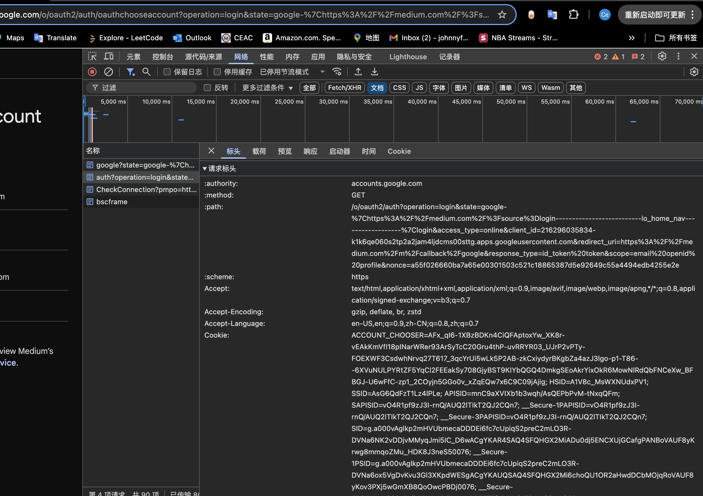

# 2. TLS, PKI, Certificate, Public Key, Private Key, and Signature

## TLS

- A **cryptographic protocol** that ensures secure communication over a network.
- Provides **confidentiality**, **integrity**, and **authentication**.
- Replaces the older SSL (Secure Sockets Layer) protocol.

## PKI

- A **framework** for managing digital keys and certificates.
- Ensures secure exchange of information over the internet.

## Certificate

- A digital file that **binds a public key to an identity**.
- Issued and signed by a Certificate Authority (CA).
- Common format: **X.509**

## Public Key

- Used to **encrypt data** or **verify a digital signature**.
- Part of the public-private key pair.
- Shared openly.

## Private Key

- Used to **decrypt data** or **create a digital signature**.
- Kept secret by the owner.
- If compromised, security is lost.

## Signature

- A **digital signature** ensures that data has not been tampered with and verifies sender authenticity.
- Generated using the sender's **private key** and verified using the **public key**.

---

# 3. 
## Why You Cannot Verify It Without Importing Cert
A self-signed certificate is not trusted by default because it’s not issued by a known Certificate Authority (CA).

## How to Make HTTPS Work (Without Bypassing TLS in Postman)
1. Did not disable SSL verification.
2. Exported the cert.
3. Imported the mycert.crt into macOS Keychain
- Open Keychain Access

- File → Import → mycert.crt

- Set Always Trust

- Restarted Postman

Now Postman can validate the HTTPS API call.

# 4. HTTP Status Codes for Authentication and Authorization Failures

| Status Code | Name         | Used When                                         |
|-------------|--------------|--------------------------------------------------|
| **401**     | Unauthorized | User not authenticated or token is invalid       |
| **403**     | Forbidden    | User is authenticated but lacks permission       |
| **400**     | Bad Request  | Malformed request (e.g., invalid token format)   |

---

# 5. Authentication vs. Authorization and Key Spring Security Components

| Authentication                              | Authorization                                |
----------------------------------------------|----------------------------------------------|
| Verifies **who** the user is                | Determines **what** the user is allowed to do |
| Identity verification                       | Access control                                |
| User logs in                                | User accesses a protected resource            |
| Login with username/password                | Access admin-only endpoint                    |
| Fails with **401 Unauthorized**             | Fails with **403 Forbidden** 

## Key Components in Spring Security

### `UserDetailsService`
- Interface for retrieving user-related data.
- Loads user info by username.
- Used during authentication.

### `AuthenticationProvider`
- Validates the user’s credentials.
- Can support custom logic or connect to external systems (e.g., LDAP).
- Returns an `Authentication` object if successful.


### `AuthenticationManager`
- The main entry point for authentication.
- Delegates to one or more `AuthenticationProvider`s.

### `AuthenticationFilter`
- Intercepts login requests
- Extracts credentials and passes them to `AuthenticationManager`.

---

# 6. HTTP Session

An **HTTP Session** is a server-side storage mechanism used to maintain **stateful information** about a client across multiple HTTP requests.

HTTP itself is **stateless**, meaning each request is independent. Sessions allow web applications to remember users and data **between requests**.

# 7. Cookie

A **cookie** is a small piece of **data stored on the client (browser)** that is sent to the server with every HTTP request.

Cookies help web applications **remember stateful information** across sessions, such as login info, preferences, or tracking IDs.

---

# 8. Compare Session and Cookie


| Feature         | Session (HTTP Session)                 | Cookie                              |
|------------------|------------------------------------------|----------------------------------------|
| **Storage**     | Server-side                            | Client-side (stored in browser)      |
| **Size Limit**  | Large (server memory-based)            | Small (typically ≤ 4KB)              |
| **Security**    | More secure (not exposed to client)    | Less secure (can be seen/edited by JS unless HttpOnly) |
| **Speed**       | Slightly slower (needs server lookup)  | Faster (no server lookup needed)     |
| **Scalability** | Less scalable (server stores data)     | More scalable (stateless)            |
| **Usage**       | Stores user objects, login info        | Stores session ID, preferences       |
| **Expires**     | Configured in server or user logout    | Controlled via expiry in header      |
| **Tampering**   | Hard to tamper                         | Can be tampered if not protected 

---
# 9. Google SSO
### Step 1: User Clicks "Login with Google"
- Redirects to Google's OAuth 2.0 authorization endpoint.

### Step 2: Google Prompts for Login/Consent
- User logs into Google (if not already) and grants permissions.

### Step 3: Authorization Code Sent Back
- Google redirects back to the third-party site with a **code** in the URL:
  ```
  https://client-app.com/oauth2/callback?code=XYZ123
  ```

### Step 4: App Exchanges Code for Tokens
- Backend sends a POST request to Google's token endpoint:
  ```
  POST https://oauth2.googleapis.com/token
  ```
  With:
  - Client ID and Secret
  - Auth code
  - Redirect URI

- Google returns:
  - `access_token`
  - `id_token` (contains user info)
  - `refresh_token` (optional)

### Step 5: App Uses `id_token` to Get User Info
- The app verifies the `id_token` JWT and logs in the user.    



# 10. Session and Cookie

## Using Cookies

Cookies store small pieces of data **on the client-side** and are sent with every HTTP request.

### Example: Set and Read Cookie in Spring Boot

#### Set Cookie
```java
@GetMapping("/set-cookie")
public ResponseEntity<String> setCookie(HttpServletResponse response) {
    Cookie cookie = new Cookie("username", "admin");
    cookie.setMaxAge(3600);
    cookie.setHttpOnly(true); 
    response.addCookie(cookie);
    return ResponseEntity.ok("Cookie set");
}
```

#### Read Cookie
```java
@GetMapping("/get-cookie")
public String getCookie(@CookieValue("username") String username) {
    return "Welcome back, " + username;
}
```
## Using HTTP Session

Sessions store data **on the server-side**, and a session ID is tracked using a cookie (like `JSESSIONID`).

### Example: Store and Access Session Data

#### Set Session Attribute
```java
@GetMapping("/login")
public String login(HttpSession session) {
    session.setAttribute("username", "admin");
    return "User logged in";
}
```

#### Get Session Attribute
```java
@GetMapping("/profile")
public String profile(HttpSession session) {
    String username = (String) session.getAttribute("username");
    return "Hello, " + username;
}
```

## How They Work Together

1. User logs in → session created → session ID stored in a cookie.
2. Browser sends cookie (`JSESSIONID`) on each request.
3. Server uses session ID to retrieve user info.

---

# 11. Spring Security Filter

The **Spring Security Filter** is a **chain of servlet filters** that intercepts and processes HTTP requests to enforce **authentication, authorization, and security policies**.

## Key Filter: `FilterChainProxy`

- Delegates to a list of **SecurityFilterChain** objects.
- Each `SecurityFilterChain` applies a sequence of filters to matching requests.

## ⚙Common Filters in the Chain

| Filter Class                              | Purpose                                    |
|-------------------------------------------|--------------------------------------------|
| `SecurityContextPersistenceFilter`        | Loads/Saves SecurityContext (session)      |
| `UsernamePasswordAuthenticationFilter`    | Handles login form submission              |
| `BasicAuthenticationFilter`               | Handles HTTP Basic Auth headers            |
| `BearerTokenAuthenticationFilter`         | Handles JWT Bearer Token in headers        |
| `ExceptionTranslationFilter`              | Catches exceptions and sends error response|
| `FilterSecurityInterceptor`               | Final check: enforces access control       |
| `CsrfFilter`                              | Validates CSRF tokens                      |

---

# 12. Bearer Token and How JWT Works

## What is a Bearer Token?

A **Bearer Token** is a security token that gives the "bearer" (whoever has it) **access to a protected resource**. It is usually passed in the HTTP `Authorization` header.

### Format:
```
Authorization: Bearer <token>
```

- Stateless: No session is stored on the server.
- The token itself contains all necessary information.


## How JWT Authentication Works

1. User logs in with credentials.
2. Server validates and generates a JWT.
3. JWT is returned to the client and stored.
4. Client includes token in `Authorization` header:
   ```
   Authorization: Bearer <jwt>
   ```
5. Server verifies the token on every request (signature + expiry).

---

# 13. How Do We Store Sensitive User Information in DB?

## Best Practices for Storing Passwords

### 1. **Hash the Password**

- Use **strong, one-way hashing algorithms**.
- Never store raw passwords.

#### Example in Spring Security:
```java
@Bean
public PasswordEncoder passwordEncoder() {
    return new BCryptPasswordEncoder();
}
```

#### Store Hashed Value in DB:
```sql
username | password
---------|--------------------------------------------------
alice    | $2a$10$Vj2BZzv3ZpZ9xZDFk8... (BCrypt hash)
```

## Storing Credit Card Info
1. **Encrypt** data using strong symmetric encryption (e.g., AES-256).
2. Use a secure **key vault** (e.g., AWS KMS, HashiCorp Vault) to store keys.
3. Enable **auditing**, **access control**, and **tokenization**.

#### Example (Spring Boot AES):
```java
Cipher cipher = Cipher.getInstance("AES/CBC/PKCS5Padding");
SecretKeySpec keySpec = new SecretKeySpec(keyBytes, "AES");
cipher.init(Cipher.ENCRYPT_MODE, keySpec);
byte[] encrypted = cipher.doFinal(cardNumber.getBytes());
```

## 14. UserDetailsService, AuthenticationProvider, AuthenticationManager, AuthenticationFilter

1. `AuthenticationFilter` intercepts a login request.
2. It passes credentials to `AuthenticationManager`.
3. `AuthenticationManager` delegates to `AuthenticationProvider`.
4. `AuthenticationProvider` uses `UserDetailsService` to load user and validate credentials.
5. If valid, an `Authentication` object is returned and stored in the `SecurityContext`.

| Component               | Responsibility                              | Related To                    |
|-------------------------|----------------------------------------------|--------------------------------|
| `UserDetailsService`     | Loads user details                          | Data access (DB, memory)       |
| `AuthenticationProvider` | Verifies credentials                        | Business/auth logic            |
| `AuthenticationManager`  | Coordinates auth process                    | Security config/core engine    |
| `AuthenticationFilter`   | Triggers authentication from HTTP requests  | Web layer / HTTP requests      |

# 15. What Is the Disadvantage of Session? How to Overcome It?

## Disadvantages of Using HTTP Session

### **Scalability Issues**
- Sessions are stored **server-side**, usually in memory.
- In a distributed system (multi-server), sessions do not persist across nodes.
- Requires **sticky sessions** or external session storage.

### **Memory Consumption**
- Each active session consumes memory.
- Too many sessions can overload server memory (DOS risk).

### **Complexity in Load Balancing**
- Requires session replication or central store for consistency across nodes.
- Adds operational overhead and complexity.

### **Security Risks**
- Session IDs can be hijacked if not transmitted securely.
- Must be managed properly (e.g., `HttpOnly`, `Secure`, CSRF protection).

### **Not Stateless**
- Breaks REST principle of statelessness.
- Makes caching and scaling harder.

## How to Overcome Session Disadvantages

### 1. Use **Stateless Authentication** with JWT

- Use **JSON Web Tokens (JWT)** instead of server-side sessions.
- Token is stored on client-side and sent in every request (Bearer token).
- No need for session memory on the server.

#### Benefits:
- Fully stateless.
- Scales easily (suitable for microservices).
- Works well with CDNs and load balancers.

### 2. Use External Session Storage

- Use centralized stores like:
  - **Redis**
  - **Memcached**
- Session replication across nodes enables clustering.

#### Spring Boot example:
```properties
spring.session.store-type=redis
```

### 3. Secure Session Management Practices

- Use **HTTPS** for all communication.
- Enable `HttpOnly`, `Secure`, and `SameSite` on cookies.
- Configure reasonable **session timeout**:
  ```properties
  server.servlet.session.timeout=15m
  ```

---

# 16. How to Get Value from `application.properties` in Spring Security?

| Method                      | Use Case                                        |
|-----------------------------|-------------------------------------------------|
| `@Value`                    | Simple key-value injections                     |
| `@ConfigurationProperties`  | Grouped, structured configuration               |
| `Environment.getProperty()` | Dynamic or programmatic access to properties   |

# 17. Role of `configure(HttpSecurity http)` and `configure(AuthenticationManagerBuilder auth)`

## `configure(HttpSecurity http)`

### Purpose:
Defines **authorization rules**, form login, CSRF, session, CORS, and filter chains.

### Where It's Used:
Overrides `configure` method in a `WebSecurityConfigurerAdapter`.

### Example:
```java
@Override
protected void configure(HttpSecurity http) throws Exception {
    http
        .csrf().disable()
        .authorizeRequests()
            .antMatchers("/admin/**").hasRole("ADMIN")
            .antMatchers("/api/**").authenticated()
            .anyRequest().permitAll()
        .and()
        .formLogin()
        .and()
        .httpBasic();
}
```

### Key Features Configurable:
- URL access rules (`authorizeRequests`)
- Login/logout configuration
- Exception handling
- CSRF protection
- HTTPS enforcement
- Security filter chain behavior

## `configure(AuthenticationManagerBuilder auth)`

### Purpose:
Sets up the **authentication mechanism**, including user credentials, roles, and custom authentication providers.

### Where It's Used:
Also part of your security config class to wire up authentication sources (in-memory, DB, LDAP, etc.)

### Example:
```java
@Override
protected void configure(AuthenticationManagerBuilder auth) throws Exception {
    auth.inMemoryAuthentication()
        .withUser("admin").password("{noop}admin123").roles("ADMIN")
        .and()
        .withUser("user").password("{noop}user123").roles("USER");
}
```

---

# 19. Best Practices to Securely Store Secrets in Applications

### **Never Hardcode Secrets in Code** 
Bad practice:
```java
String apiKey = "hardcoded-secret-key";
```
Instead: Load from environment or secure vault.

### **Use Environment Variables**
Store secrets in environment variables, then read them using:
```java
@Value("${DB_PASSWORD}")
private String dbPassword;
```

### **Use Spring’s Externalized Configuration**
Spring Boot supports:
- `application.properties`
- `application.yml`
- Profile-specific files (`application-prod.yml`)
- Encrypted values (with tools like Jasypt)

### **Encrypt Secrets at Rest**
Use tools like:
- **Jasypt**: Encrypt properties in files.
- **AWS KMS**, **Azure Key Vault**, **HashiCorp Vault** for enterprise-grade encryption.

### **Use Secret Management Tools**
Instead of storing secrets in files, use dedicated systems:
- **HashiCorp Vault**
- **AWS Secrets Manager**
- **GCP Secret Manager**
- **Azure Key Vault**

### **Avoid Committing Secrets to Git**
Use `.gitignore`, Git hooks, or GitHub secret scanning tools to prevent accidental commits.

### **Use Least Privilege Access**
Only expose secrets to services/users that **absolutely need them**, using principle of least privilege.

---
