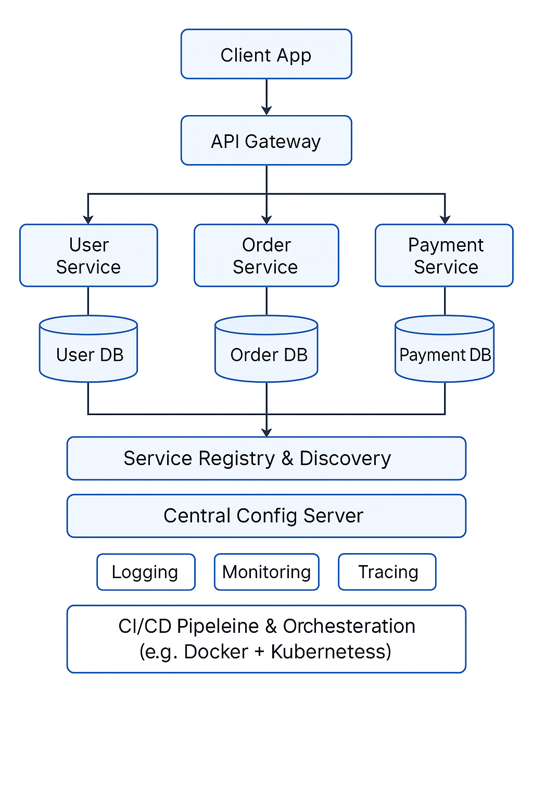

# 1. list all of the new annotations you learned to your annotations.md

# 2. Explain monolithic architecture, service oriented architecture and Micro service architecture.

##### Monolithic Architecture:

A single unified structure where all components of an app are packed together and run at once. Components are tightly coupled and not very scalable.

A typical example is a MVP by early-stage startups. It is easy to develop quickly by a small team, but is difficult to maintain.

##### Service-oriented architecture:

A design style where the application is divided into separate services that communicate over a network, often using a centralized enterprise service bus (ESB). Services are reusable and loosely coupled. Communications are mainly through XML-heavy protocals so it is usually slow.

A typical example is a banking system where different services communicate through a central bus.

##### Microservices architecture:

An architectural style where the application is broken into small, independently deployable services, each with its own database and functionality. Communication is usually through lightweight protocols like RESST or gRPC.

Most modern big companies have this architecture.

| Feature                | Monolithic           | SOA                    | Microservices            |
| ---------------------- | -------------------- | ---------------------- | ------------------------ |
| Deployment             | Single unit          | Multiple services      | Independent services     |
| Scalability            | Whole app            | Per service            | Fine-grained             |
| Coupling               | Tightly coupled      | Loosely coupled        | Highly decoupled         |
| Communication          | In-process calls     | SOAP/XML via ESB       | REST/gRPC, message queue |
| Tech Stack Flexibility | Limited              | Moderate               | High                     |
| Best Use Case          | Small to medium apps | Enterprise integration | Large, scalable systems  |
| Maintenance            | Can get complex      | Moderate complexity    | Complex but modular      |

# 3. Document the microservice architeture and core components

| Component                        | Description                                                              | Example Technologies                        |
| -------------------------------- | ------------------------------------------------------------------------ | ------------------------------------------- |
| API Gateway                      | Entry point for clients; routes requests, handles auth and rate limiting | NGINX, Kong, Spring Cloud Gateway           |
| Service Registry & Discovery     | Tracks available service instances for dynamic routing                   | Eureka, Consul, Zookeeper                   |
| Configuration Server             | Centralized configuration management for services                        | Spring Cloud Config, HashiCorp Vault        |
| Individual Microservices         | Business-focused, independently deployable services                      | Spring Boot, Express.js, FastAPI            |
| Inter-Service Communication      | How services talk to each other (sync or async)                          | REST, gRPC, RabbitMQ, Apache Kafka          |
| Database per Service             | Independent database for each microservice                               | MySQL, MongoDB, PostgreSQL, Redis           |
| Load Balancer                    | Distributes requests across service instances                            | HAProxy, Envoy, Kubernetes Ingress          |
| Circuit Breaker / Resilience     | Prevents failure cascades, fallback behavior                             | Resilience4j, Hystrix, Istio                |
| Logging                          | Captures logs from distributed services                                  | ELK Stack (Elasticsearch, Logstash, Kibana) |
| Monitoring                       | Tracks metrics like CPU, memory, error rate                              | Prometheus, Grafana, Datadog                |
| Tracing                          | Observability across distributed calls                                   | Jaeger, Zipkin, OpenTelemetry               |
| Security                         | Manages auth and access control                                          | OAuth 2.0, JWT, Keycloak                    |
| CI/CD Pipeline                   | Automates build, test, and deployment                                    | Jenkins, GitHub Actions, GitLab CI/CD       |
| Containerization & Orchestration | Packages and manages service deployment                                  | Docker, Kubernetes, Docker Swarm            |



# 4. Explain Resilience patterns? Explain circuit breaker with Spring Cloud Hystrix code example.

**Resilience patterns** help services handle failures gracefully without bringing down the entire system. These patterns ensure reliability, fault tolerance, and graceful degradation.

Key Resilience patterns:

| Pattern                     | Purpose                                                                |
| --------------------------- | ---------------------------------------------------------------------- |
| **Circuit Breaker**   | Prevents a system from repeatedly trying to execute a failing request  |
| **Retry**             | Retries failed requests with a backoff strategy                        |
| **Timeout**           | Sets maximum time a service waits for a response                       |
| **Bulkhead**          | Isolates failures in one service/component to avoid cascading failures |
| **Rate Limiter**      | Controls the number of requests a service can handle over time         |
| **Failover/Fallback** | Provides a backup response or service when the primary fails           |

**Circuit Breaker** protects your service from repeated failures by **“opening”** the circuit when a threshold is reached. It works in 3 states:

* **Closed** : Everything is normal. Requests go through.
* **Open** : Requests are blocked/fail fast because the system is unstable.
* **Half-Open** : After a timeout, a few requests are allowed to test if recovery is possible.

```java
import com.netflix.hystrix.contrib.javanica.annotation.HystrixCommand;
import org.springframework.stereotype.Service;
import org.springframework.web.client.RestTemplate;

@Service
public class OrderService {

    private final RestTemplate restTemplate = new RestTemplate();

    @HystrixCommand(fallbackMethod = "fallbackGetOrder")
    public String getOrder(String orderId) {
        return restTemplate.getForObject("http://order-service/api/orders/" + orderId, String.class);
    }

    public String fallbackGetOrder(String orderId) {
        return "Order Service is currently unavailable. Please try again later.";
    }
}

```

In main:

```java
@SpringBootApplication
@EnableCircuitBreaker
public class Application { ... }
```

In `application.properties`:

```
hystrix.command.default.execution.isolation.thread.timeoutInMilliseconds=2000
```

# 5. Explain load balancing algorithms.

Load balancing algorithms are strategies used to distribute incoming network or application traffic across multiple servers.

| Algorithm                  | How It Works (Intro)                                                                                               | Best For                                         |
| -------------------------- | ------------------------------------------------------------------------------------------------------------------ | ------------------------------------------------ |
| Round Robin                | Distributes requests sequentially across the server pool in a loop.                                                | Even traffic, similar server specs               |
| Least Connections          | Sends the next request to the server with the fewest active connections.                                           | Varying request durations                        |
| Weighted Round Robin       | Like Round Robin, but servers with higher weights get more requests.                                               | Uneven server capacity                           |
| Weighted Least Connections | Like Least Connections, but adjusts for server capacity using weights.                                             | Mix of high/low capacity and long/short requests |
| IP Hash                    | Uses a hash of the client's IP address to determine which server handles the request (ensures consistent routing). | Sticky sessions / client affinity                |
| Resource-based (Custom)    | Uses real-time server metrics (CPU, memory, etc.) to dynamically choose the optimal server.                        | Real-time optimization needs                     |

# 6. Explain API Gateway.

An API Gateway is a single entry point for clients to interact with multiple backend services in a microservices architecture.

| Responsibility                            | Description                                                   |
| ----------------------------------------- | ------------------------------------------------------------- |
| **Routing**                         | Directs incoming requests to the appropriate backend service. |
| **Authentication & Authorization**  | Validates API tokens or credentials before passing requests.  |
| **Rate Limiting / Throttling**      | Prevents abuse by limiting request rate per user or IP.       |
| **Load Balancing**                  | Distributes traffic across multiple service instances.        |
| **Caching**                         | Caches frequent responses to reduce backend load.             |
| **Logging & Monitoring**            | Collects metrics, logs, and traces for observability.         |
| **Request/Response Transformation** | Modifies request/response headers, formats, or bodies.        |
| **CORS Handling**                   | Controls cross-origin resource sharing policies.              |

Common gateways: Kong, Nginx, AWS API Gateway

# 7. Explain service discovery and service registry

Service Discovery: Services automatically locate each other without hardcoded IPs or hostnames. The process is dynamic.

Service Registry: A real-time database of service locations (hostname/IPs + ports). Services register themselves with the registry when they start and deregister when they shut down.

# 8. List Spring Cloud Modules that serve as Microservice components (e.g. Euerka for Service Discovery)

| Spring Cloud Module                    | Microservice Component Role                  | Description                                                                   |
| -------------------------------------- | -------------------------------------------- | ----------------------------------------------------------------------------- |
| **Spring Cloud Eureka**          | 🧭 Service Discovery                         | A service registry for automatic service registration and lookup.             |
| **Spring Cloud Config**          | ⚙️ Centralized Configuration               | Externalized configuration management across environments.                    |
| **Spring Cloud Gateway**         | 🚪 API Gateway                               | Routing, filtering, load balancing, and securing APIs.                        |
| **Spring Cloud Netflix Hystrix** | 💥 Resilience / Circuit Breaker (deprecated) | Prevents cascading failures by breaking connections to failing services.      |
| **Spring Cloud OpenFeign**       | 🔌 Declarative REST Client                   | Simplifies calling other services via annotated interfaces.                   |
| **Spring Cloud LoadBalancer**    | ⚖️ Client-Side Load Balancing              | Replaces Netflix Ribbon (now deprecated); balances requests across instances. |
| **Spring Cloud Sleuth**          | 🕵️ Distributed Tracing                     | Adds trace and span IDs for logs to trace requests across services.           |
| **Spring Cloud Zipkin**          | 📈 Distributed Tracing Visualization         | Collects and displays tracing data (used with Sleuth).                        |
| **Spring Cloud Bus**             | 📣 Event Propagation / Config Refresh        | Broadcasts configuration changes across microservices.                        |
| **Spring Cloud Stream**          | 🧬 Messaging / Event-Driven Architecture     | Abstracts messaging platforms (Kafka, RabbitMQ) for event-based systems.      |
| **Spring Cloud Security**        | 🔐 Authentication / Authorization            | Integrates OAuth2, JWT, etc. for securing service-to-service communication.   |

# 9. Walk through https://microservices.io/patterns/index.html
