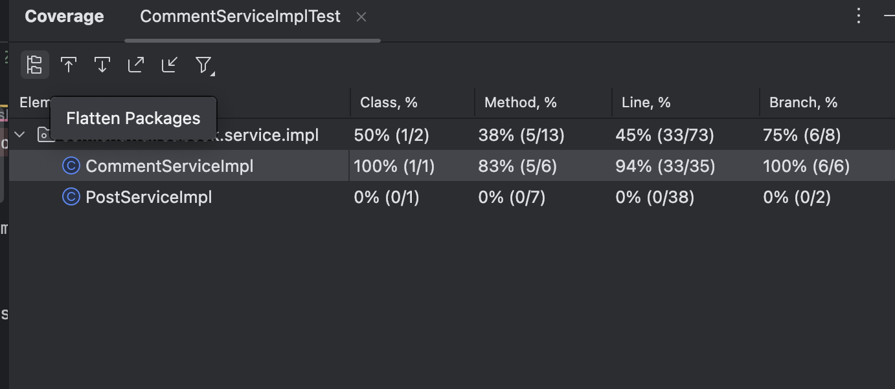

# 1. Explanation and Comparison of Testing Concepts

---
## Testing related:

## 1. Unit Testing

### Definition:
Tests **individual components (e.g., methods or classes)** in isolation.

### Example:
Testing `calculateTotal()` in a `CartService` without involving a database.

### Tools:
- JUnit (Java)
- Mockito (for mocking dependencies)

---

## 2. Functional Testing

### Definition:
Tests the application against its **business requirements**. Focuses on **what** the system does.

### Example:
Verify that a user can successfully **register**, login, and view their profile.

### Tools:
- Selenium
- Postman (for APIs)

---

## 3. Integration Testing

### Definition:
Tests the **interaction between components**, like services and databases.

### Example:
Test that `OrderService` correctly stores data via `OrderRepository`.

### Tools:
- Spring Boot Test
- Testcontainers

---

## 4. Regression Testing

### Definition:
Ensures that **new code changes do not break** existing features.

### Example:
After adding new payment methods, existing credit card payment tests are re-run.

### Tools:
- JUnit/Selenium test suites
- CI/CD auto re-run

---

## 5. Smoke Testing

### Definition:
A **basic check** to verify if the application starts and main functionality works.

### Example:
Run test: "Can the app start and show login page?"

### Tools:
- Manual click-through
- CI/CD basic runbooks

---

## 6. Performance Testing

### Definition:
Tests the **response time, speed, and efficiency** under load.

### Example:
How fast does the API respond when 500 users hit `/login`?

### Tools:
- JMeter
- Gatling

---

## 7. Stress Testing

### Definition:
Tests **system behavior under extreme load or conditions**.

### Example:
Simulate 10,000 concurrent users to check if the server crashes.

### Tools:
- JMeter
- Locust

---

## 8. A/B Testing

### Definition:
Compare **two versions** of a feature to determine which performs better.

### Example:
Version A: Red "Buy Now" button  
Version B: Green "Buy Now" button  
→ Track conversion rate.

### Tools:
- Google Optimize
- LaunchDarkly

---

## 9. End-to-End (E2E) Testing

### Definition:
Tests the **entire flow of an application**, from frontend to backend and DB.

### Example:
User signs up, receives email, logs in, creates a post — all tested in one flow.

### Tools:
- Cypress
- Selenium

---

## 10. User Acceptance Testing (UAT)

### Definition:
Performed by **end users** to verify if the application meets their expectations.

### Example:
Business user tests the new report generation feature before go-live.

### Tools:
- Manual testing
- TestRail for UAT tracking

---

## Environment related:

---

## 1. Development Environment (Dev)

### Purpose:
Used by developers for **active coding, debugging, and unit testing**.

### Characteristics:
- Local machines or isolated dev servers
- Hot reloading, debug logs enabled
- No real users or production data

### Example:
Running the Spring Boot app on `localhost:8080`

---

## 2. QA Environment (Quality Assurance)

### Purpose:
Used by testers to perform **functional, regression, and integration tests**.

### Characteristics:
- Similar to production but isolated
- Stable builds from CI pipeline
- Fake/test data is used
- May include mock services or test doubles

### Example:
Testers verify a new feature on `https://qa.myapp.com`

---

## 3. Pre-Production / Staging Environment

### Purpose:
Acts as a **mirror of production** to test deployment, performance, and UAT.

### Characteristics:
- Same config, database schema, and integrations as production
- Limited access, stable environment
- May run automated smoke tests or load tests

### Example:
Run final acceptance tests before pushing to `https://myapp.com`

---

## 4. Production Environment (Prod)

### Purpose:
The **live environment** accessed by end users.

### Characteristics:
- High performance, high availability
- Monitored with logging, alerts, observability
- All changes are deployed via CI/CD with approvals

### Example:
Real users visit `https://myapp.com` and interact with live services

---

## 🔁 Summary Table

| Environment   | Purpose                          | Users          | Data Type      |
|---------------|----------------------------------|----------------|----------------|
| Development   | Coding & debugging               | Developers     | Test/Local     |
| QA            | Testing, regression              | QA/Testers     | Test/Fake      |
| Staging       | Final verification, UAT          | QA + Business  | Test/Clone     |
| Production    | Live user interaction            | End Users      | Real           |

# 2. Report

