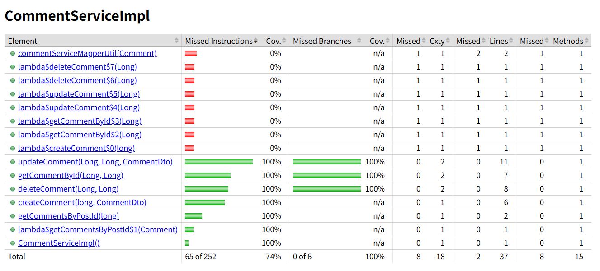

# hw12
### Explain and compare following concepts, provide specific examples when doing comparison:
**Testing related:**  
1. **Unit Testing**
2. **Functional Testing**
3. **Integration Testing**
4. **Regression Testing**
5. **Smoke Testing**
6. **Performance Testing**
7. **Stress Testing**
8. **A/B Testing**
9. **End-to-End Testing**
10. **User Acceptance Testing**

**Environment related:**
1. **Development**
2. **QA (Quality Assurance)**
3. **Pre-prod/Staging**
4. **Production**

**Write unit test for CommentServiceImpl.java: https://github.com/CTYue/springboot-redbook/blob/10_testing/src/main/java/com/chuwa/redbook/service/impl/CommentServiceImpl.java**  
**Try to cover as many lines/branches as possible.**  
**Prove your code coverage using Jacoco Report.**  

Testing related:
1. Unit Testing
    - What: Tests individual functions or methods in isolation.
    - Goal: Verify that each small piece of code works as expected.
    - Example: Testing a calculateTotalPrice() function in a shopping cart module.
2. Functional Testing
    - What: Tests a specific feature or function of the software against requirements.
    - Goal: Ensure the software behaves as intended from the user's perspective.
    - Example: Testing if the "Add to Cart" button properly adds an item.
    - Comparison: Unit testing is code-level and granular, while functional testing is user-level and focuses on the feature as a whole.
3. Integration Testing
    - What: Tests how different modules or services work together.
    - Goal: Ensure components integrate properly.
    - Example: Testing if the payment gateway correctly works with the checkout module.
    - Comparison: Unit testing tests isolated units, while integration testing focuses on interactions between them.
4. Regression Testing
    - What: Retesting existing functionality to ensure new changes haven't broken anything.
    - Goal: Avoid reintroducing old bugs.
    - Example: After upgrading the database schema, retesting the user login flow to ensure it still works.
    - Comparison: Regression testing may include unit, functional, and integration tests, but its purpose is to confirm that existing functionality remains stable.
5. Smoke Testing
    - What: A quick set of basic tests to ensure the application is stable enough for deeper testing.
    - Goal: Validate essential functionality (like a system boot check).
    - Example: Confirming that the login page loads and basic navigation works after a new build.
    - Comparison: Smoke testing is shallow and wide, while other types (like regression) are deep and focused.
6. Performance Testing
    - What: Measures system performance under expected load.
    - Goal: Determine response times, throughput, and resource usage.
    - Example: Checking if your e-commerce app handles 1000 concurrent users during a flash sale.
7. Stress Testing
    - What: Pushes the system beyond normal load to see how it behaves under extreme conditions.
    - Goal: Identify breaking points.
    - Example: Simulating 10,000 users logging in simultaneously to test server crash handling.
    - Comparison: Performance testing checks expected usage; stress testing checks beyond expected usage.
8. A/B Testing
    - What: Compares two versions of a feature to determine which performs better.
    - Goal: Optimize user experience and conversions.
    - Example: Testing two different landing page designs to see which leads to more sign-ups.
    - Comparison: A/B testing is more business/UX-oriented, while others are primarily technical quality checks.
9. End-to-End Testing
    - What: Tests the complete flow of an application from start to finish.
    - Goal: Ensure the whole system works together as expected.
    - Example: A user logs in, adds items to the cart, checks out, and receives a confirmation email.
10. User Acceptance Testing (UAT)
    - What: Final testing performed by end users to confirm the system meets requirements.
    - Goal: Gain client or stakeholder approval before going live.
    - Example: Business users verifying a finance dashboard before release.
    - Comparison: End-to-end testing is by QA to ensure system flow; UAT is by actual users for final approval.

Environment related:
1. Development
    - What: Where developers build and test new features.
    - Characteristics: Unstable, fast iteration, full debugging access.
    - Example: Dev team works on a new login feature locally or on a dev server.
2. QA (Quality Assurance)
    - What: Where testers validate functionality and bugs are reported/fixed.
    - Characteristics: Controlled environment, frequent testing cycles.
    - Example: QA team runs test cases on builds sent by developers.
    - Comparison: Dev is for building; QA is for verifying.
3. Pre-prod/Staging
    - What: Mirrors production as closely as possible.
    - Goal: Final testing before release.
    - Example: Load tests and UAT are run here; A/B test configs are verified.
    - Comparison: QA is for active testing; staging is for near-prod final validation.
4. Production
    - What: Live environment accessed by real users.
    - Characteristics: Highly stable, monitored, rollback-ready.
    - Example: Customers buying products on the real website.

Unit test codes are in "/Coding/CommentServiceImplTest.java"

Jacoco report:
