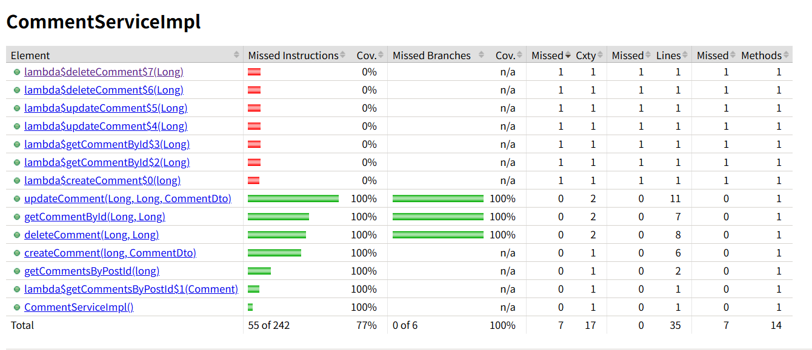

Explain and compare following concepts, provide specific examples when doing comparison:

Testing related:

1. **Unit Testing**

   Unit testing focuses on testing individual components in isolation.

   ```java
   @Test
   public void testCalculateTax() {
       PriceService priceService = new PriceService();
       double taxAmount = priceService.calculateTax(100.0, 10.0);
       assertEquals(10.0, taxAmount, 0.001);
   }
   ```

2. **Functional Testing**

   Verifies that each function works according to requirements.

   ```java
   @SpringBootTest(webEnvironment = SpringBootTest.WebEnvironment.RANDOM_PORT)
   public class UserControllerFunctionalTest {
       @Autowired
       private TestRestTemplate restTemplate;
       
       @Test
       public void testUserRegistration() {
           UserRegistrationRequest request = new UserRegistrationRequest("john@example.com", "password123", "John", "Doe");
           ResponseEntity<UserDTO> response = restTemplate.postForEntity("/api/users/register", request, UserDTO.class);
           
           assertEquals(HttpStatus.CREATED, response.getStatusCode());
           assertNotNull(response.getBody().getId());
           assertEquals("john@example.com", response.getBody().getEmail());
       }
   }
   ```

3. **Integration Testing**

   Tests interactions between different components.

   ```java
   @SpringBootTest
   public class OrderServiceIntegrationTest {
       @Autowired
       private OrderService orderService;
       
       @Autowired
       private PaymentService paymentService;
       
       @Test
       public void testCompleteOrderFlow() {
           Order order = orderService.createOrder(userId, items);
           Payment payment = paymentService.processPayment(order.getId(), paymentDetails);
           
           assertEquals(PaymentStatus.COMPLETED, payment.getStatus());
           Order updatedOrder = orderService.getOrder(order.getId());
           assertEquals(OrderStatus.PAID, updatedOrder.getStatus());
       }
   }
   ```

4. **Regression Testing**

   Ensures new changes don't break existing functionality.

5. **Smoke Testing**

   Quick verification of critical functionality.

   ```java
   @SpringBootTest(webEnvironment = SpringBootTest.WebEnvironment.RANDOM_PORT)
   public class SmokeTest {
       @Autowired
       private TestRestTemplate restTemplate;
       
       @Test
       public void applicationHealthCheck() {
           ResponseEntity<String> response = restTemplate.getForEntity("/actuator/health", String.class);
           assertEquals(HttpStatus.OK, response.getStatusCode());
       }
   }
   ```

6. **Performance Testing**

   Evaluates system performance under load.

7. **Stress Testing**

   Pushes system beyond normal capacity.

8. **A/B Testing**

   Compares two versions to determine which performs better.

9. **End-to-End Testing**

   Tests complete workflows from start to finish.

10. **User Acceptance Testing**

    Tests with actual users to ensure it meets requirements.

 Environment related:

1. **Development**

   Where developers code and test locally.

   ```java
   // application-dev.properties
   spring.datasource.url=jdbc:h2:mem:devdb
   spring.jpa.hibernate.ddl-auto=create-drop
   spring.profiles.active=dev
   logging.level.org.springframework=DEBUG
   feature.new-payment-gateway=true
   ```

2. **QA (Quality Assurance)**

   For systematic testing by QA team.

   ```java
   // application-qa.properties
   spring.datasource.url=jdbc:mysql://qa-db-server:3306/qa_database
   spring.jpa.hibernate.ddl-auto=update
   spring.profiles.active=qa
   logging.level.com.company.app=DEBUG
   feature.new-payment-gateway=true
   mock.external.services=true
   ```

3. **Pre-prod/Staging**

   Final verification before production.

   ```java
   // application-staging.properties
   spring.datasource.url=jdbc:mysql://staging-db-server:3306/staging_database
   spring.jpa.hibernate.ddl-auto=validate
   spring.profiles.active=staging
   logging.level.com.company.app=INFO
   feature.new-payment-gateway=true
   mock.external.services=false
   ```

4. **Production**

   Live environment for end users.

   ```java
   // application-prod.properties
   spring.datasource.url=jdbc:mysql://prod-db-cluster:3306/production_database
   spring.jpa.hibernate.ddl-auto=none
   spring.profiles.active=prod
   logging.level.com.company.app=WARN
   feature.new-payment-gateway=false
   api.rate.limit=1000
   ```

| Testing Type        | Focus                  | Implemented With                | When Used                   |
| ------------------- | ---------------------- | ------------------------------- | --------------------------- |
| Unit Testing        | Single components      | JUnit, Mockito                  | During development          |
| Integration Testing | Component interactions | Spring Boot Test                | After unit tests            |
| Functional Testing  | Feature requirements   | TestRestTemplate, WebTestClient | After component completion  |
| Regression Testing  | Existing functionality | Automated test suites           | After each feature addition |
| Smoke Testing       | Basic functionality    | Simple tests with Spring Boot   | After deployment            |
| Performance Testing | System responsiveness  | JMeter, Gatling                 | Before release              |
| Stress Testing      | System limits          | JMeter, Gatling                 | Before high-traffic events  |
| A/B Testing         | Feature variants       | Feature flags, analytics tools  | In production               |
| End-to-End Testing  | Complete workflows     | Selenium, Cucumber              | Before release              |
| UAT                 | Real-world use         | Manual testing                  | Before final approval       |

| Environment | Purpose            | Configuration                  | Example                 |
| ----------- | ------------------ | ------------------------------ | ----------------------- |
| Development | Local coding       | application-dev.properties     | Developer machines      |
| QA          | Testing            | application-qa.properties      | Test servers            |
| Staging     | Final verification | application-staging.properties | Pre-production servers  |
| Production  | Live use           | application-prod.properties    | Customer-facing servers |

Write unit test for CommentServiceImpl.java:  <https://github.com/CTYue/springboot-redbook/blob/10_testing/src/main/java/com/chuwa/redbook/service/impl/CommentServiceImpl.java>

Try to cover as many lines/branches as possible.

Prove your code coverage using a JaCoCo report. 



