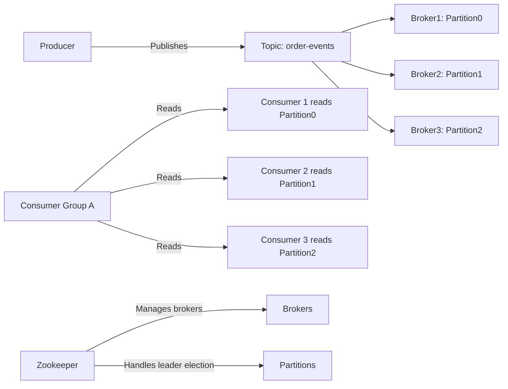
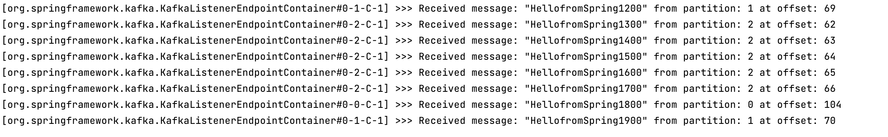
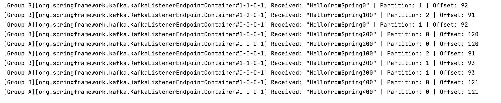

# Explain following concepts, and how they coordinate with each other:

### Topic

- a "channel" or "category" where Kafka messages are published.

### Partition

- Each topic is split into multiple partitions
- A partition is a log (an ordered, immutable sequence) where messages are appended.
- This allows horizontal scaling
- Each partition is ordered individually. There is no total ordering over the topic.

### Broker

- A Kafka server. Multiple brokers on a Kafka cluster.
- Stores partition and handles client requests.
- Each broker has an ID, and topics' partitions are spread across brokers.

### Consumer group

- A collection of consumers working together, good for horizontal scaling
- Only one consumer from a group <-> a partition of a topic

### Producer

- Sends messages into topics
- Decides which partition a message will be sent to (round-robin, based on key ...)

### Offset

- Position of a message within a partition, a unique key
- Consumers tracks offsets to know what has been read
- Can be committed (saved) so consumers can restart safely without reprocessing old messages.

### Zookeeper

- manages and coordinates the Kafka brokers
- Responsible for:
  * **Broker metadata** (who is alive)
  * **Leader election** for partitions (which broker manages writes for a partition)
  * **Cluster configuration management**
- Replaced by KRaft in newer versions of Kafka

# 1. Given N (number of partitions) and M (number of consumers,) what will happen when N>=M and N<M respectively?

### Case 1: N ≥ M

- Each consumer will get at least one partition.
- Some consumers might get multiple partitions if N > M (because all partitions must be assigned).
- No partition will be left unassigned.
- All consumers are active — no consumer will be idle.

### Case 2: N < M

- Each partition can be assigned to only one consumer — Kafka does NOT allow multiple consumers to read the same partition within the same consumer group.
- Therefore, some consumers will be completely idle (i.e., not assigned any partition).
- All partitions are still assigned, but not all consumers are utilized.

# 2. Explain how brokers work with topics?

Topics are broken into different partitions and these partitions are spread across multiple brokers. Each partition only belongs to exactly one leader broker at a time. Each broker can host multiple partitions across different topics.

# 3. Are messages pushed to consumers or consumers pull messages from topics?

Consumers pull messages from brokers of specific topics.

# 4. How to avoid duplicate consumption of messages?

Kafka gaurantees **at-least-once** delivery. Therefore, consumers should ensure idempotency. Offsets are committed only after successful processing. Consumers can try using methods like unique ids to identify the messages.

# 5. What will happen if some consumers are down in a consumer group? Will data loss occur? Why?

Rebalance happens and other consumers will take over down consumers' partitions. There will be no data loss as data are all stored with brokers.

# 6. What will happen if an entire consumer group is down? Will data loss occur? Why?

Message processing will pause in this case until any consumer comes back online. Normally no data loss will occur. However, if no consumer got back online until retention time has reached, Kafka will delete messages.

# 7. Explain consumer lag and how to resolve it?

- Consumer lag is the number of messages the consumer has not yet processed.
- Lag = Last Produced Offset - Last Committed (or Read) Offset
- If the lag keeps accumulate, retention threshold will eventually be triggered
- To resolve it:

| Method                          | What You Do                                                                                                                          |
| ------------------------------- | ------------------------------------------------------------------------------------------------------------------------------------ |
| 1. Scale out consumers          | Add more consumers to the consumer group (horizontal scaling).                                                                       |
| 2. Optimize consumer processing | Make your message handling code faster (less blocking, async processing, batch DB writes, etc.).                                     |
| 3. Increase partition count     | More partitions = more consumers can be added (parallelism). But**requires topic re-creation**unless using special techniques. |
| 4. Tune consumer fetch settings | Increase `fetch.min.bytes`, `fetch.max.bytes`, or `max.poll.records` so consumers pull more messages per poll.                 |
| 5. Monitor and alert early      | Set up lag monitoring (using Prometheus, Kafka Manager, or Burrow) to catch lag early before it grows too big.                       |
| 6. Investigate broker issues    | Check if network or broker-side problems are slowing fetch responses.                                                                |

# 8. Explain how Kafka tracks message delivery?

Kafka does NOT "track" each message individually like an acknowledgment list. Instead, Kafka uses offsets to track how far a consumer has read.

If consumer fails before committing offset, Kafka assumes it did NOT finish processing the messages.

# 9. Compare Kafka vs RabbitMQ, compare messaging frameworks vs MySql (Why Kafka)?

| Aspect                        | Kafka                                                                          | RabbitMQ                                                                  |
| ----------------------------- | ------------------------------------------------------------------------------ | ------------------------------------------------------------------------- |
| **Type**                | Distributed streaming platform                                                 | Traditional message broker (queue-based)                                  |
| **Messaging Model**     | **Publish-Subscribe (Topics/Partitions)**                                | **Queue-based (Queue/Exchange/Binding)**                            |
| **Data Storage**        | Persistent by default (configurable retention)                                 | Short-term; messages often deleted after being consumed                   |
| **Ordering Guarantees** | Per partition ordering guaranteed                                              | FIFO queues possible (but harder with scaling)                            |
| **Message Retention**   | Based on**time** or **size** policies (independent of consumption) | Messages are deleted once acknowledged by consumers                       |
| **Consumer Model**      | Consumers**pull** messages (offset-tracking)                             | Broker**pushes** messages to consumers                              |
| **High Throughput**     | Very high (designed for streaming, event sourcing)                             | Good but lower compared to Kafka under heavy load                         |
| **Scaling**             | Horizontally scalable across brokers and partitions                            | Harder to scale across nodes at massive scale                             |
| **Use Cases**           | Event streaming, big data pipelines, microservices event bus                   | Reliable task queues, background job processing, RPC                      |
| **Latency**             | Higher (because of disk persistence, pull model)                               | Lower latency (good for real-time task distribution)                      |
| **Built-in Replay**     | Yes (because of stored offsets)                                                | No (messages gone once acknowledged unless specially configured)          |
| **Typical Setup**       | Heavy production use (event-driven architectures, real-time analytics)         | Simpler microservices needing task queue (email sending, background jobs) |

| Aspect                    | Kafka                                                                 | MySQL (for messaging)                                                  |
| ------------------------- | --------------------------------------------------------------------- | ---------------------------------------------------------------------- |
| **Purpose**         | Purpose-built for streaming/messaging                                 | General-purpose database, not messaging                                |
| **Performance**     | Extremely fast appends, optimized for logs                            | High overhead for inserts/queries, not designed for event delivery     |
| **Scaling**         | Horizontal scaling via partitions                                     | Hard to scale MySQL easily (especially for millions of small messages) |
| **Data Retention**  | Native (store events for days/months/forever)                         | Would need custom cleanup jobs (complex and risky)                     |
| **Consumer model**  | Multiple consumers can independently read at their own pace (offsets) | Harder — clients would need complicated polling + tracking logic      |
| **Replayability**   | Easy (just reset offsets)                                             | Complicated (need manual re-query logic)                               |
| **Fault-tolerance** | Replicated logs, leader election                                      | DB replication exists, but not optimized for streaming models          |
| **Throughput**      | Millions of events/sec                                                | Limited by transactional DB overhead                                   |
| **Decoupling**      | Producers and consumers fully decoupled                               | Tightly coupled to DB schema and queries                               |

### Kafka = Bullet train designed for rapid, reliable long-distance travel.

### RabbitMQ = Small delivery van, fast for short hops.

### MySQL = Filing cabinet — great for storage, not for transportation.

# 10. On top of https://github.com/CTYue/Spring-Producer-Consumer

- )Write your consumer application with Spring Kafka dependency, set up 3 consumers in a singleconsumer group. Prove message consumption with screenshots.
  
- Increase number of consumers in a single consumer group, observe what happens, explain your observation.
  I set the number to 5. Only three consumers are actually consuming messages from partitions. Other consumers just idle.
- Create multiple consumer groups using Spring Kafka, set up different numbers of consumers within each group, observe consumer offset. Prove that each consumer group is consuming messages on topics as expected, take screenshots of offset records.
  
  We can observe that group A only have one consumer but it receives all the messages from all partitions. Group B has 3 consumers and each independently handles one partition.
