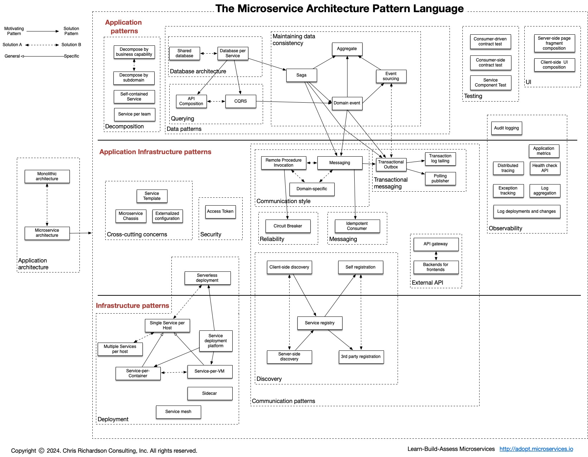

# HW13 Microservice
## 1. list all of the new annotations you learned to your annotations.md
- Updated on elena_xu/main

## 2. Explain monolithic architecture, service oriented architecture and Microservice architecture.
### Monolithic architecture
- Structure
  - All code (frontend, backend, db logic) lives in the one big codebase 
  - Deploy it as a single unit (one `.jar`, `.war`)
- Pros
  - Easier to develop and test when small.
  - Simple to deploy (just one app).
- Cons
  - Hard to scale parts independently 
  - One bug can crash the entire system.
  - Slows down large teams (merge conflicts, long CI pipelines).
  - Difficult to adopt new tech without refactoring everything.

### Service-Oriented Architecture (SOA)
- Structure
  - Services are split by business function (order, billing, payment).
  - Communicate over SOAP/XML or HTTP with a shared Enterprise Service Bus (ESB).
- Example:
  - An e-commerce platform where catalog, cart, and payment systems are separate services but tightly managed by one centralized system.
- Pros
  - Better separation of concerns.
  - Services can evolve independently to some extent.
- Cons
  - Heavyweight communication (SOAP, WSDL, ESB).
  - Often still has a lot of tight coupling.
  - Shared databases or platforms lead to hidden dependencies.

### Microservices Arthitecture
- Structure
  - Each service has it's own db, run, deploy, and scale independently, uses Service Registry/REST/gRPC/Message Queues for communication.
    - Find service: Service Registry (DNS, Eureka)
    - Talking to services: REST, gRPC, Thrift
    - Asynchronous events: Kafka, RabbitMQ, etc.
    - Routing external calls: API Gateway (Zuul, Gateway)
  - Pros
    - High scalability and resilience.
    - Teams can work on different services without stepping on each other.
    - Easier to adopt different tech per service (Node.js for one, Java for another).
  - Cons
    - Complex to set up: needs orchestration, service discovery, monitoring, devops, etc.
    - Data consistency is harder (eventual consistency).
    - Debugging across services can be painful.

## 3. Document the microservice architeture and core components
Microservice Architecture is a software design where apppliatoin is split into independent services — each handling a specific business function, deployed and scaled independently.

Take Linkedin as an example:
- User service
- Connection service
- Feed service
- Notification service

### Core components
- Services: Business logic, independently deployable units (e.g., UserService, AuthService)
- Service Discovery: Dynamically tracks where services are running (e.g., Eureka, Consul, Kubernetes DNS)
- API Gateway: Entry point for clients; routes, authenticates, rate-limits (e.g., Spring Cloud Gateway, Zuul, Kong)
- Inter-Service Communication: REST (sync), gRPC (fast binary), Kafka/RabbitMQ (async messaging)
- DB per Service: Each service owns its data to avoid tight coupling (e.g., UserService has its own PostgreSQL)
- Configuration Server: Centralized config management (e.g., Spring Cloud Config, Consul Key/Value Store)
- Security: Handles auth (JWT, OAuth2), HTTPS, and role-based access across services
- Monitoring / Logging: Tracks health, logs, errors (e.g., Prometheus, Grafana, ELK Stack, Zipkin)
- CI/CD Pipelines: Automates testing and deployment for each service (e.g., GitHub Actions, Jenkins)
- Containerization & Orchestration: Packages services (Docker) and manages them (Kubernetes, ECS)

### Work Flow
```pgsql
                         ┌─────────────────────┐
                         │     Clients         │
                         │ (Web / Mobile App)  │
                         └─────────▲───────────┘
                                   │
                           ┌───────┴────────┐
                           │   API Gateway  │
                           └───────▲────────┘
         ┌─────────────────────────┼─────────────────────────┐
         ▼                         ▼                         ▼
 ┌─────────────┐          ┌──────────────┐          ┌────────────────┐
 │ User Service│ ←REST→→→ │ Feed Service │ ←REST→→→ │ Notification Svc│
 └────┬────────┘          └──────┬───────┘          └──────┬─────────┘
      │                         Kafka                      │
      ▼                                                 Kafka
┌─────────────┐                                       ┌─────────────────┐
│User Database│                                       │Notification DB  │
└─────────────┘                                       └─────────────────┘

         ▲                                                  ▲
         │                                                  │
  ┌─────────────┐                                    ┌──────────────┐
  │Service Reg. │                                    │ Config Server│
  └─────────────┘                                    └──────────────┘
```
### Good Practices
- Isolate service data (DB per svc); not Sharing databases across services
- Use service discovery; not Using hardcoding service URLs
- Automate testing + CI/CD; not	Manual deployments
- Monitor and log everything; not	Blind trust in prod
- Fail fast, retry smart (circuit breaker); not Blind retry loops

## 4. Explain Resilience patterns? Explain circuit breaker with Spring Cloud Hystrix code example.
###  Resilience Patterns in Microservices
These are design patterns that help systems stay responsive and gracefully handle failures:

| **Pattern**       | **Purpose**                                                                 |
|-------------------|------------------------------------------------------------------------------|
| **Retry**         | Try again a few times before giving up                                       |
| **Circuit Breaker**| Stop calling a failing service temporarily (like tripping a fuse)           |
| **Fallback**      | Provide a backup response or default behavior when a service fails          |
| **Bulkhead**      | Isolate failures to one part of the system (like watertight ship rooms)     |
| **Rate Limiter**  | Prevent overloading a service                                                |
| **Timeout**       | Don’t wait forever — set a time limit for responses                         |
| **Cache**         | Use saved responses if the real service is too slow or unavailable          |

## 5. Explain load balancing algorithms.
Load balancing is the process of distributing incoming traffic across multiple backend servers to:
- Avoid overloading one server
- Improve response time
- Maximize system availability and fault tolerance

| Algorithm             | How It Works                                                             | When to Use                                                  |
|-----------------------|--------------------------------------------------------------------------|---------------------------------------------------------------|
| Round Robin           | Each request goes to the next server in a circular order                | Good when servers are equally powerful                        |
| Weighted Round Robin  | Like Round Robin, but some servers get more traffic (based on weight)   | When some servers are more powerful                           |
| Least Connections     | Chooses the server with the fewest active connections                   | Great for long-lived connections like WebSockets              |
| Least Response Time   | Chooses the server that responds fastest (tracked over time)            | Best for latency-sensitive apps                               |
| IP Hash               | Uses client IP to decide which server to route to                       | Good for session stickiness (same user always gets same server) |
| Custom / Predictive   | Uses AI/metrics to make smarter routing decisions                       | When you're operating at large scale (e.g., Netflix, Amazon)  |
| Failover              | Routes to next server only if the first one is down                     | Simple HA setup (not really balancing)                        |
| Random                | Just randomly picks a server                                             | Surprisingly effective in small setups                        |

## 6. Explain API Gateway.
An API Gateway is the entry point to route all client requests to a system of microservices. Act like traffic controller, security guard and tranlator
### Common Functions
- Routing: forward request to service
- Authentication: verify tokens and user identity
- Rate Limiting: prevents traffic floods
- Load Balancing: distrubites load across services
- Catching: store common respoinses to speed things up
- Logging/Monitoring: tracks request/response for debugging and analytics 
- Protol traslation: eg HTTP -> gRPC

### Examples
- AWS API Gateway
- NGINX

## 7. Explain service discovery and service registry
- service discovery: The automatic process where a service finds the network location (IP, port) of another service it needs to talk to.
- service registry: A database (or directory) that stores service instances and their addresses, like a phonebook for services.
- relationship: Service Discovery needs a Service Registry to work. Without the registry, services have no clue where their buddies are.
- why we need both of them? 
  - services are dynamic
  - IPs change in cloud and kubernetes
  - this help avoid hardcoding service addresses
- work flow
  - service A starts -> registers itself with service registry.
  - when service B asks registry to find service A
  - registry responds with serve A's location
  - service B connnets to service A
- tools realize
  - Eureka
  - zookeeper
  - kubernets internal DNS

## 8. List Spring Cloud Modules that serve as Microservice components (e.g. Euerka for Service Discovery)
Spring Cloud Modules are individual libraries inside the Spring Cloud ecosystem that solve specific problems commonly faced when building and operating microservices.
- Eureka: service discovery
- Gateway: api gateway
- Config: centralized configuration management
- OpenFeign: Declarative HTTP client for inter-service calls	
- LoadBalancer: Client-side load balancing for service-to-service calls
- Circuit Breaker: Fault tolerance with circuit breakers (based on Resilience4j)
- Sleuth: Distributed tracing (tags requests across services)
- Stream: Event-driven microservices via messaging systems (Kafka, RabbitMQ)
- Bus: Propagates configuration changes/events across services
- Security: Authentication and Authorization across services
- Zoomkeeper/Consul: Alternative Service Discovery with other tools (Zookeeper, Consul)

### Workflow
[Clients] → [Spring Cloud Gateway] → [Services (Registered via Eureka)] → [Inter-service calls via OpenFeign + LoadBalancer] → [Config managed by Spring Cloud Config] → [Resilience via Circuit Breaker] → [Tracing via Sleuth] → [Messaging via Stream]

## 9. Walk through https://microservices.io/patterns/index.html

