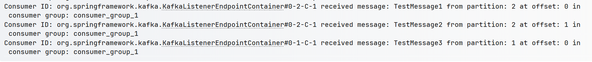
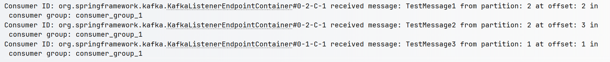
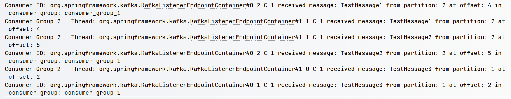
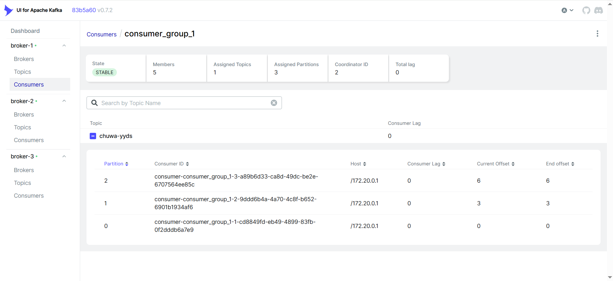
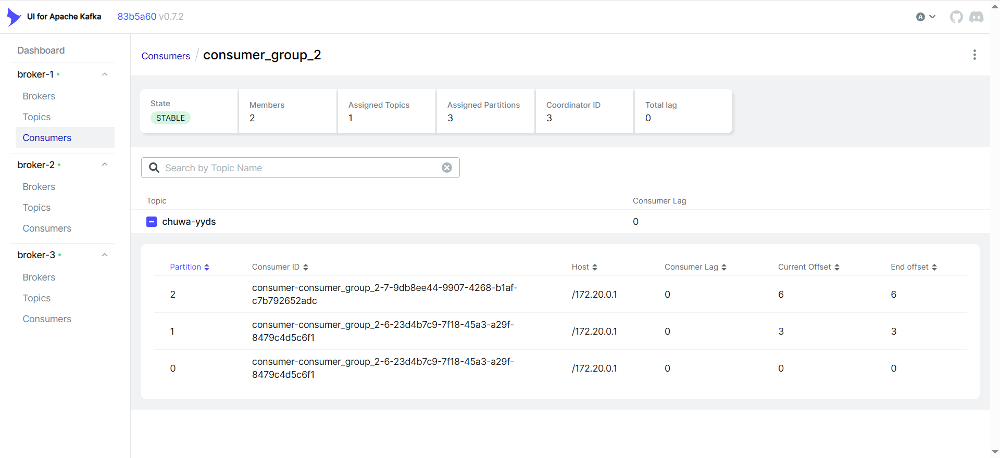
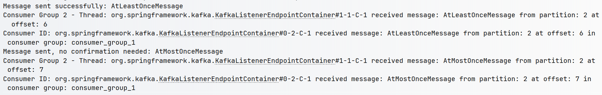
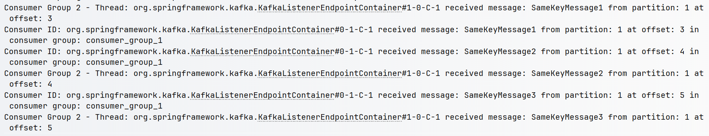

Explain following concepts, and how they coordinate with each other: 

- **Topic**

  A topic is a category or feed name to which records are published. Topics are partitioned and replicated across multiple brokers for scalability and fault tolerance.

- **Partition**

  A topic is divided into partitions, which are ordered, immutable sequences of records. Each partition has a unique ID and can be hosted on different brokers, allowing parallel processing and increased throughput.

- **Broker**

  A broker is a server in the Kafka cluster that stores data and serves client requests. Brokers manage partitions and handle read/write operations. Multiple brokers work together to form a Kafka cluster.

- **Consumer group**

  A consumer group is a set of consumers that cooperatively consume messages from topics. Each partition is consumed by exactly one consumer within a group, enabling parallel processing and load balancing.

- **Producer**

  A producer publishes records to topics. Producers can choose which partition to send records to (using a key or round-robin) and can be configured for different reliability guarantees.

- **Offset**

  An offset is a sequential ID assigned to each message within a partition. Consumers use offsets to track their position in the partition, allowing them to resume from where they left off after failures.

- **Zookeeper**

  Zookeeper (though being phased out in newer versions) manages the Kafka cluster by maintaining configuration information, providing distributed synchronization, and handling broker failure detection and leader election.


**How They Coordinate:**

1. Producers send records to topic partitions on brokers
2. Brokers store these records with unique offsets
3. Consumers in consumer groups read from assigned partitions
4. Each consumer tracks its position using offsets
5. Zookeeper coordinates the entire system by managing broker and consumer metadata


Answer following questions:

1. Given **N** (number of partitions) and **M** (number of consumers), what will happen when **N ≥ M** and when **N < M**?

   **When N ≥ M** (Partitions ≥ Consumers):

   - Each consumer will handle one or more partitions
   - Distribution is balanced among available consumers
   - Example: With 6 partitions and 3 consumers, each consumer handles 2 partitions

   **When N < M** (Partitions < Consumers):

   - Some consumers will remain idle with no partitions assigned

   - Maximum parallelism is limited by the number of partitions

   - Example: With 3 partitions and 6 consumers, only 3 consumers will be active, 3 will be idle

     

2. Explain how brokers work with topics.

   Brokers work with topics by:

   - Storing topic partitions as log files on disk

   - Managing partition leadership (one broker is leader for each partition)

   - Handling read/write requests for their hosted partitions

   - Replicating data between brokers for fault tolerance

   - Maintaining metadata about topics, partitions, and replicas

     

3. Are messages pushed to consumers, or do consumers pull messages from topics?

   Kafka uses a **pull model**. Consumers actively pull messages from brokers rather than brokers pushing to consumers. This approach:

   - Allows consumers to control their consumption rate

   - Prevents overwhelming slow consumers

   - Enables batch processing for better efficiency

   - Facilitates offset management by consumers

     

4. How can you avoid duplicate consumption of messages?

   To avoid duplicate consumption:

   - Use Kafka's offset management system

   - Commit offsets only after successful message processing

   - Implement idempotent consumers for critical systems

   - Configure `enable.auto.commit=false` and manually commit

   - Consider exactly-once semantics with transactional producers and consumers

     

5. What will happen if some consumers go down in a consumer group? Will data loss occur? Why?

   When some consumers in a group fail:

   - Kafka triggers rebalancing of partitions among remaining consumers

   - Failed consumer's partitions are reassigned to active consumers

   - No data loss occurs as messages remain in Kafka until retention period expires

   - Processing may slow down as remaining consumers handle more partitions

     

6. What will happen if an entire consumer group goes down? Will data loss occur? Why?

   When an entire consumer group fails:

   - Messages remain stored in Kafka topics according to retention policy

   - No immediate data loss occurs

   - When consumers restart, they resume from their last committed offsets

   - Uncommitted offsets may cause message reprocessing (duplicates) or skipping

     

7. Explain consumer lag and how to resolve it.

   **Consumer lag** is the delay between when a message is produced and when it's consumed, measured by difference between latest offset and consumer's current offset.

   **Causes:**

   - Slow consumer processing
   - Insufficient consumer resources
   - Network issues
   - Sudden spikes in message production

   **Solutions:**

   - Scale out consumers (add more consumers/partitions)

   - Optimize consumer processing code

   - Increase hardware resources for consumers

   - Implement back-pressure mechanisms

   - Monitor lag metrics and set up alerts

     

8. Explain how Kafka tracks message delivery.

   Kafka tracks message delivery through:

   - **Offsets**: Each consumer group tracks its position in each partition

   - **Offset commits**: Consumers periodically update their position in Kafka

   - **Producer acknowledgments**: Configurable acknowledgment levels (acks=0, acks=1, acks=all)

   - **Log end offset (LEO)**: Last offset in each partition

   - **High watermark (HW)**: Last committed offset visible to consumers

     

9. Compare Kafka with RabbitMQ. Compare messaging frameworks with MySQL (i.e., why use Kafka?).

   **Kafka vs RabbitMQ:**

   - **Kafka**: High-throughput, distributed log, message retention, replay capability, better for big data pipelines
   - **RabbitMQ**: Rich routing patterns, priority queues, immediate delivery, better for complex routing needs

   **Messaging Frameworks vs MySQL:**

   - **Throughput**: Kafka handles millions of messages/second vs database limitations

   - **Decoupling**: Messaging allows loose coupling between services

   - **Scalability**: Kafka scales horizontally for both producers and consumers

   - **Processing model**: Kafka enables stream processing vs MySQL's request-response model

   - **Retention**: Kafka can retain historical data based on time/size vs database storage costs

     

10. On top of  <https://github.com/CTYue/Spring-Producer-Consumer>

    - Write your consumer application using the Spring Kafka dependency, and set up 3 consumers within a single consumer group. Prove message consumption with screenshots.

      ```java
      factory.setConcurrency(3);// Set 3 individual consumers within a consumer group
      ```

      

    - Increase the number of consumers within a single consumer group, observe what happens, and explain your observations.

      ```java
      factory.setConcurrency(5);// Changed from 3 to 5 consumers
      ```

      

      When increasing the number of consumers from 3 to 5 within a single consumer group, only 3 consumers remain active because the topic only has 3 partitions. Kafka's fundamental rule is that each partition can only be assigned to one consumer within a group. Although we configured 5 consumers, the extra 2 consumers remain idle. The logs show that only consumers processing partitions 0, 1, and 2 are receiving messages. This demonstrates Kafka's partition-based consumption model and confirms that the maximum parallelism is limited by the number of partitions

    - Create multiple consumer groups using Spring Kafka, set up a different number of consumers within each group, and observe the consumer offsets.

      ```java
      // KafkaSecondConsumerConfig
      factory.setConcurrency(2); // Set 2 consumers in this group
      ```

      

      When creating multiple consumer groups with different numbers of consumers (5 in `consumer_group_1` and 2 in `consumer_group_2`), we observe that both groups independently consume the same messages from the topic. Each group maintains its own offset tracking, as shown in the UI screenshots where both groups have different consumer IDs but are processing the same partitions. This demonstrates Kafka's capability to support multiple applications consuming the same data stream independently, with each application maintaining its own progress through the topic.

    - Prove that each consumer group is consuming messages from topics as expected, with screenshots of offset records.

      

      

    - Demonstrate different message delivery guarantees in Kafka with necessary code or configuration changes.

      ```java
      // At-least-once delivery guarantee
      public void sendMessageAtLeastOnce(String key, String message) {
          CompletableFuture<SendResult<String, String>> future = 
              kafkaTemplate.send(topicName, key, message);
      
          future.whenComplete((result, ex) -> {
              if (ex != null) {
                  System.err.println("Failed to send message: " + message);
                  // Retry logic would go here
                  sendMessage(key, message); // Simple retry
              } else {
                  System.out.println("Message sent successfully: " + message);
              }
          });
      }
      
      // At-most-once delivery guarantee
      public void sendMessageAtMostOnce(String key, String message) {
          try {
              kafkaTemplate.send(topicName, key, message);
              System.out.println("Message sent, no confirmation needed: " + message);
          } catch (Exception e) {
              System.err.println("Failed to send message, won't retry: " + message);
              // No retry logic
          }
      }
      ```

      

    - Write your own partitioning logic to demonstrate that messages are assigned to different brokers, or alternatively, demonstrate Kafka’s default round-robin partitioning logic with code changes.

      ```java
      public class CustomPartitioner implements Partitioner {
          @Override
          public int partition(String topic, Object key, byte[] keyBytes, 
                             Object value, byte[] valueBytes, Cluster cluster) {
              int partitionCount = cluster.partitionCountForTopic(topic);
              if (key == null) {
                  return 0; // Always use the first partition if no key is provided
              }
              
              // Select partition based on key's hash code
              int hashCode = key.hashCode();
              return Math.abs(hashCode) % partitionCount;
          }
      
          @Override
          public void close() {}
      
          @Override
          public void configure(Map<String, ?> configs) {}
      }
      ```
    
      ```java
      @Bean
      public ProducerFactory<String, String> producerFactory() {
          Map<String, Object> configProps = new HashMap<>();
          configProps.put(ProducerConfig.BOOTSTRAP_SERVERS_CONFIG, bootstrapServers);
          configProps.put(ProducerConfig.KEY_SERIALIZER_CLASS_CONFIG, StringSerializer.class);
          configProps.put(ProducerConfig.VALUE_SERIALIZER_CLASS_CONFIG, StringSerializer.class);
          configProps.put(ProducerConfig.PARTITIONER_CLASS_CONFIG, CustomPartitioner.class);
          return new DefaultKafkaProducerFactory<>(configProps);
      }
      ```
    
      

    **Note:** There's already a Docker Compose file in the above GitHub repo. You can start the 3 brokers (with Zookeeper) using the `docker-compose up` command.
