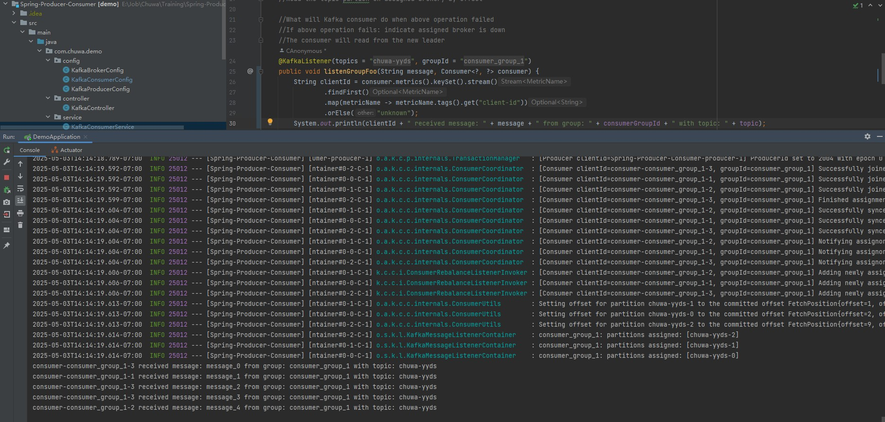
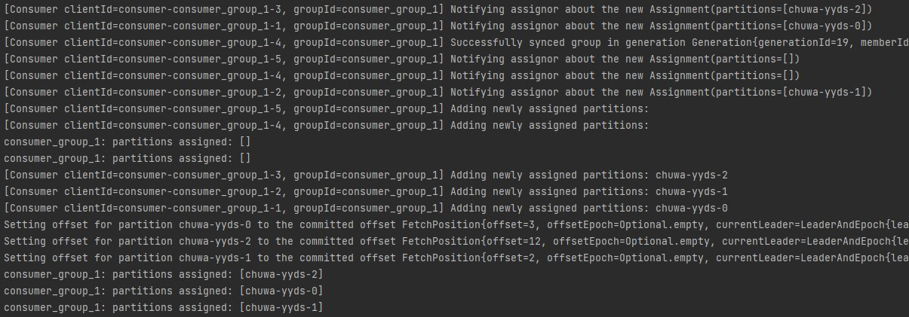
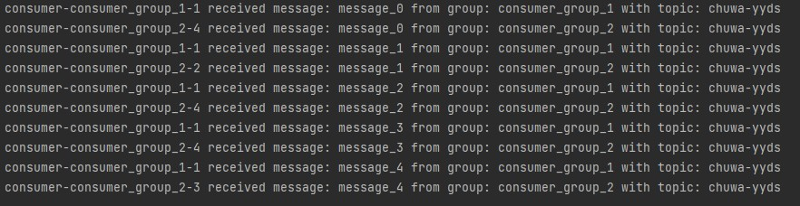
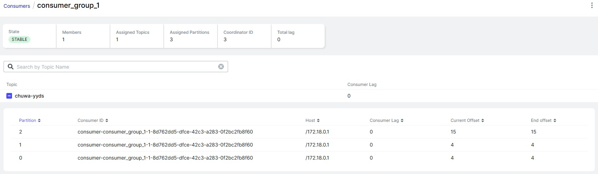
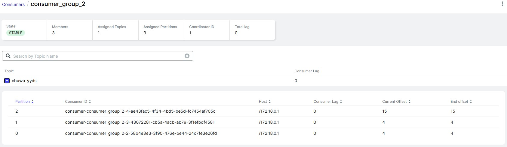
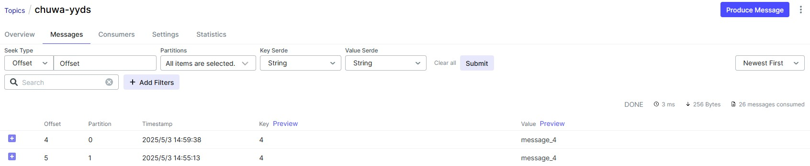

# hw14
### Explain following concepts, and how they coordinate with each other:
- Topic: A logical channel to which producers send data and consumers read data.
- Partition: Each topic is split into partitions, which are ordered, immutable sequences of records.
- Broker: A Kafka server that handles: Storing topic data (partition data), receiving messages from producers, serving messages to consumers.
- Consumer Group: A collection of consumers that work together to consume data from a topic.
- Producer: A producer sends data (records) to Kafka topics.
- Offset: Each message in a partition has a unique offset. It's the message’s position in the partition.
- Zookeeper: A distributed coordination system used by Kafka for: Broker discovery and leader election, keeping metadata like topic/partition assignments, coordinating partition leaders in case of failure.

How They Coordinate:
1. **Producer** sends messages to a **Topic**, which is split into **Partitions**.
2. **Partitions** are hosted across multiple **Brokers** for load balancing.
3. **Consumer Groups** read from these partitions, with Kafka ensuring only one consumer per partition within a group.
4. **Offsets** allow **consumers** to resume from where they left off.
5. **Zookeeper** manages metadata, leader election, and coordination (if used).
### 1. Given N (number of partitions) and M (number of consumers,) what will happen when N>=M and N<M respectively?
1. N>=M:  
    Kafka will evenly assign partitions across consumers. Some consumers may get more than one partition, but all consumers will be active. Each partition is assigned to only one consumer in the group.
2. N<M:  
    Kafka can only assign one consumer per partition. So only N consumers will be active, and the remaining M-N consumers will be idle.
### 2. Explain how brokers work with topics?
1. Producer connects to any broker in the cluster.
2. Broker redirects producer to the leader broker for the correct partition of the topic.
3. Producer sends data to that broker, which stores it on disk.
4. Replication is handled by the leader broker, pushing data to follower replicas on other brokers.
5. When a consumer group subscribes, Kafka assigns partitions (hosted by brokers) to consumers.
6. If a broker fails, Kafka reassigns leadership of partitions to other brokers.
### 3. Are messages pushed to consumers or consumers pull messages from topics?
- Consumers request data by polling the Kafka broker for new messages.
- The broker responds with available records, up to a configured maximum.
- Consumers control their read rate -- they decide when to poll and how much data to fetch.
### 4. How to avoid duplicate consumption of messages?
1. Use Idempotent Consumers:  
    - Make your consumer logic idempotent, meaning processing the same message multiple times has no side effects.
    - Before processing of the record, check if the record is already processed.
    - Commit offsets after successful processing of the message.
2. Use Exactly-Once Semantics (EOS) in Kafka:
    - To enable EOS: Use idempotent producer (enable.idempotence=true), use transactional producer (transactional.id=...), use Kafka Streams or a transactional-aware consumer + producer model
    - This ensures: Messages are delivered exactly once to the output topic or system. Consumer offsets are committed atomically with the result of processing.
### 5. What will happen if some consumers are down in a consumer group? Will data loss occur? Why?
- When a consumer in a group goes down:
    1. Kafka detects the failure via heartbeats and session timeouts.
    2. Kafka rebalances the remaining consumers: Reassigns the partitions that belonged to the failed consumer to the remaining ones.
    4. The reassigned consumers continue processing from the last committed offset.
- Data loss won't occur: Even if consumers go down, the data remains in Kafka. Messages are persisted on disk, replicated across brokers, and not deleted until retention policies expire.
### 6. What will happen if an entire consumer group is down? Will data loss occur? Why?
When an entire consumer group goes down: No consumer is reading the records from any patition, so the messages are retained according to the topic's retention policy. So as long as the retention period hasn’t expired, no data will be lost, even if the whole group is offline.
### 7. Explain consumer lag and how to resolve it?
- Consumer lag in Kafka refers to the difference between the latest message available in a partition and the latest message a consumer in a group has processed (committed offset).
- Resolve consumer lag:
    | Solution | Description |
    | --- | --- |
    | **Scale out consumers** | Add more consumers to the group (up to number of partitions). |
    | **Optimize processing logic** | Reduce per-message processing time (batch writes, parallelism, etc.). |
    | **Tune consumer configs** | E.g., increase `max.poll.records`, adjust `fetch.min.bytes`, tune `session.timeout.ms`. |
    | **Avoid committing before processing** | Ensures reprocessing if the consumer crashes. |
    | **Partition wisely** | More partitions allow more parallelism — increase if needed. |
    | **Use async I/O or buffering** | Prevent I/O blocking in consumers (e.g., use async DB drivers or queues). |
    | **Monitor lag with tools** | Use Kafka tools (e.g., Burrow, Kafka Exporter, Confluent Control Center) to detect lag early. |
### 9. Explain how Kafka tracks message delivery?
1. Stores messages in partitions, indexed by an offset.
2. Allows consumers to read from any offset.
3. Tracks the latest committed offset per consumer group and partition.
### 10. On top of https://github.com/CTYue/Spring-Producer-Consumer
- Write your consumer application with Spring Kafka dependency, set up 3 consumers in a single consumer group.  
    Prove message consumption with screenshots.
- Increase number of consumers in a single consumer group, observe what happens, explain your observation.
- Create multiple consumer groups using Spring Kafka, set up different numbers of consumers within each group, observe consumer offset,
- Prove that each consumer group is consuming messages on topics as expected, take screenshots of offset records,
- Demo different message delivery guarantees in Kafka, with necessary code or configuration changes.
- Write your own partitioning logic, to demo your messages will be assigned to different brokers, or you can also demo kafka's default round-robin paritioning logic, with code changes.  
    Note: There's already a docker compose file in above git repo, you can start the 3 brokers (with zookeep) using docker-compose up command.

1. 3 consumers and message consumption:
    
2. Increase number of consumers to 5: Some consumers are idle, not assigned to any partiton.
    
3. Multiple consumer groups:
    
4. Each consumer group is consuming messages on topics as expected:
    
    
5. Different message delivery guarantees:
    1. At Most Once: Without any retry, messages may be lost.
        ```java
        @KafkaListener(topics = "demo", groupId = "group1")
        public void consume(String message) {
            System.out.println("Received: " + message);
        }
        ```
    2. At Least Once: Kafka will retry, which may lead to duplicate messages.
        ```java
        @KafkaListener(topics = "demo", groupId = "group2")
        public void consume(ConsumerRecord<String, String> record, Acknowledgment ack) {
            try {
                System.out.println("Received: " + record.value());
                ack.acknowledge();
            } catch (Exception e) {
                // no ack, will lead to duplicated consume.
            }
        }
        ```
    3. Exactly Once: Kafka provides transaction functionality, which must be coordinated with the transaction write of Kafka Producer and the idempotent processing logic of Consumer.
        ```java
        @Service
        public class MyProducer {
            @Autowired
            private KafkaTemplate<String, String> kafkaTemplate;

            @Transactional
            public void sendTransactional(String msg) {
                kafkaTemplate.send("demo", msg);
                // update the database at the same time, to implement exactly-once
            }
        }
        ```
        ```java
        @KafkaListener(topics = "demo", groupId = "group3", containerFactory = "kafkaListenerContainerFactory")
        public void consume(String message) {
            System.out.println("Exactly-once received: " + message);
        }
        ```
    | Guarantee | Config | Pros | Cons |
    | --- | --- | --- | --- |
    | At most once | auto-commit: true | Fast, no replication | May lose data |
    | At least once | auto-commit: false + manually ack | No data loss | May duplicate, need idempotent processing |
    | Exactly once | transactional Producer + idempotent Consumer | Safest | Slow, complicated configuration |
6. Own partitioning logic:
    ```java
    public class CustomPartitioner implements Partitioner {

        @Override
        public int partition(String topic, Object keyObj, byte[] keyBytes, Object value,
        byte[] valueBytes, Cluster cluster) {
            String key = keyObj.toString();
            int numPartitions = cluster.partitionCountForTopic(topic);

            return (Math.abs(key.hashCode()) + 2) % numPartitions;
        }

        @Override
        public void close() {}

        @Override
        public void configure(Map<String, ?> configs) {}
    }
    ```
    Set custom partitioner in `KafkaProducerConfig.producerFactory()`:
    ```java
    configProps.put(ProducerConfig.PARTITIONER_CLASS_CONFIG, CustomPartitioner.class);
    ```
    