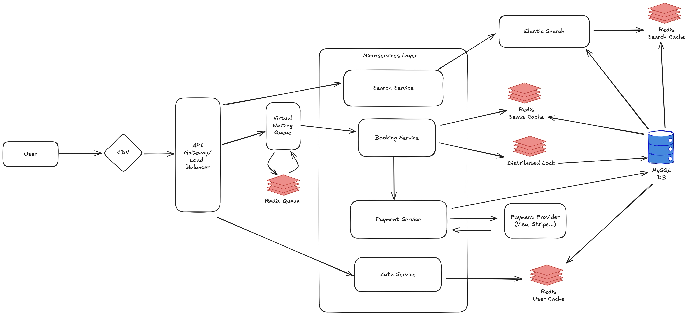

# Design Ticketmaster

# Design Summary

 

## 1. Ingress

- CDN
- API Gateway/Load Balancer
- Virtual queue
  - Control flow into booking service
  - Redis for queuing and dequing

## 2. Core Microservices

- Search Service: Search events and events info
  - Elastic Search
  - Redis Search Cache
- Booking Service: Viewing and booking tickets
  - Seat Availability Cache
  - Distributed Lock: avoid double-booking
  - HTTP to payment service
- Payment Service: calling third party payment provider
- Auth Service: Provides authentication and interact with user info
  - Redis for user cache

## 3. Database:

- MySQL DB
- sharding for scalability and durability

## Areas for improvement

- Design a portal for admins/event organizers to upload events and seats
- Be more clear and careful on how this system handles idempotency
- Be more thoughful of why and how APIs are designed

# Learned from other people's design

- Separating large files storage from metadata for more efficient access
- For uploading, split large file into smaller chunks. Always ensure there is certain retry mechanism.
- Keep design simple unless absolutely necessary to resolve certain issues
