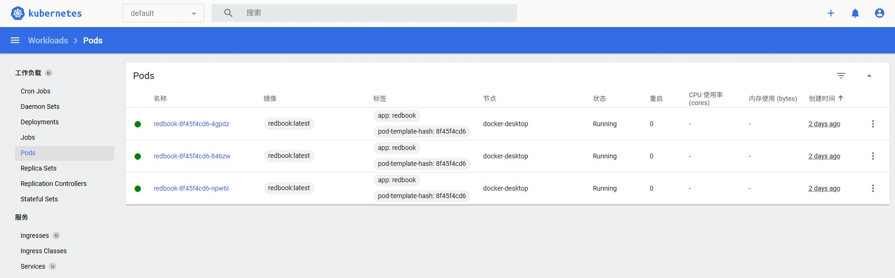
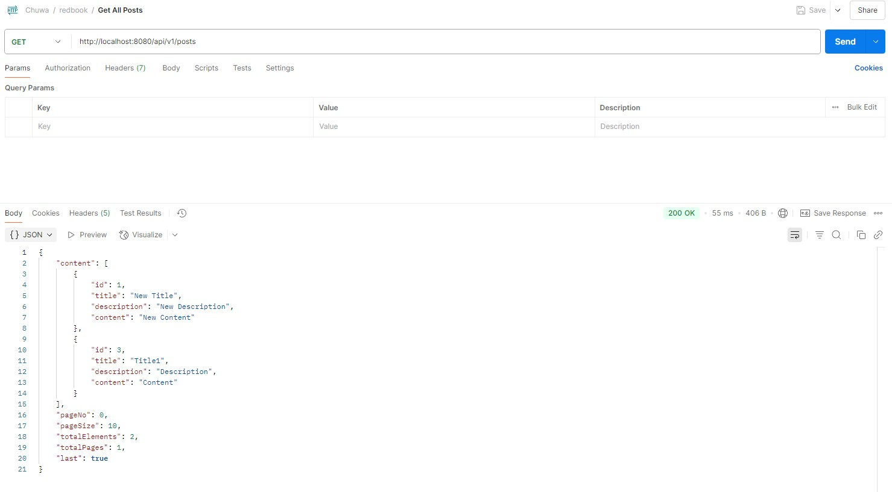
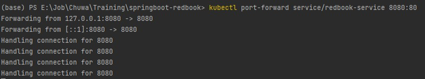

# hw15
### Dockerize Spring-redbook application using https://github.com/CTYue/springboot-redbook/tree/docker
### Start your local kubernetes and deploy above dockerized image to it, with dev-deployment.yaml.

