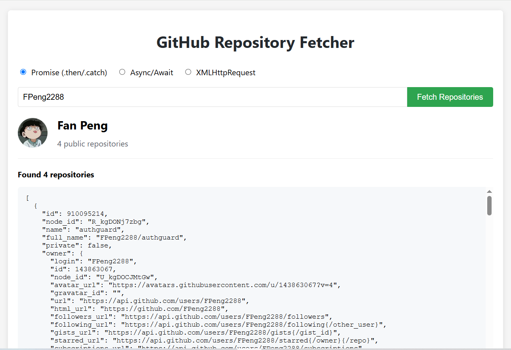
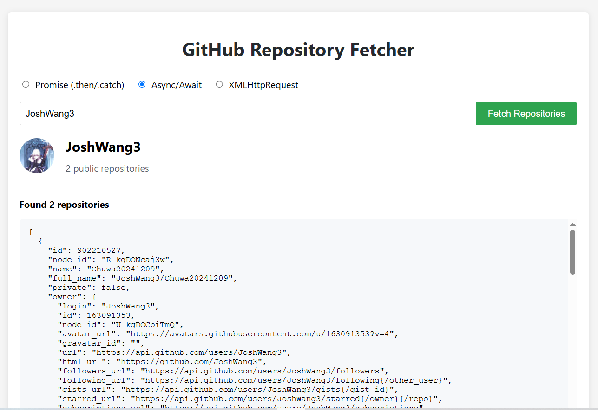
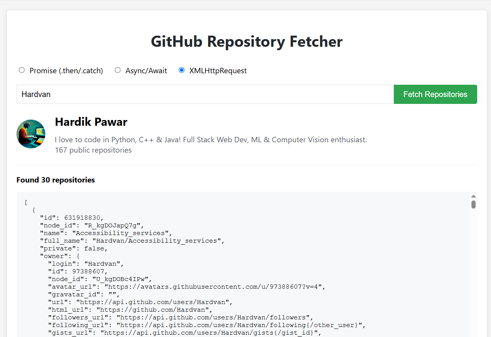

1. Read and practice all sample code examples from `71-Dom-Bom-JavaScript-Typescript-Node.md` using your local browser or an online compiler.

2. Solve 5 LeetCode problems using JavaScript.

3. Compare `let` and `var`, and explain variable hoisting with your own code examples.

   | Feature            | `let`                                   | `var`                                  |
   | ------------------ | --------------------------------------- | -------------------------------------- |
   | Scope              | Block scope                             | Function scope                         |
   | Hoisting           | Declaration hoisted but not initialized | Hoisted and initialized as `undefined` |
   | Redeclaration      | Not allowed in same scope               | Allowed in same scope                  |
   | Global declaration | Does not become property of window      | Becomes property of window             |
   | Temporal Dead Zone | Yes                                     | No                                     |

   #### Variable Hoisting Explained

   Variable hoisting is the behavior of JavaScript engines where variable declarations are moved to the top of their scope before code execution.

   **Hoisting with `var`**

   Variables declared with `var` are hoisted and initialized as `undefined`.

   ```javascript
   console.log(x); // Output: undefined (not an error)
   var x = 5;
   console.log(x); // Output: 5
   
   // The above code is equivalent to:
   // var x; // Declaration is hoisted
   // console.log(x); // undefined
   // x = 5;
   // console.log(x); // 5
   ```

   **Hoisting with `let`**

   Variables declared with `let` are also hoisted but not initialized, resulting in a "Temporal Dead Zone" (TDZ).

   ```javascript
   // console.log(y); // Error: Cannot access 'y' before initialization
   let y = 10;
   console.log(y); // Output: 10
   
   // The above code is processed by the JavaScript engine similar to:
   // let y; // Declaration is hoisted, but not initialized (in TDZ)
   // console.log(y); // Error, variable is in TDZ
   // y = 10; // Initialization, exits TDZ
   // console.log(y); // 10
   ```

   #### Block Scope vs Function Scope

   **`var` - Function Scope**

   ```javascript
   function scopeDemo() {
     if (true) {
       var insideIf = "I'm a var";
     }
     console.log(insideIf); // Output: "I'm a var" (still accessible outside if block)
   }
   
   scopeDemo();
   // console.log(insideIf); // Error: insideIf is not defined (not accessible outside function)
   ```

   **`let` - Block Scope**

   ```javascript
   function blockScopeDemo() {
     if (true) {
       let insideIfBlock = "I'm a let";
       console.log(insideIfBlock); // Output: "I'm a let" (accessible inside block)
     }
     // console.log(insideIfBlock); // Error: insideIfBlock is not defined (not accessible outside block)
   }
   
   blockScopeDemo();
   ```

   #### Scope Example in Loops

   **Issue with `var`**

   ```javascript
   function varInLoop() {
     var funcs = [];
     for (var i = 0; i < 3; i++) {
       funcs.push(function() {
         console.log(i);
       });
     }
     
     return funcs;
   }
   
   var funcArray = varInLoop();
   funcArray[0](); // Output: 3 (not 0)
   funcArray[1](); // Output: 3 (not 1)
   funcArray[2](); // Output: 3 (not 2)
   ```

   **Solution with `let`**

   ```javascript
   function letInLoop() {
     let funcs = [];
     for (let j = 0; j < 3; j++) {
       funcs.push(function() {
         console.log(j);
       });
     }
     
     return funcs;
   }
   
   let funcArrayWithLet = letInLoop();
   funcArrayWithLet[0](); // Output: 0 (correct)
   funcArrayWithLet[1](); // Output: 1 (correct)
   funcArrayWithLet[2](); // Output: 2 (correct)
   ```

   

4. Explain closures with code examples.

   A closure occurs when a function can remember and access variables from its outer scope, even after the outer function has finished executing.

   **Basic Example**

   ```javascript
   function makeGreeter() {
     let name = "John"; // Variable in outer function
     
     // Inner function that forms a closure
     function greet() {
       console.log("Hello, " + name); // Accessing outer variable
     }
     
     return greet; // Return the inner function
   }
   
   // Get the inner function
   let sayHello = makeGreeter();
   
   // Even though makeGreeter has finished, sayHello still remembers "John"
   sayHello(); // Outputs: "Hello, John"
   ```

   **Practical Example: Counter**

   ```javascript
   function createCounter() {
     let count = 0; // Private variable
     
     return function() {
       count++; // Remembers and modifies count
       return count;
     };
   }
   
   let counter = createCounter();
   console.log(counter()); // 1
   console.log(counter()); // 2
   console.log(counter()); // 3
   ```

   **Why Closures Are Useful**

   1. **Data Privacy** - Create variables that cannot be directly accessed from outside

   2. **State Preservation** - Functions can "remember" information without using global variables

   3. **Function Factories** - Create functions with specific settings

      

5. Explain "Callback Hell" with a code example.

   "Callback hell" (also known as "pyramid of doom") is a situation in JavaScript where multiple nested callbacks create code that is difficult to read, debug, and maintain. This typically happens when dealing with asynchronous operations that depend on each other.

   ```javascript
   // Simulating asynchronous operations with setTimeout
   function getUserData(userId, callback) {
     console.log("Fetching user data...");
     setTimeout(() => {
       const userData = { id: userId, name: "John Doe" };
       callback(userData);
     }, 1000);
   }
   
   function getUserPosts(userData, callback) {
     console.log(`Fetching posts for ${userData.name}...`);
     setTimeout(() => {
       const posts = [
         { id: 1, title: "First Post" },
         { id: 2, title: "Second Post" }
       ];
       callback(posts);
     }, 1000);
   }
   
   function getPostComments(postId, callback) {
     console.log(`Fetching comments for post #${postId}...`);
     setTimeout(() => {
       const comments = [
         { id: 1, text: "Great post!" },
         { id: 2, text: "I disagree." }
       ];
       callback(comments);
     }, 1000);
   }
   ```

   ```javascript
   // The Callback Hell begins here
   getUserData(123, (userData) => {
     console.log("User data received:", userData);
     
     getUserPosts(userData, (posts) => {
       console.log("User posts received:", posts);
       
       getPostComments(posts[0].id, (comments) => {
         console.log("Post comments received:", comments);
         
         // We can go deeper...
         setTimeout(() => {
           console.log("Processing comments...");
           
           setTimeout(() => {
             console.log("Updating UI...");
             
             setTimeout(() => {
               console.log("Logging activity...");
               
               // This could go on and on...
             }, 1000);
           }, 1000);
         }, 1000);
       });
     });
   });
   ```

   **Why is this problematic?**

   1. **Readability**: The code becomes increasingly indented, making it hard to follow the flow.
   2. **Error handling**: It's difficult to implement proper error handling across all callbacks.
   3. **Debugging**: Identifying where an error occurred can be challenging.
   4. **Code maintenance**: Making changes to the code structure becomes increasingly difficult.

   **Modern Solutions to Callback Hell**

   1. **Promises**

      ```javascript
      // Using Promise chaining
      getUserData(123)
        .then(userData => {
          console.log("User data received:", userData);
          return getUserPosts(userData);
        })
        .then(posts => {
          console.log("User posts received:", posts);
          return getPostComments(posts[0].id);
        })
        .then(comments => {
          console.log("Post comments received:", comments);
        })
        .catch(error => {
          console.error("An error occurred:", error);
        });
      ```

   2. **Async/Await**

      ```javascript
      async function fetchUserDataAndPosts() {
        try {
          const userData = await getUserData(123);
          console.log("User data received:", userData);
          
          const posts = await getUserPosts(userData);
          console.log("User posts received:", posts);
          
          const comments = await getPostComments(posts[0].id);
          console.log("Post comments received:", comments);
        } catch (error) {
          console.error("An error occurred:", error);
        }
      }
      
      fetchUserDataAndPosts();
      ```

      

6. Explain `Promise`, `async`, and `await` with code examples.

   Promises, async, and await are fundamental concepts in JavaScript for handling asynchronous operations. 

   **Promises**

   A Promise is an object representing the eventual completion or failure of an asynchronous operation. 

   It has three states: 

   - pending

   - fulfilled

   - rejected

   ```javascript
   // Creating a Promise
   const myPromise = new Promise((resolve, reject) => {
     // Asynchronous operation, like fetching data
     const success = true;
     
     if (success) {
       resolve("Operation successful"); // Called on success
     } else {
       reject("Operation failed");  // Called on failure
     }
   });
   
   // Using a Promise
   myPromise
     .then(result => {
       console.log(result); // "Operation successful"
     })
     .catch(error => {
       console.log(error); // Won't execute here
     });
   ```

   **async/await**

   async/await is syntactic sugar built on top of Promises that makes asynchronous code easier to read and write as if it were synchronous.

   - `async` keyword declares an asynchronous function that always returns a Promise
   - `await` keyword pauses execution until a Promise resolves, and can only be used inside async functions

   ```javascript
   // Function that returns a Promise
   function fetchData() {
     return new Promise((resolve, reject) => {
       setTimeout(() => {
         resolve("Data retrieved");
       }, 2000);
     });
   }
   
   // Using async/await
   async function getData() {
     console.log("Starting data fetch");
     
     try {
       // await pauses execution until Promise completes
       const data = await fetchData();
       console.log(data); // "Data retrieved"
     } catch (error) {
       console.log("Error:", error);
     }
     
     console.log("Data fetch complete");
   }
   
   // Calling the async function
   getData();
   // Output:
   // "Starting data fetch"
   // (2 seconds later)
   // "Data retrieved"
   // "Data fetch complete"
   ```

   

7. Write an HTML page that generates a lucky number based on the date, time, and user input. Users should be able to get their random lucky number by clicking a button or pressing the Enter key after entering their input.

   

   

8. Write an HTML page that returns a user's GitHub repositories (<https://api.github.com/users/{user_id}/repos>) in JSON format. The page should have a text box and a submit button for users to enter a GitHub user ID. The `fetch` call should be asynchronous. If the API call fails for any reason, display a customized, user-friendly error message. If you know multiple ways to implement asynchronous calls, please demonstrate them using different approaches.

   

   

   

   

9. Explain how JavaScript implements asynchronous non-blocking features — particularly the Event Loop, Macrotasks, and Microtasks — with code samples.

   **Event Loop**

   JavaScript is single-threaded but handles asynchronous operations through the event loop which:

   1. Executes synchronous code in the call stack
   2. Checks if the call stack is empty
   3. If empty, checks for tasks in the queue
   4. Moves tasks to the call stack for execution

   ```javascript
   console.log("Start");
   setTimeout(() => console.log("Timer callback"), 0);
   console.log("End");
   // Output: Start → End → Timer callback
   ```

   **Macrotasks**

   Macrotasks are the main task type processed by the event loop:

   - setTimeout/setInterval
   - I/O operations
   - UI rendering events
   - Full script execution

   The event loop processes only one macrotask per iteration.

   **Microtasks**

   Microtasks have higher priority than macrotasks:

   - Promise callbacks (.then/.catch/.finally)
   - queueMicrotask()
   - process.nextTick() (Node.js)

   Event loop execution order:

   1. Execute all synchronous code
   2. Execute all microtasks
   3. Execute one macrotask
   4. Execute all microtasks
   5. Repeat steps 3-4

   ```javascript
   console.log("Script start");
   
   setTimeout(() => console.log("Timer callback (macrotask)"), 0);
   
   Promise.resolve()
     .then(() => console.log("Promise callback (microtask)"));
   
   console.log("Script end");
   
   // Output:
   // Script start
   // Script end
   // Promise callback (microtask)
   // Timer callback (macrotask)
   ```

   **Complex Example**

   ```javascript
   console.log("1");
   
   setTimeout(() => {
     console.log("2");
     Promise.resolve().then(() => console.log("3"));
   }, 0);
   
   Promise.resolve().then(() => {
     console.log("4");
     setTimeout(() => console.log("5"), 0);
   });
   
   // Output: 1 → 4 → 2 → 3 → 5
   ```

   Execution flow explained:

   1. Synchronous code: print "1"
   2. Add setTimeout callback to macrotask queue
   3. Add Promise callback to microtask queue
   4. Macrotask ends, process microtask queue, print "4", add new setTimeout to macrotask queue
   5. Execute first macrotask, print "2", add Promise.then to microtask queue
   6. Execute microtask, print "3"
   7. Execute last macrotask, print "5"

   This mechanism allows JavaScript to implement non-blocking I/O and efficiently handle asynchronous operations while maintaining its single-threaded nature.
