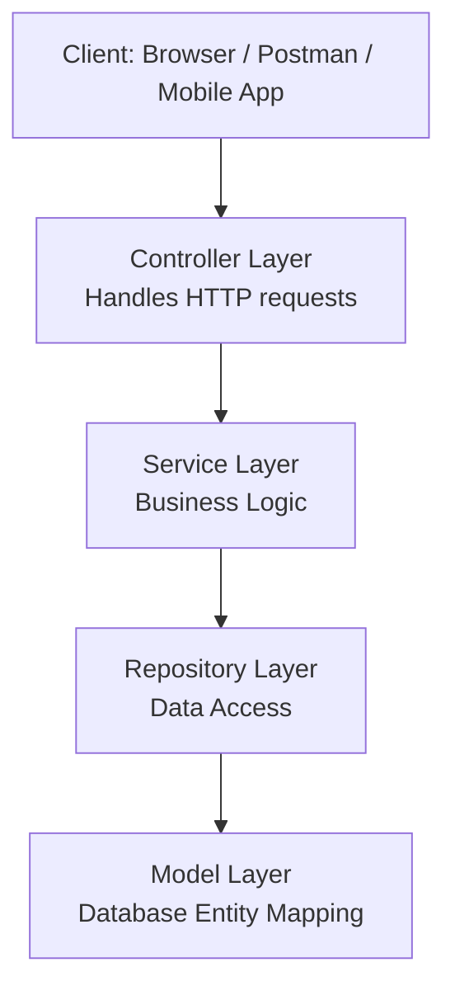

# 1. create a file to list all of the annotaitons you learned and known, and explain the usage and how do you understand it. you need to update it when you learn a new annotation. Please organize those annotations well, like annotations used by entity, annotations used by controller.
1. File name: **annotations.md**
2. you'd better also list a code example under the annotations.

**See annotations.md**

# 2. explain how the below annotaitons specify the table in database?
    ```Java
    @Column(columnDefinition = "varchar(255) default 'John Snow'")
    private String name;
    @Column(name="STUDENT_NAME", length=50, nullable=false, unique=false)
    private String studentName;
    ```
First annotations defines a column that is type `varchar(255)`, which means characters of max length 255 and the default value should be `'John Snow'`.

Second annotation spefifies a column with name `STUDENT_NAME` and should have max length of 50 characters. The values cannot be null and the values do not have to be unique.

# 3. What is the default column names of the table in database for `@Column`?
    ```Java
    @Column
    private String firstName;
    @Column
    private String operatingSystem;
    ```

When not specified, JPA uses the name of the Java field as the column name. Case sensitivity depends on the underlying database.

# 4. What are the layers in springboot application? what is the role of each layer?


# 5. Describe the flow in all of the layers if an API is called by Postman.

1. **Client (Postman)** sends an HTTP request (e.g. `GET /posts/1`).
2. **Controller Layer** handles the request via a method annotated with `@GetMapping`, extracts parameters, and calls the service.
3. **Service Layer** contains business logic and calls the repository.
4. **Repository Layer** uses Spring Data JPA to query the database (e.g. `findById`).
5. **Model Layer** maps the result to a Java object (`@Entity`), which is returned up the stack.
6. Spring Boot **serializes the object to JSON** and returns it to Postman.

# 6. What is the application.properties? do you know application.yml?
Both `application.properties` and `application.yml` (or application.yaml) are configuration files used in Spring Boot applications to define settings like database connection details, server port, logging levels, and other custom properties.

They are both under `src/main/resources/`.

| Feature               | `.properties`                  | `.yml` / `.yaml`                |
|----------------------|-------------------------------|---------------------------------|
| Syntax               | Flat key-value                 | Hierarchical / indentation-based |
| Readability          | Simple but can get repetitive | Cleaner for nested configs       |
| Supported by Spring  | ✅                             | ✅                               |
| Nesting              | Manual with dot notation       | Natural via indentation          |
| Duplicate keys       | Must be unique                 | Allows grouping under same key   |

# 7. What’s the naming differences between GraphQL vs. REST ? Why is the differences ?

**REST: Resource-Based**
- Uses **multiple endpoints**, named with **nouns** (e.g., `/users`, `/orders`).
- Actions are defined by **HTTP verbs**:
  - `GET /users` → fetch users  
  - `POST /users` → create user  
  - `PUT /users/123` → update user  
  - `DELETE /users/123` → delete user

**GraphQL: Action-Based**
- Uses **one endpoint** (`/graphql`).
- Actions are defined in the **query or mutation name** with **verbs**:
    ```graphql
    query {
        getUser(id: "123") {
        name
        }
    }

    mutation {
        createUser(name: "Alice", email: "alice@example.com") {
        id
        }
    }
    ```
- There is the difference because REST is resource-centric and GraphQL is action-centric.\
REST is trying to decouple action from URL, hence there are different methods like GET or POST.\
GraphQL is trying to use one endpoint and to make retrieval more flexible and efficient.

# 8. Provide 2 real-world examples of N+1 problem in REST that can be solved by GraphQL.
### 1: Users and Their Posts

**REST:**
1. `GET /users` → returns list of users (N users)
2. For each user: `GET /users/{id}/posts` → N additional calls

**GraphQL:**\
Single request fetches users and their posts.
```graphql
query {
    users {
        id
        name
        posts {
            id
            title
        }
    }
}
```


### 2: Orders and Product Details
**REST**:

1. `GET /orders` → returns list of orders (N orders)
2. For each order: GET /products/{id} → N more calls for product info

**GraphQL**
```graphql
query {
    orders {
        id
        product {
            id
            name
            price
        }
    }
}
```

# 9. Finish the following API
**REST**
DELETE post by ID (with exception cases)
**GraphQL**
Query getAllPost

`DELETE /api/v1/posts/{postID}`

```graphql
query {
  getAllPost {
    id
    title
    content
    author {
      id
      name
    }
    createdAt
    updatedAt
  }
}
```