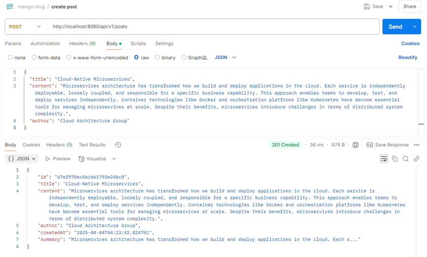
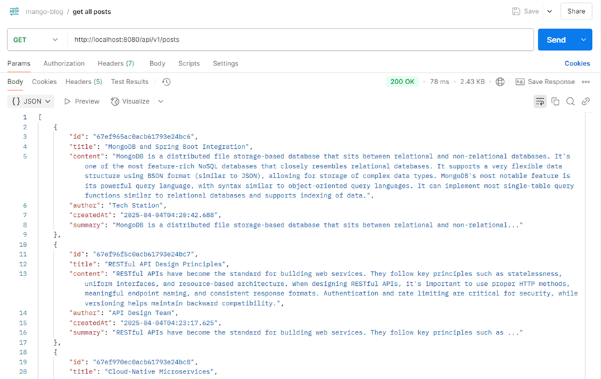
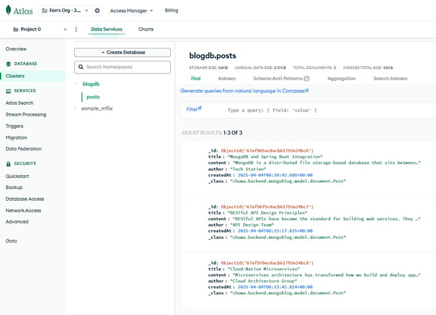

1. create a file to list all of the annotaitons you learned and known, and explain the usage and how do you  understand it. you need to update it when you learn a new annotation. Please organize those annotations  well, like annotations used by entity, annotations used by controller.

   1. File name: **annotations.md**

   2. you'd better also list a **code example** under the annotations.

      

2. explain how the below annotaitons specify the table in database?

   ```java
   @Column(columnDefinition = "varchar(255) default 'John Snow'")
   private String name;
   ```

   - Uses `columnDefinition` to specify the SQL fragment that will be used when creating the table
   - Directly defines the column type as `varchar(255)`
   - Sets a default value of 'John Snow' for the column
   - The column name will be the same as the field name ("name")
   - This approach gives complete control to use database-specific column definitions

   ```java
   @Column(name="STUDENT_NAME", length=50, nullable=false, unique=false)
   private String studentName;
   ```

   - Uses `name` to explicitly set the column name to "STUDENT_NAME" instead of using the field name

   - Sets the column length to 50 characters

   - Makes the column non-nullable (NOT NULL constraint)

   - Specifies that the column is not unique (allows duplicate values)

   - JPA will translate these attributes to the appropriate SQL syntax for the database

     

3. What is the default column names of the table in database for `@Column`?

   ```java
   @Column
   private String firstName;
   @Column
   private String operatingSystem;
   ```

   The **default column names** in the database will be the **same as the Java field names**:

   - `firstName`
   - `operatingSystem`

   

4. What are the **layers** in springboot application? what is the **role** of each layer?

   1. **Presentation Layer**

      - Components: Controllers (`@Controller`, `@RestController`)
      - Role: Handles HTTP requests, validates input, delegates to the service layer, and builds responses
      - Responsibilities:
        - Receiving client requests
        - Input validation
        - Response formatting (JSON, XML, HTML)
        - Exception handling at the API level
        - Managing session state (when needed)

   2. **Service Layer**

      - Components: Service classes (`@Service`)
      - Role: Implements business logic and orchestrates the application workflow
      - Responsibilities:
        - Implementing business rules and logic
        - Transaction management (`@Transactional`)
        - Coordinating operations between multiple repositories
        - Authorization and validation
        - Data transformation between DTOs and entities

   3. **Repository/Data Access Layer**

      - Components: Repositories (`@Repository`) and DAOs
      - Role: Interacts with databases and external systems
      - Responsibilities:
        - CRUD operations on entities
        - Query execution
        - Database transaction handling
        - Data mapping

   4. **Domain/Model Layer**

      - Components: Entity classes (`@Entity`), DTOs, Value Objects
      - Role: Represents the core domain concepts and data structures
      - Responsibilities:
        - Data representation
        - Basic validation rules through annotations (`@NotNull`, `@Size`, etc.)
        - Business constraints at the entity level

   5. **Configuration Layer**

      - Components: Configuration classes (`@Configuration`)

      - Role: Configures the application, beans, and external integrations

      - Responsibilities:

        - Setting up beans (`@Bean`)

        - Configuring security, database, messaging

        - Managing profiles (`@Profile`)

        - Property binding (`@ConfigurationProperties`)

          

5. Describe the **flow in all of the layers** if an API is called by Postman.

   1. **Client Request**

      - Postman sends an HTTP request to a specific endpoint (e.g., `POST /api/v1/users`)
      - The request includes HTTP method, headers, URL parameters, and possibly a request body

   2. **Web Container (Tomcat/Undertow/Jetty)**

      - The embedded web server receives the HTTP request
      - It creates a thread to handle the request

   3. **Spring Boot Filters**

      - Request passes through configured filters (e.g., CORS, security filters)
      - Filters may modify request headers, perform authentication, etc.

   4. **Dispatcher Servlet**

      - The central servlet receives the request
      - Determines which controller should handle the request based on the URL mapping

   5. **Presentation Layer (Controller)**

      - The appropriate controller method is invoked
      - Controller extracts and validates request parameters
      - Request body is deserialized into objects (if applicable)

      ```java
      @RestController
      @RequestMapping("/api/v1/users")
      public class UserController {
          @PostMapping
          public ResponseEntity<UserResponse> createUser(@RequestBody UserRequest request) {
              // Call service layer
              UserDTO userDTO = userService.createUser(request);
              return ResponseEntity.status(HttpStatus.CREATED).body(userDTO);
          }
      }
      ```

   6. **Service Layer**

      - Controller delegates business logic to the service layer
      - Service applies business rules and validates business constraints
      - May coordinate operations across multiple repositories
      - Handles transactions

      ```java
      @Service
      public class UserServiceImpl implements UserService {
          @Transactional
          public UserDTO createUser(UserRequest request) {
              // Validate business rules
              // Transform request to entity
              User user = new User();
              user.setName(request.getName());
              
              // Call repository
              User savedUser = userRepository.save(user);
              
              // Transform entity to DTO
              return mapToDTO(savedUser);
          }
      }
      ```

   7. **Repository Layer**

      - Service calls repository methods to interact with the database
      - Repository executes CRUD operations

      ```java
      @Repository
      public interface UserRepository extends JpaRepository<User, Long> {
          // Spring Data JPA automatically implements basic CRUD operations
          // Custom query methods can be added here
      }
      ```

   8. **Database Interaction**

      - Hibernate/JPA translates repository method calls into SQL
      - SQL is executed against the database
      - Results are mapped back to entity objects

   9. **Return Flow (Back Up the Stack)**

      - Repository returns entity objects to service

      - Service transforms entities to DTOs if needed

      - Service returns DTOs to controller

      - Controller wraps DTOs in an HTTP response

      - Response passes back through filters

      - Web server sends HTTP response back to Postman

        

6. What is the **application.properties**? do you know application.yml?

   Spring Boot offers two primary formats for application configuration: `application.properties` and `application.yml`. Both serve the same purpose but with different syntax.

   **application.properties**

   This is the traditional Java properties file format using key-value pairs:

   ```properties
   # Server configuration
   server.port=8080
   server.servlet.context-path=/api
   
   # Database configuration
   spring.datasource.url=jdbc:mysql://localhost:3306/mydb
   spring.datasource.username=root
   spring.datasource.password=password
   ```

   **application.yml**

   YAML format offers a more structured, hierarchical configuration with less repetition:

   ```properties
   server:
     port: 8080
     servlet:
       context-path: /api
   
   spring:
     datasource:
       url: jdbc:mysql://localhost:3306/mydb
       username: root
       password: password
   ```

   **Key Differences**

   - Syntax: YAML uses indentation for hierarchy while properties uses dot notation

   - Readability: YAML is often considered more readable for complex configurations
   - Lists: YAML has cleaner syntax for arrays/lists

   

7. What’s the naming differences between **GraphQL** vs. **REST** ? Why is the differences ?

   **Naming Differences Between GraphQL and REST**

   **REST Naming Conventions**

   In REST (Representational State Transfer), naming is resource-oriented:

   - **Nouns for resources**: `/users`, `/products`, `/orders`
   - **HTTP methods for actions**: `GET`,`POST`, `PUT`, `DELETE`
   - **Hierarchical relationships**: `/users/123/orders`
   - **Query parameters for filtering**: `/products?category=electronics&sort=price`
   - **Different endpoints for different resources**: `/users`, `/products`

   **GraphQL Naming Conventions**

   In GraphQL, naming is operation-oriented:

   - **Single endpoint** (typically `/graphql`)
   - **Query types** for fetching data: `query`, `mutation`, `subscription`
   - **Fields for data selection**: `{ user(id: "123") { name, email } }`
   - **Arguments for filtering**: `{ products(category: "electronics", sort: "price") { id, name } }`
   - **Resolver functions** named according to the fields they resolve

   **Why the Differences?**

   The naming differences stem from fundamental architectural differences:

   1. **Design Philosophy**:
      - REST: Resource-centric design where URLs represent resources
      - GraphQL: Query-centric design where queries represent data needs

   2. **Data Fetching Approach**:
      - REST: Each endpoint returns a fixed data structure
      - GraphQL: Client specifies exactly what data it needs in each request

   3. **API Evolution**:
      - REST: Developed in early 2000s for simpler web services
      - GraphQL: Developed by Facebook in 2015 to address limitations in REST, particularly for complex data needs and mobile applications

   4. **Operational Model**:
      - REST: Multiple endpoints with standardized HTTP methods
      - GraphQL: Single endpoint with custom query language

   These differences reflect the different eras and problems each technology was designed to solve: REST for resource-oriented web APIs in the Web 2.0 era, and GraphQL for flexible data fetching in complex, data-intensive applications.

   

8. Provide 2 real-world examples of N+1 problem in REST that can be solved by GraphQL.

   The N+1 problem occurs when an API needs to load a resource and its related entities, resulting in 1 request for the main resource and N additional requests for each related entity.

   **Example 1: Social Media User Profile with Posts**

   **REST Implementation**

   When fetching a user profile with their recent posts:

   1. Initial request: `GET /api/users/123`

      ```json
      {
        "id": 123,
        "name": "John Doe",
        "email": "john@example.com",
        "postIds": [501, 502, 503, 504, 505]
      }
      ```

      For each post ID, make additional requests:

      - `GET /api/posts/501`
      - `GET /api/posts/502`
      - `GET /api/posts/503`
      - `GET /api/posts/504`
      - `GET /api/posts/505`

      **Problem**: This requires 1 + 5 = 6 HTTP requests in total, increasing latency and network overhead.

      **GraphQL Solution**

      With GraphQL, a single request fetches all needed data:

      ```sql
      query {
        user(id: 123) {
          id
          name
          email
          posts {
            id
            title
            content
            createdAt
          }
        }
      }
      ```

      **Benefits**: One request, reduced latency, exact data needed.

      **Example 2: E-commerce Product Listing with Reviews**
      **REST Implementation**

      When displaying products with their reviews:

      1. Initial request: `GET /api/products?category=electronics`

         ```json
         [
           { "id": 1, "name": "Smartphone", "price": 699.99 },
           { "id": 2, "name": "Laptop", "price": 1299.99 },
           { "id": 3, "name": "Headphones", "price": 199.99 }
         ]
         ```

      2. For each product, request reviews:

         - `GET /api/products/1/reviews`
         - `GET /api/products/2/reviews`
         - `GET /api/products/3/reviews`

      **Problem**: 1 + 3 = 4 HTTP requests, and potentially hundreds more for a longer product list.

      **GraphQL Solution**
      A single query fetches everything needed:

      ```sql
      query {
        products(category: "electronics") {
          id
          name
          price
          reviews {
            id
            rating
            comment
            author {
              name
            }
          }
        }
      }
      ```

      **Benefits**: One network request, optimized data transfer, client specifies exactly what data it needs.

      

9. Finish the following API

   **REST**

   DELETE post by ID (with exception cases)  

   ```java
   @RestController
   @RequestMapping("/api/v1/posts")
   public class PostController {
       
       private final PostService postService;
       
       @Autowired
       public PostController(PostService postService) {
           this.postService = postService;
       }
       
       @DeleteMapping("/{id}")
       public ResponseEntity<?> deletePostById(@PathVariable Long id) {
           try {
               // Check if post exists
               if (!postService.existsById(id)) {
                   return ResponseEntity
                       .status(HttpStatus.NOT_FOUND)
                       .body(new ErrorResponse("Post not found with id: " + id));
               }
               
               // Check if user has permission to delete
               if (!postService.hasDeletePermission(id)) {
                   return ResponseEntity
                       .status(HttpStatus.FORBIDDEN)
                       .body(new ErrorResponse("You don't have permission to delete this post"));
               }
               
               // Delete the post
               postService.deleteById(id);
               
               // Return success response
               return ResponseEntity
                   .status(HttpStatus.NO_CONTENT)
                   .build();
                   
           } catch (IllegalArgumentException e) {
               return ResponseEntity
                   .status(HttpStatus.BAD_REQUEST)
                   .body(new ErrorResponse(e.getMessage()));
           } catch (Exception e) {
               return ResponseEntity
                   .status(HttpStatus.INTERNAL_SERVER_ERROR)
                   .body(new ErrorResponse("An error occurred while deleting the post"));
           }
       }
   }
   
   // Error response class
   class ErrorResponse {
       private String message;
       
       public ErrorResponse(String message) {
           this.message = message;
       }
       
       public String getMessage() {
           return message;
       }
   }
   ```

   **GraphQL**

   Query getAllPost 

   ```java
   // Schema Definition (in .graphqls file)
   type Post {
       id: ID!
       title: String!
       content: String!
       author: User!
       createdAt: String!
       updatedAt: String
       comments: [Comment]
       tags: [String]
       likes: Int
   }
   
   type Query {
       getAllPosts(page: Int, size: Int): PostResult!
   }
   
   type PostResult {
       posts: [Post]!
       totalCount: Int!
       hasNext: Boolean!
   }
   
   // Resolver Implementation
   @Component
   public class PostQueryResolver implements GraphQLQueryResolver {
       
       private final PostService postService;
       
       @Autowired
       public PostQueryResolver(PostService postService) {
           this.postService = postService;
       }
       
       public PostResult getAllPosts(Integer page, Integer size) {
           // Default values if not provided
           int pageNumber = page != null ? page : 0;
           int pageSize = size != null ? size : 10;
           
           // Get paginated posts
           Page<Post> postPage = postService.findAllPosts(pageNumber, pageSize);
           
           // Create and return result
           PostResult result = new PostResult();
           result.setPosts(postPage.getContent());
           result.setTotalCount((int) postPage.getTotalElements());
           result.setHasNext(postPage.hasNext());
           
           return result;
       }
   }
   
   // Data class for result
   @Data
   public class PostResult {
       private List<Post> posts;
       private int totalCount;
       private boolean hasNext;
   }
   ```

   

10. Create a Project, name it with **mongo-blog**, write a **POST API** for mongo-blog, change database to **MongoDB**;

    ```http
    POST http://localhost:8080/api/v1/posts
    ```

    RequestBody:

    ```json
    {
      "title": "Cloud-Native Microservices",
      "content": "Microservices architecture has transformed how we build and deploy applications in the cloud. Each service is independently deployable, loosely coupled, and responsible for a specific business capability. This approach enables teams to develop, test, and deploy services independently. Container technologies like Docker and orchestration platforms like Kubernetes have become essential tools for managing microservices at scale. Despite their benefits, microservices introduce challenges in terms of distributed system complexity.",
      "author": "Cloud Architecture Group"
    }
    ```

    Response status: `201 Created`

    Response:

    ```json
    {
        "id": "67ef970ec0acb61793e24bc8",
        "title": "Cloud-Native Microservices",
        "content": "Microservices architecture has transformed how we build and deploy applications in the cloud. Each service is independently deployable, loosely coupled, and responsible for a specific business capability. This approach enables teams to develop, test, and deploy services independently. Container technologies like Docker and orchestration platforms like Kubernetes have become essential tools for managing microservices at scale. Despite their benefits, microservices introduce challenges in terms of distributed system complexity.",
        "author": "Cloud Architecture Group",
        "createdAt": "2025-04-04T04:23:42.824701",
        "summary": "Microservices architecture has transformed how we build and deploy applications in the cloud. Each s..."
    }
    ```

    

    ```http
    GET http://localhost:8080/api/v1/posts
    ```

    RequestBody: N/A, since it is GET

    Response status: `200 OK`

    Response:

    ```json
    [
        {
            "id": "67ef965ac0acb61793e24bc6",
            "title": "MongoDB and Spring Boot Integration",
            "content": "MongoDB is a distributed file storage-based database that sits between relational and non-relational databases. It's one of the most feature-rich NoSQL databases that closely resembles relational databases. It supports a very flexible data structure using BSON format (similar to JSON), allowing for storage of complex data types. MongoDB's most notable feature is its powerful query language, with syntax similar to object-oriented query languages. It can implement most single-table query functions similar to relational databases and supports indexing of data.",
            "author": "Tech Station",
            "createdAt": "2025-04-04T04:20:42.688",
            "summary": "MongoDB is a distributed file storage-based database that sits between relational and non-relational..."
        },
        {
            "id": "67ef96f5c0acb61793e24bc7",
            "title": "RESTful API Design Principles",
            "content": "RESTful APIs have become the standard for building web services. They follow key principles such as statelessness, uniform interfaces, and resource-based architecture. When designing RESTful APIs, it's important to use proper HTTP methods, meaningful endpoint naming, and consistent response formats. Authentication and rate limiting are critical for security, while versioning helps maintain backward compatibility.",
            "author": "API Design Team",
            "createdAt": "2025-04-04T04:23:17.625",
            "summary": "RESTful APIs have become the standard for building web services. They follow key principles such as ..."
        },
        {
            "id": "67ef970ec0acb61793e24bc8",
            "title": "Cloud-Native Microservices",
            "content": "Microservices architecture has transformed how we build and deploy applications in the cloud. Each service is independently deployable, loosely coupled, and responsible for a specific business capability. This approach enables teams to develop, test, and deploy services independently. Container technologies like Docker and orchestration platforms like Kubernetes have become essential tools for managing microservices at scale. Despite their benefits, microservices introduce challenges in terms of distributed system complexity.",
            "author": "Cloud Architecture Group",
            "createdAt": "2025-04-04T04:23:42.824",
            "summary": "Microservices architecture has transformed how we build and deploy applications in the cloud. Each s..."
        }
    ]
    ```

    

11. [Spring Boot Integration With MongoDB Tutorial | MongoDB](https://www.mongodb.com/resources/products/compatibilities/spring-boot)

    
