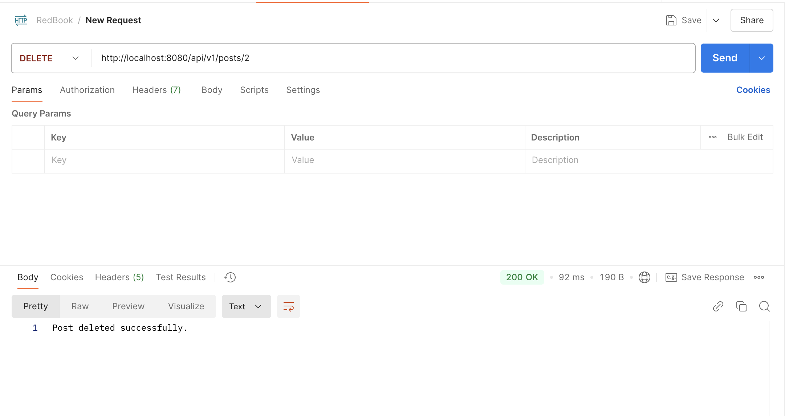
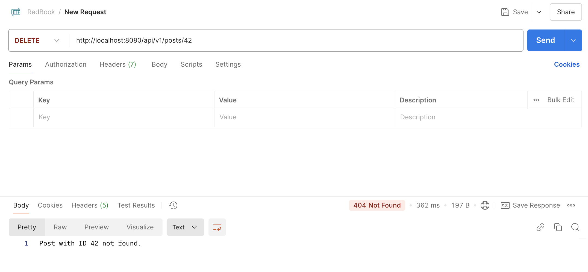

# HW6 Spring
## 2. explain how the below annotaitons specify the table in database?
```java
@Column(columnDefinition = "varchar(255) default 'John Snow'")
private String name;
@Column(name="STUDENT_NAME", length=50, nullable=false, unique=false)
private String studentName;
```
`@Column(columnDefinition = "varchar(255) default 'John Snow'")`
- This gives a full control over the column definition in the database.
  - columnDefinition: Directly specifies the SQL DDL(Data Definition Language) for the column.
  - It overrides other JPA settings and tells the database to create a column:
    - Type: varchar(255)
    - Default value: 'John Snow'

`@Column(name = "STUDENT_NAME", length = 50, nullable = false, unique = false)`
- This customizes column properties while letting JPA generate the SQL.
  - name: Sets the column name in the table to STUDENT_NAME.
  - length: Sets the max character length to 50 (for varchar).
  - nullable = false: Makes the column NOT NULL.
  - unique = false: The column is not required to be unique.

## 3. What is the default column names of the table in database for `@Column`?
```java
@Column
private String firstName;
@Column
private String operatingSystem;
```
- The default column names in the database will be `firstName` and `operatingSystem`
  - If don’t specify @Column(name = ...), JPA uses the Java field name as the default column name.
    - JPA treats this as:
    ```sql
    COLUMN NAME = "operatingSystem"
    ```
- BUT in the real database, how that name appears can vary depending on the database's naming rules.
  - Database	How it treats column names by default `operatingSystem`
  - PostgreSQL	Converts unquoted identifiers to lowercase → becomes `operatingsystem`
  - MySQL	Keeps case, but is case-insensitive → usually appears as `operatingSystem`
  - Oracle	Converts unquoted identifiers to uppercase → becomes `OPERATINGSYSTEM`
  - SQL Server	Keeps case but behaves case-insensitively → shows as `operatingSystem`

## 4. What are the layers in springboot application? what is the role of each layer
   - Controller Layer (aka Web/API layer): Handles HTTP requests and responses
   - Service Layer:	Contains business logic and application rules
   - Repository Layer:	Communicates with the database
   - Model Layer (aka Entity/Domain layer):	Defines data structures 

## 5. Describe the flow in all of the layers if an API is called by Postman.

  Example: `GET http://localhost:8080/posts/42`

   Postman Sends the HTTP Request
    - Postman initiates a GET request to my backend.
    - The request is routed to Spring Boot’s embedded server.
     
  1. Controller Layer `@RestController`
      ```java
         @GetMapping("/posts/{id}")
         public Post getPostById(@PathVariable Long id) {
             return postService.getPostById(id);
         }
      ```
       - Spring Boot matches the URL /posts/42 to this method.
       - The `@PathVariable` pulls `42` from the URL and passes it as `id`.
       - Controller delegates to the Service Layer.
  2. Service Layer `@Service`
      ```java
      public Post getPostById(Long id) {
          return postRepository.findById(id)
              .orElseThrow(() -> new RuntimeException("Post not found"));
      }
      ```
       - Handles the business logic.
       - Calls the Repository Layer to fetch the post from the database.
       - Might apply validation, authorization, logging, or transactional logic.
  3. Repository Layer `@Repository`
      ```java
      public interface PostRepository extends JpaRepository<Post, Long> {}
      ```
       - Executes `findById(42)` — either uses a custom query or Spring Data JPA auto-generates SQL.
       - Hits the actual database (e.g., MySQL/PostgreSQL) via Hibernate
       - Returns a Post entity (or Optional.empty() if not found).
  4. Service Layer
       - Receives the Post from the repository.
       - May transform it, filter fields, or apply business rules.
       - Returns the final `Post` object to the Controller.
  5. Controller Layer
       - Gets the final result (a `Post` object).
       - Automatically serializes it to JSON using Jackson.
       - Sends the JSON response back to Postman.
Final result in postman
```json
{
  "id": 42,
  "title": "The North Remembers",
  "content": "Winter is coming."
}
```
Flow
```txt
Postman --> Controller --> Service --> Repository --> Database
            <-- Response  <-- Result  <-- Entity ----
```

## 6. What is the application.properties? do you know application.yml?
- `application.properties`
   - Located in  `src/main/resources/application.properties` 
   - It’s a Spring Boot-specific configuration file used configure runtime settings like:
   - Configure: 
     - DB: spring.datasource.url=jdbc:mysql://localhost:3306/root
     - Server: server.port=8081
     - Logging: logging.level.org.springframework=DEBUG
     - Security: spring.security.user.name=admin
     - Profiles: spring.profiles.active=dev
- `application.yml`
  - Same purpose with `application.properties`, just use different syntaxes.
    - instead of writing `server.port=8081` `spring.datasource`.username=root, it writes in YAML format 
      ```yaml
      server:
        port: 8081

      spring:
        datasource:
          username: root
      ``` 
  - Advantages
    - More readable for nested configs
    - Cleaner structure
    - Easier to manage complex settings like lists or maps
    - BUT, it's White-space sensitive and  Not as beginner-friendly for copy-paste tweaking

## 7. What’s the naming differences between GraphQL vs. REST ? Why is the differences ?

| Aspect             | REST                                         | GraphQL                                        |
|--------------------|----------------------------------------------|------------------------------------------------|
| URL (endpoint) naming | Resource-oriented (nouns)                   | Single endpoint (`/graphql`)                   |
| Operation naming   | Verb is implied by HTTP method (GET, POST, etc.) | Explicitly named queries and mutations         |
| Resource access     | Multiple endpoints: `/users`, `/users/42/posts` | Single endpoint: `POST /graphql`              |
| Data fields         | Server defines what you get                  | Client chooses field names & structure         |
| Method names        | Not named directly                          | You name the operation: `getUser`, `createPost`, etc. |

### REST Naming = URL + HTTP Verb
In REST, combine HTTP methods and URLs to define intent:
```http
GET    /users         → get all users  
GET    /users/1       → get user with ID 1  
POST   /users         → create new user  
PUT    /users/1       → update user 1  
DELETE /users/1       → delete user 1
```
- Naming is resource-centric (nouns)
- The action comes from the HTTP verb

### GraphQL Naming = Named Operations
GraphQL uses one endpoint and define intent in the body:
```graphQL
query GetUser {
  user(id: 1) {
    name
    email
  }
}

mutation CreateUser {
  createUser(input: {name: "Jon"}) {
    id
    name
  }
}
```
- Naming is action-centric (getUser, createUser)
- control the shape and fields of the response
- The client declares exactly what it needs — no more, no less

### Why are the naming conventions different?
- REST is designed around resources
  - Clean, simple URLs
  - Great for CRUD APIs
  - Naming follows HTTP standard
- GraphQL is designed around operations and flexibility
  - One smart endpoint
  - Lets the client name the operation, not the server
  - Optimized for frontend freedom, nested data, and performance

## 8. Provide 2 real-world examples of N+1 problem in REST that can be solved by GraphQL.
### REST N+1 Problem
Happens when
- request a list of N items.
- For each item, I make an additional (1) request to fetch related data.

### Real-World Example #1: Blog Platform — Posts & Authors
REST (with N+1 problem)
1. GET /posts -> Returns 10 posts (each with an authorId)
2. For each post:
 - GET /users/1
 - GET /users/2
 - …
 - GET /users/10
3. Result: 1 request for posts + 10 separate requests for authors
4. N+1 requests = slow, lots of network overhead

GraphQL Solution
```graphql
query {
  posts {
    id
    title
    content
    description
    author {
      id
      name
    }
  }
}
```
-  One request
-  Fetches posts and nested author data
-  No duplicate queries — GraphQL + DataLoader can batch & cache those author lookups

### Real-World Example #2: E-commerce — Orders & Products
REST (with N+1 problem)
1. GET /orders -> Returns 5 orders, each with multiple productIds
2. For each product in each order:
   - GET /products/101
   - GET /products/102
   - ...
   - Maybe 15–20 product requests total
- Explodes fast with nested relationships
- App spends more time waiting for the network than doing actual work

GraphQL Solution
```graphql
query {
  orders {
    id
    date
    products {
      id
      name
      price
    }
  }
}
```
- Single query
- All orders + nested product details in one shot
- No loops, no repeated calls

## 9. Finish the following API
REST
DELETE post by ID (with exception cases)
```java
package com.backend.redbook.service;

public class PostNotFoundException extends RuntimeException {
    public PostNotFoundException(String message) {
        super(message);
    }
}
```
```java
@Override
public void deletePostById(Long id) {
    if (!postRepository.existsById(id)) {
        throw new PostNotFoundException("Post with ID " + id + " not found.");
    }
    postRepository.deleteById(id);
}
```
```java
@DeleteMapping("/posts/{id}")
public ResponseEntity<String> deletePost(@PathVariable Long id) {
    try {
        postService.deletePostById(id);
        return ResponseEntity.ok("Post deleted successfully.");
    } catch (PostNotFoundException e) {
        return ResponseEntity.status(HttpStatus.NOT_FOUND).body(e.getMessage());
    } catch (Exception e) {
        return ResponseEntity.status(HttpStatus.INTERNAL_SERVER_ERROR).body("Something went wrong.");
    }
}
```
Postman Test



GraphQL
Query getAllPost
1. `schema.graphqls`
```graphql
type Query {
  getAllPost: [Post]
}

type Post {
  id: ID
  title: String
  content: String
}
```
2. GraphQL Resolver (Using Spring GraphQL)
```java
@Component
public class PostQueryResolver {

    private PostRepository postRepository;

    public PostQueryResolver(PostRepository postRepository) {
        this.postRepository = postRepository;
    }

    @QueryMapping
    public List<Post> getAllPost() {
        return postRepository.findAll();
    }
}
```
3. GraphQL Query
```graphql
query {
  getAllPost {
    id
    title
    content
  }
}
```

## 10. Create a Project, name it with mongo-blog, write a POST API for mongo-blog, change database to MongoDB

## 11. https://www.mongodb.com/compatibility/spring-boot