1. List all of the annotations you learned from class and homework to annotations.md

   Already updated and written in `Short Questions/annotations.md`

   

2. Type out the code for the Comment feature of the class project.

   The project code is in `Projects/redbook`

   

3. In postman, call all of the APIs in PostController and CommentController.

   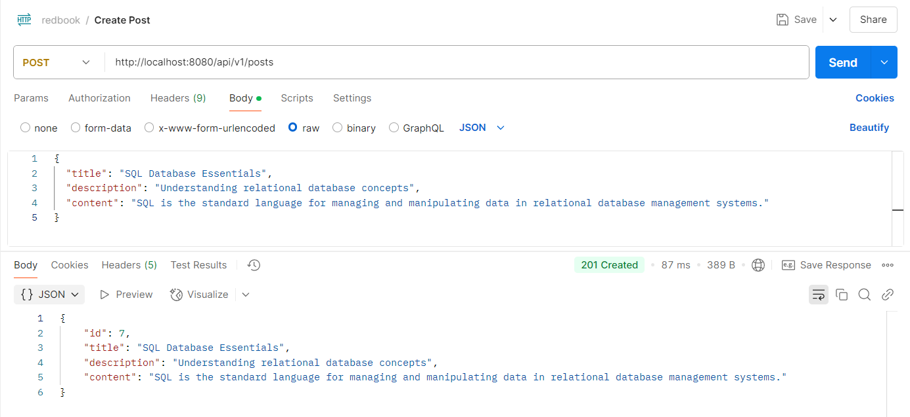

   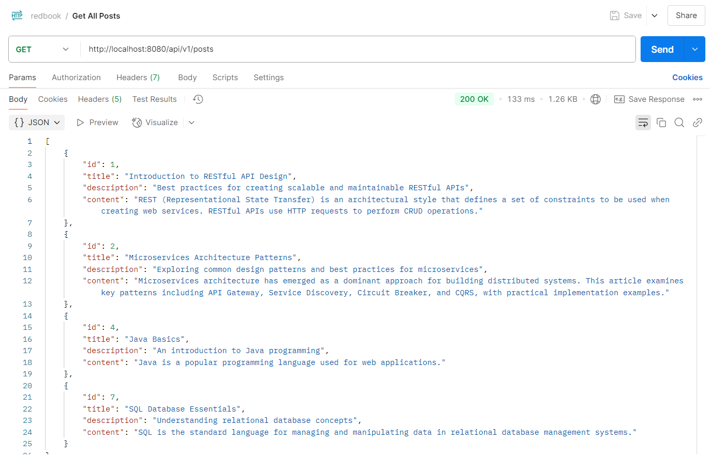

   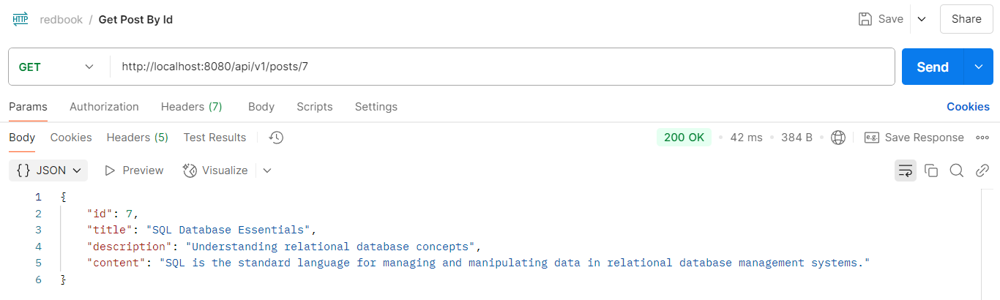

   

   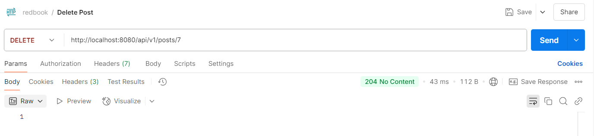

   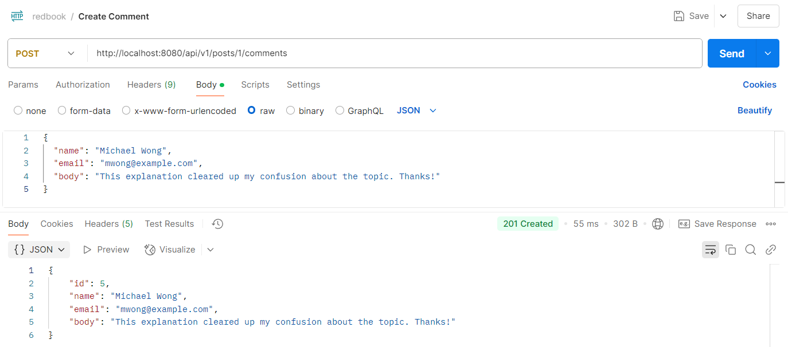

   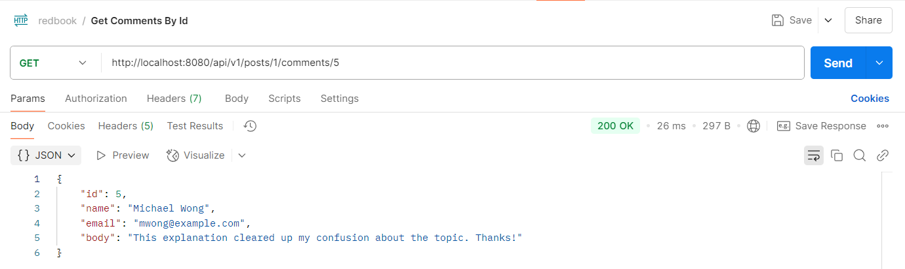

   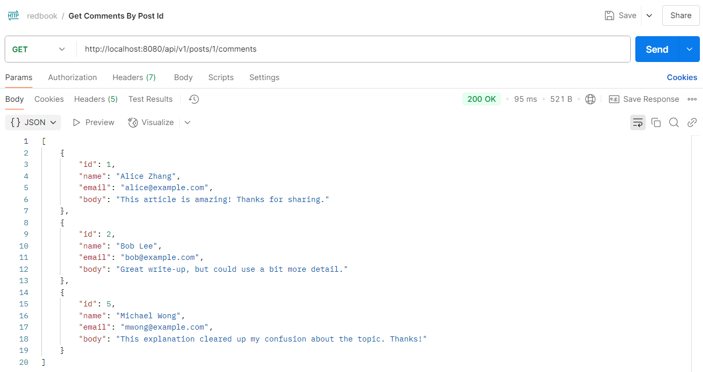

   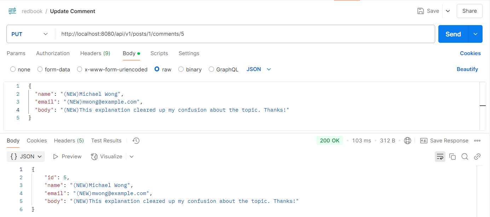

   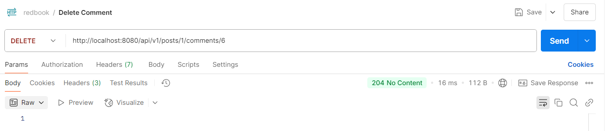

   

4. What is JPA? and what is Hibernate?

   **JPA** (Java Persistence API) is a **specification** that defines a standard approach for Object-Relational Mapping (ORM) in Java applications, providing a way to manage relational data.

   **Hibernate** is one of the most popular **implementations** of the JPA specification, offering a robust ORM framework that simplifies interactions between Java applications and databases.

   

5. What is Hikari? what is the benefits of connection pool?

   HikariCP is a high-performance JDBC connection pool library for Java applications. It's designed to be lightweight, simple to use, and extremely fast compared to other connection pool implementations. HikariCP has become the default connection pool in Spring Boot applications due to its excellent performance characteristics.

   Connection pools provide several important benefits for database applications:

   1. **Performance improvement**: Creating database connections is expensive and time-consuming. Connection pools maintain a set of pre-established connections that can be reused, significantly reducing connection creation overhead.

   2. **Resource management**: Database connections consume server resources. Pools limit the maximum number of connections, preventing resource exhaustion.

   3. **Connection lifecycle management**: Pools handle connection validation, idle timeout management, and proper closing of connections, reducing the risk of connection leaks.

   4. **Load balancing**: Advanced connection pools can distribute database load across multiple database servers.

   5. **Transaction management**: Many connection pools integrate with transaction management systems to ensure proper handling of connections during transactions.

      

6. What is the  `@OneToMany`, `@ManyToOne`, `@ManyToMany` ? Write some examples.

   `@OneToMany` defines a one-to-many relationship between two entities, where one entity can be associated with multiple instances of the other.

   `@ManyToOne` is the inverse of `@OneToMany`, defining the "many" side of the relationship where multiple entities can be associated with a single instance of another entity.

   ```java
   @Entity
   public class Department {
       @Id
       @GeneratedValue(strategy = GenerationType.IDENTITY)
       private Long id;
       
       private String name;
       
       @OneToMany(mappedBy = "department", cascade = CascadeType.ALL)
       private List<Employee> employees = new ArrayList<>();
       
       // getters and setters
   }
   
   @Entity
   public class Employee {
       @Id
       @GeneratedValue(strategy = GenerationType.IDENTITY)
       private Long id;
       
       private String name;
       
       @ManyToOne
       @JoinColumn(name = "department_id")
       private Department department;
       
       // getters and setters
   }
   ```

   `@ManyToMany` defines a many-to-many relationship where multiple entities can be associated with multiple instances of another entity. This typically requires a join table.

   ```java
   @Entity
   public class Student {
       @Id
       @GeneratedValue(strategy = GenerationType.IDENTITY)
       private Long id;
       
       private String name;
       
       @ManyToMany
       @JoinTable(
           name = "student_course",
           joinColumns = @JoinColumn(name = "student_id"),
           inverseJoinColumns = @JoinColumn(name = "course_id")
       )
       private Set<Course> courses = new HashSet<>();
       
       // getters and setters
   }
   
   @Entity
   public class Course {
       @Id
       @GeneratedValue(strategy = GenerationType.IDENTITY)
       private Long id;
       
       private String title;
       
       @ManyToMany(mappedBy = "courses")
       private Set<Student> students = new HashSet<>();
       
       // getters and setters
   }
   ```

   

7. What is the  `cascade = CascadeType.ALL, orphanRemoval = true` ? And what are the other CascadeType and their features? In which situation we choose which one?

   This combination of options creates a strong parent-child relationship between entities, where:

   - `cascade = CascadeType.ALL`: All operations (persist, merge, remove, refresh, detach) performed on the parent entity will be cascaded to the associated child entities.

   - `orphanRemoval = true`: Child entities that are no longer referenced by the parent will be automatically removed from the database.

   JPA provides several cascade types, each serving different purposes:

   1. **CascadeType.PERSIST**
      - Cascades the persist (save) operation to associated entities
      - Use when: You want new child entities to be saved when the parent is saved
   2. **CascadeType.MERGE**
      - Cascades the merge operation to associated entities
      - Use when: You want updates to child entities to be saved when the parent is updated
   3. **CascadeType.REMOVE**
      - Cascades the remove operation to associated entities
      - Use when: You want child entities to be deleted when the parent is deleted
   4. **CascadeType.REFRESH**
      - Cascades the refresh operation to associated entities
      - Use when: You want child entities to be refreshed from the database when the parent is refreshed
   5. **CascadeType.DETACH**
      - Cascades the detach operation to associated entities
      - Use when: You want child entities to be detached from the persistence context when the parent is detached
   6. **CascadeType.ALL**
      - Includes all of the above cascade types
      - Use when: You want all operations on the parent to affect the children

   When to Use Each CascadeType

   - **CascadeType.ALL**
     - Best for true parent-child relationships where the child cannot exist without the parent
     - Example: Orders and OrderItems, where items make no sense without their order
   - **CascadeType.PERSIST and MERGE** (common combination)
     - Good for related entities that need consistent saving/updating but independent deletion
     - Example: A User and their Profile, where you want profile updates to be saved with user updates, but deleting a user doesn't necessarily mean deleting their profile
   - **CascadeType.REMOVE**
     - Use carefully, as it will delete child records when the parent is deleted
     - Example: Comments on a blog post, where you want all comments deleted if the post is deleted
   - **No Cascade**
     - For loosely related entities where operations should be handled independently
     - Example: Many-to-many relationships like Student-Course, where operations on one shouldn't automatically affect the other

   - **orphanRemoval = true**
     - Add this when you want child entities to be automatically deleted when they're no longer referenced by the parent
     - Example: A Document with embedded Images, where removing an image from the document should delete the image entirely

   

8. What is the  `fetch = FetchType.LAZY, fetch = FetchType.EAGER` ? What is the difference? In which  situation you choose which one?

   `FetchType.LAZY`: Associated entities are loaded only when explicitly accessed

   `FetchType.EAGER`: Associated entities are loaded immediately when the parent entity is loaded

   **Use FetchType.LAZY when**:

   - The associated collection could be large
   - The associated entities aren't always needed
   - You want to optimize memory usage and initial query performance
   - Working with many-to-one or one-to-many relationships that contain many child records

   **Use FetchType.EAGER when**:

   - The associated collection is small and stable in size
   - The associated entities are almost always needed when the parent is accessed
   - Working with one-to-one relationships where you almost always need both sides
   - Performance analysis shows that making separate queries is less efficient

   **Default Values**

   - `@OneToMany` and `@ManyToMany`: Default is LAZY

   - `@OneToOne` and `@ManyToOne`: Default is EAGER

   **Best Practices**

   - Prefer LAZY loading as a general rule to avoid performance issues

   - Use EAGER only when you're certain you'll need the related data every time

   - For complex scenarios, consider using specific JPQL/HQL queries with JOIN FETCH to control exactly what is loaded

   - Be aware of the "N+1 query problem" that can occur with LAZY loading

     

9. What is the rule of JPA naming convention? Shall we implement the method by ourselves? Could you list  some examples?

   These naming conventions are based on a combination of:

   - Operation prefixes (find, get, query, count, delete, etc.)
   - Property paths (field names in your entity)
   - Comparison operators (equals, like, greaterThan, etc.)
   - Logical operators (and, or)

   **Query Methods**

   ```java
   public interface EmployeeRepository extends JpaRepository<Employee, Long> {
       // Basic finding methods - many prefixes work
       List<Employee> findByLastName(String lastName);
       Employee getByEmail(String email);
       List<Employee> readByDepartmentName(String deptName);
       
       // Multiple criteria
       List<Employee> findByFirstNameAndLastName(String firstName, String lastName);
       List<Employee> findByHireDateBetween(Date startDate, Date endDate);
       
       // String matching
       List<Employee> findByLastNameContaining(String fragment);
       List<Employee> findByEmailStartingWith(String prefix);
       
       // Comparison operators
       List<Employee> findBySalaryGreaterThan(BigDecimal minSalary);
       List<Employee> findByAgeGreaterThanEqual(int age);
       
       // Ordering results
       List<Employee> findByDepartmentIdOrderBySalaryDesc(Long deptId);
       
       // Limiting results
       List<Employee> findTop3ByOrderBySalaryDesc();
   }
   ```

   **Other Operation Types**

   ```java
   public interface EmployeeRepository extends JpaRepository<Employee, Long> {
       // Counting
       long countByDepartmentId(Long departmentId);
       
       // Existence check
       boolean existsByEmail(String email);
       
       // Deletion
       void deleteByLastName(String lastName);
       void removeByDepartmentId(Long departmentId);
   }
   ```

   

10. Try to use JPA advanced methods in your class project. In the repository layer, you need to use the  naming convention to use the method provided by JPA.

    ```java
    @Repository
    public interface CommentRepository extends JpaRepository<Comment, Long> {
        List<Comment> findByPostId(Long postId);
    }
    ```

    

11. (Optional) Check out a new branch( <https://github.com/TAIsRich/springboot-redbook/tree/hw02_01_jdbcTemplate>) from branch 02_post_RUD, replace the dao layer using JdbcTemplate.

    Corresponding code in `dao/jdbc`

    

12. Type the code, you need to checkout new branch from branch **02_post_RUD**, name the new branch with <https://github.com/TAIsRich/springboot-redbook/tree/hw05_01_slides_JPQL>.

    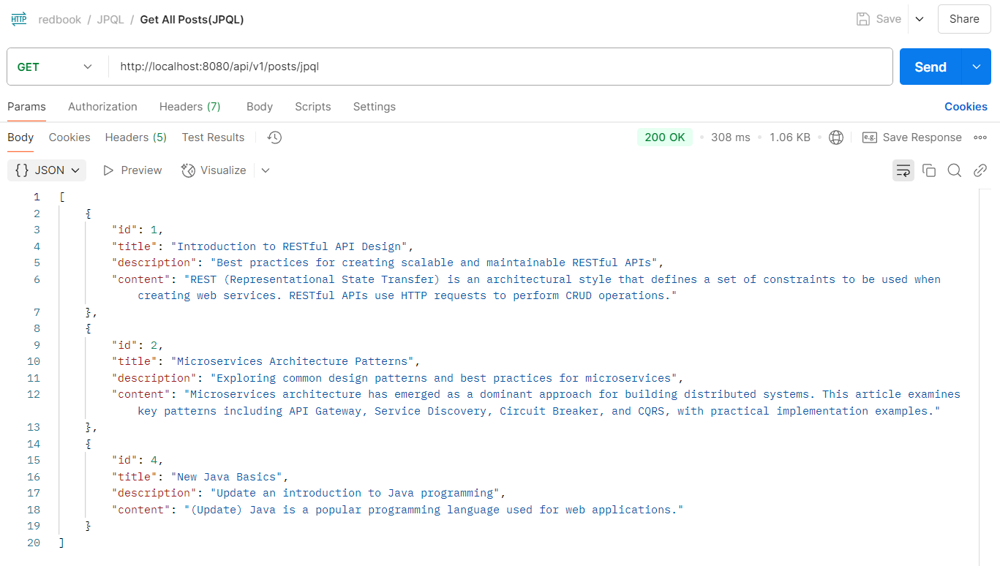

    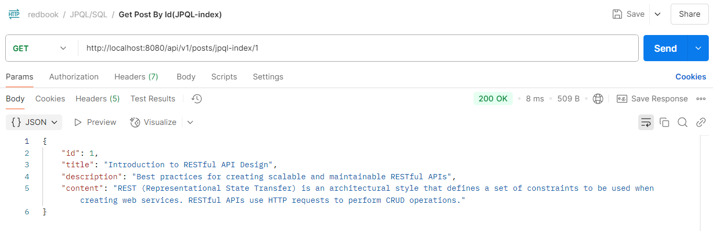

    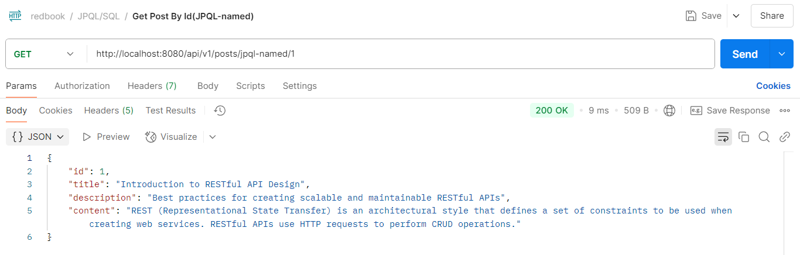

    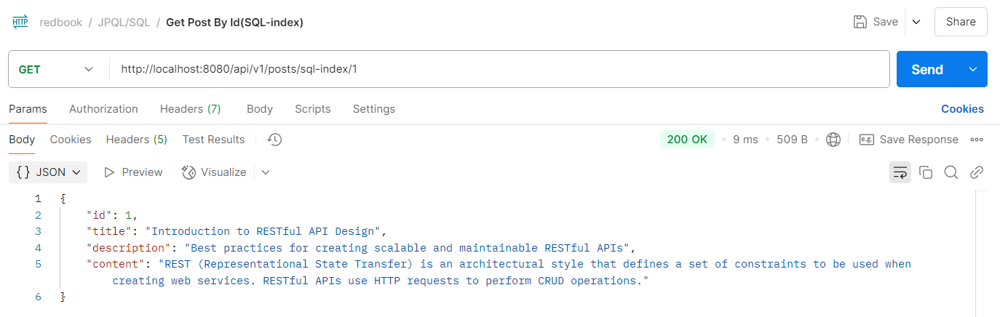

    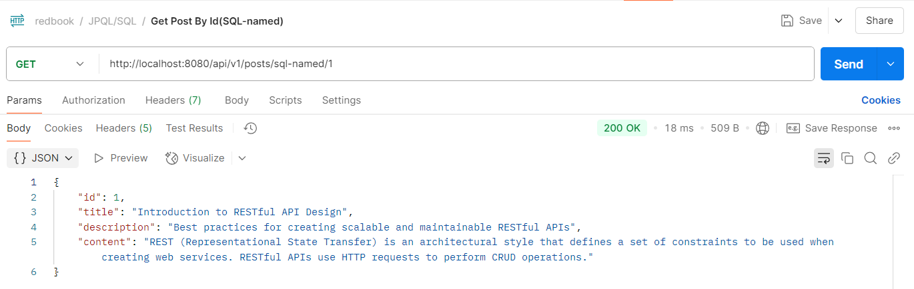

    

13. What is JPQL?

    JPQL (Java Persistence Query Language) is a platform-independent query language used in Java applications to query entities stored in relational databases. It's similar to SQL but operates on object entities rather than database tables.

    ```java
    // Creating a JPQL query to find all employees with salary > 50000
    String jpqlQuery = "SELECT e FROM Employee e WHERE e.salary > 50000";
    TypedQuery<Employee> query = entityManager.createQuery(jpqlQuery, Employee.class);
    List<Employee> employees = query.getResultList();
    ```

    

14. What is `@NamedQuery` and `@NamedQueries`?

    `@NamedQuery` and `@NamedQueries` are JPA annotations used to define reusable JPQL queries at the entity class level.

    `@NamedQuery` defines a single named query with a name and query string:

    ```java
    @Entity
    @NamedQuery(
        name = "Employee.findHighEarners",
        query = "SELECT e FROM Employee e WHERE e.salary > :minSalary"
    )
    public class Employee {
        // Entity properties
    }
    ```

    `@NamedQueries` is a container annotation that groups multiple `@NamedQuery` annotations:

    ```java
    @Entity
    @NamedQueries({
        @NamedQuery(
            name = "Employee.findHighEarners",
            query = "SELECT e FROM Employee e WHERE e.salary > :minSalary"
        ),
        @NamedQuery(
            name = "Employee.findByDepartment",
            query = "SELECT e FROM Employee e WHERE e.department = :department"
        )
    })
    public class Employee {
        // Entity properties
    }
    ```

    Using a named query:

    ```java
    TypedQuery<Employee> highEarnersQuery = entityManager.createNamedQuery("Employee.findHighEarners", Employee.class);
    highEarnersQuery.setParameter("minSalary", 50000);
    List<Employee> highEarners = highEarnersQuery.getResultList();
    
    TypedQuery<Employee> departmentQuery = entityManager.createNamedQuery("Employee.findByDepartment", Employee.class);
    departmentQuery.setParameter("department", "IT");
    List<Employee> itEmployees = departmentQuery.getResultList();
    ```

    

15. What is `@Query`? In which Interface we write the SQL or JPQL?

    `@Query` is a Spring Data JPA annotation used to define custom queries directly in repository interfaces. Unlike `@NamedQuery` which is defined at the entity level, `@Query` is placed directly on repository methods.

    ```java
    public interface EmployeeRepository extends JpaRepository<Employee, Long> {
        
        @Query("SELECT e FROM Employee e WHERE e.salary > :minSalary")
        List<Employee> findHighEarners(@Param("minSalary") double minSalary);
        
        @Query("SELECT e FROM Employee e WHERE e.department = :department")
        List<Employee> findByDepartment(@Param("department") String department);
        
        // Native SQL query example (using nativeQuery = true)
        @Query(value = "SELECT * FROM employees WHERE hire_date > :date", nativeQuery = true)
        List<Employee> findRecentHires(@Param("date") Date date);
    }
    ```

    

16. What is HQL and Criteria Queries?

    **HQL (Hibernate Query Language)**

    HQL is the object-oriented query language used by Hibernate, which is an implementation of JPA. It's very similar to JPQL but with some Hibernate-specific features.

    ```java
    Session session = sessionFactory.getCurrentSession();
    String hql = "FROM Employee e WHERE e.salary > :salary ORDER BY e.lastname";
    List<Employee> employees = session.createQuery(hql, Employee.class)
                                    .setParameter("salary", 50000)
                                    .getResultList();
    ```

    **Criteria Queries**

    Criteria API provides a type-safe, programmatic way to construct queries instead of using string-based queries. It helps catch query syntax errors at compile time rather than runtime.

    ```java
    CriteriaBuilder cb = entityManager.getCriteriaBuilder();
    CriteriaQuery<Employee> cq = cb.createQuery(Employee.class);
    Root<Employee> employeeRoot = cq.from(Employee.class);
    
    // Create where clause: salary > 50000
    cq.select(employeeRoot)
      .where(cb.greaterThan(employeeRoot.get("salary"), 50000));
    
    // Execute query
    List<Employee> employees = entityManager.createQuery(cq).getResultList();
    ```

    

17. What is EntityManager?

    EntityManager is a core interface in the Java Persistence API (JPA) that provides methods for managing the lifecycle of entity instances and executing queries against a database.

    Key responsibilities of EntityManager include:

    1. Managing the persistence context - tracking entity objects and their changes
    2. CRUD operations - creating, reading, updating, and deleting entities
    3. Query execution - running JPQL, Criteria, and native SQL queries
    4. Transaction management - when used with JTA or resource-local transactions

    ```java
    @PersistenceContext
    private EntityManager entityManager;
    
    // Find an entity by primary key
    Employee employee = entityManager.find(Employee.class, 1L);
    
    // Create a new entity
    Employee newEmployee = new Employee("John Doe", "IT", 60000);
    entityManager.persist(newEmployee);
    
    // Update an entity
    employee.setSalary(55000);
    entityManager.merge(employee);
    
    // Remove an entity
    entityManager.remove(employee);
    
    // Execute a JPQL query
    TypedQuery<Employee> query = entityManager.createQuery(
        "SELECT e FROM Employee e WHERE e.department = :dept", 
        Employee.class);
    query.setParameter("dept", "IT");
    List<Employee> results = query.getResultList();
    ```

    

18. What is SessionFactory and Session?

    SessionFactory and Session are interfaces from Hibernate, which is one of the most popular JPA implementations.

    **SessionFactory** is a thread-safe, immutable factory for Session objects. It's created once during application initialization and shared among all application threads.

    Key characteristics:

    1. Heavy-weight object - expensive to create
    2. Thread-safe - can be shared across threads
    3. Represents a connection to a single database
    4. Caches entity metadata and SQL statements

    ```java
    // Configuration and creation of SessionFactory
    StandardServiceRegistry registry = new StandardServiceRegistryBuilder()
        .configure() // reads hibernate.cfg.xml
        .build();
        
    SessionFactory sessionFactory = new MetadataSources(registry)
        .buildMetadata()
        .buildSessionFactory();
    ```

    **Session** is the main runtime interface between a Java application and Hibernate. It's a lightweight, non-thread-safe object that represents a single unit of work with the database.

    Key characteristics:

    1. Lightweight - inexpensive to create
    2. Not thread-safe - should not be shared between threads
    3. Short-lived - typically one session per request in web applications
    4. Provides first-level cache within a transaction
    5. Wraps a JDBC connection

    ```java
    // Get the session
    try (Session session = sessionFactory.openSession()) {
        // Start a transaction
        Transaction tx = session.beginTransaction();
        
        try {
            // Perform database operations
            Employee employee = new Employee("Jane Smith", "HR", 65000);
            session.persist(employee);
            
            // Query operations
            List<Employee> employees = session.createQuery("FROM Employee", Employee.class)
                                              .getResultList();
            
            // Commit the transaction
            tx.commit();
        } catch (Exception e) {
            // Rollback in case of an exception
            tx.rollback();
            throw e;
        }
    }
    ```

    

19. What is Transaction? how to manage your transaction?

    A transaction is a sequence of one or more operations (like insert, update, delete) executed as a single logical unit of work. A transaction must be either fully completed or fully rolled back — ensuring data integrity.

    Transactions follow the ACID properties:

    1. **Atomicity**: All operations in a transaction succeed or all fail (roll back). There's no partial completion.
    2. **Consistency**: A transaction transforms the database from one valid state to another valid state, maintaining all defined rules and constraints.
    3. **Isolation**: Concurrent transactions execute as if they were running sequentially, preventing data corruption from simultaneous access.
    4. **Durability**: Once a transaction is committed, its changes persist even in case of system failures.

    Programmatic Transaction Management

    ```java
    EntityManager entityManager = entityManagerFactory.createEntityManager();
    EntityTransaction transaction = entityManager.getTransaction();
    
    try {
        transaction.begin();
        // Perform database operations
        transaction.commit();
    } catch (Exception e) {
        transaction.rollback();
        throw e;
    } finally {
        entityManager.close();
    }
    ```

    Declarative Transaction Management (with Spring)

    ```java
    @Service
    public class EmployeeService {
        
        @Autowired
        private EmployeeRepository employeeRepository;
        
        @Transactional
        public void hireEmployee(Employee employee) {
            employeeRepository.save(employee);
            // More operations...
        }
    }
    ```

    

20. What is Hibernate Caching? Explain Hibernate caching mechanism in detail.

    Hibernate Caching is a strategy used to improve application performance by reducing database hits.

    Hibernate Caching Mechanism

    Hibernate offers a multi-level caching mechanism:

    1. **First-level Cache**

       - Session-scoped cache (also called persistence context)
       - Enabled by default and cannot be disabled
       - Exists for the duration of a Session
       - Reduces database hits within the same transaction

       ```java
       Session session = sessionFactory.openSession();
       // First database hit
       Employee emp1 = session.get(Employee.class, 1);
       // No database hit, object retrieved from first-level cache
       Employee emp2 = session.get(Employee.class, 1);
       session.close();
       ```

    2. **Second-level Cache**

       - SessionFactory-scoped cache
       - Optional and disabled by default
       - Shared across all sessions created from the same SessionFactory
       - Requires explicit configuration
       - Requires a cache provider (EHCache, Infinispan, etc.)

       ```java
       // Configuration in hibernate.cfg.xml or properties
       <property name="hibernate.cache.use_second_level_cache">true</property>
       <property name="hibernate.cache.region.factory_class">
           org.hibernate.cache.ehcache.EhCacheRegionFactory
       </property>
       
       // Entity configuration
       @Entity
       @Cacheable
       @Cache(usage = CacheConcurrencyStrategy.READ_WRITE)
       public class Employee {
           // Entity properties
       }
       ```

    3. **Query Cache**

       - Caches query results, not entities
       - Must be explicitly enabled
       - Useful for frequently executed queries with the same parameters

       ```java
       // Enable query cache
       <property name="hibernate.cache.use_query_cache">true</property>
       
       // Using query cache
       Query query = session.createQuery("FROM Employee WHERE department = :dept");
       query.setParameter("dept", "IT");
       query.setCacheable(true);
       List<Employee> employees = query.getResultList();
       ```

    **Cache Concurrency Strategies**

    1. **READ_ONLY**: For reference data that never changes

    2. **NONSTRICT_READ_WRITE**: For data that rarely changes (no strict transaction isolation)

    3. **READ_WRITE**: For data that can be updated, with transaction isolation

    4. **TRANSACTIONAL**: Full transaction support with isolation

    **Cache Regions**

    Hibernate allows grouping of cached entities into regions for finer control:

    ```java
    @Cache(usage = CacheConcurrencyStrategy.READ_WRITE, region = "employee")
    ```

    

21. What is the difference between first-level cache and second-level cache?

    | Feature                 | First-Level Cache                                         | Second-Level Cache                                           |
    | ----------------------- | --------------------------------------------------------- | ------------------------------------------------------------ |
    | **Scope**               | Session-scoped (transaction-level)                        | SessionFactory-scoped (application-level)                    |
    | **Status**              | Always enabled, cannot be disabled                        | Optional and disabled by default                             |
    | **Lifecycle**           | Created when Session opens, destroyed when Session closes | Created at application startup, destroyed at application shutdown |
    | **Sharing**             | Not shared between sessions                               | Shared across all sessions from same SessionFactory          |
    | **Implementation**      | Built into Hibernate core                                 | Requires third-party providers (EHCache, Infinispan, etc.)   |
    | **Configuration**       | No configuration needed                                   | Requires explicit configuration                              |
    | **Object Identity**     | Maintains object identity within a session                | Does not guarantee object identity across sessions           |
    | **Purpose**             | Prevents duplicate object loading within same transaction | Reduces database access across multiple transactions/users   |
    | **Performance Impact**  | Local impact (single transaction)                         | Global impact (entire application)                           |
    | **Cache Invalidation**  | Automatic when session closes                             | Requires explicit strategy (time-based, LRU, etc.)           |
    | **Memory Consumption**  | Lower (session-scoped)                                    | Higher (application-wide)                                    |
    | **Concurrency Control** | Handled by transaction isolation                          | Requires explicit concurrency strategy                       |

    ```java
    // First-level cache example
    Session session1 = sessionFactory.openSession();
    Employee emp1 = session1.get(Employee.class, 1); // Database hit
    Employee emp2 = session1.get(Employee.class, 1); // No database hit (first-level cache)
    session1.close();
    
    Session session2 = sessionFactory.openSession();
    Employee emp3 = session2.get(Employee.class, 1); // Database hit (new session)
    session2.close();
    
    // With second-level cache enabled
    Session session3 = sessionFactory.openSession();
    Employee emp4 = session3.get(Employee.class, 1); // Database hit
    session3.close();
    
    Session session4 = sessionFactory.openSession();
    Employee emp5 = session4.get(Employee.class, 1); // No database hit (second-level cache)
    session4.close();
    ```

    

22. How do you understand `@Transactional`?

    - It's a declarative way to manage transactions rather than writing explicit transaction code

    - It can be applied at both method and class levels

    - When applied at class level, all public methods inherit the transaction behavior

    - Spring creates a proxy around the annotated bean to handle transaction logic

    ```java
    @Service
    public class EmployeeService {
        
        @Autowired
        private EmployeeRepository repository;
        
        @Transactional
        public void updateSalary(Long id, double newSalary) {
            Employee emp = repository.findById(id).orElseThrow();
            emp.setSalary(newSalary);
            // No explicit save() needed - changes are tracked
        }
    }
    ```

    Key attributes:

    - `propagation`: Controls how transactions relate to existing transactions
    - `isolation`: Defines data visibility between concurrent transactions
    - `timeout`: Sets maximum execution time before automatic rollback
    - `readOnly`: Optimization hint that can improve performance for read operations
    - `rollbackFor`/`noRollbackFor`: Customizes exception handling for commits/rollbacks
