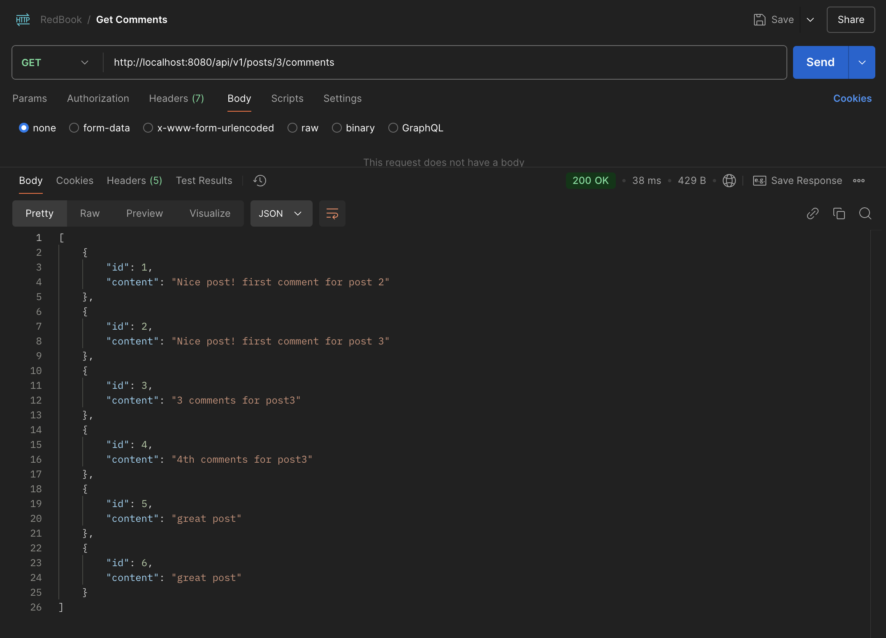
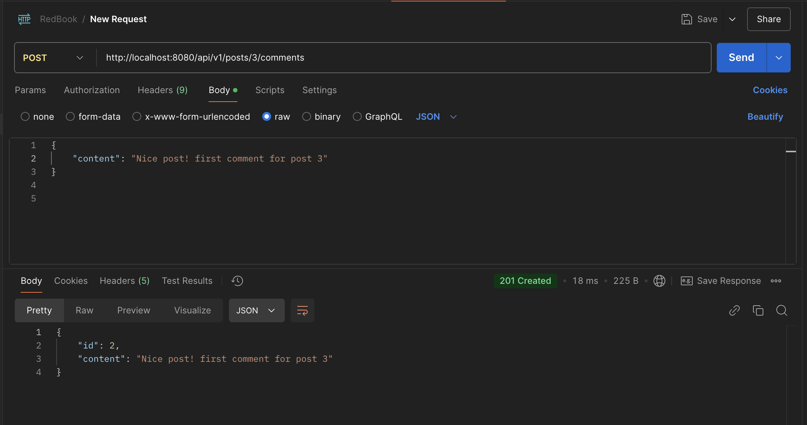

# HW8 - Spring Boot JPA
## 1. List all of the annotations you learned from class and homework to annotaitons.md  
In the file `annotations.md` in current folder

## 2. Type out the code for the Comment feature of the class project.  
```java
package com.backend.redbook.controller;

import com.backend.redbook.dto.CommentDto;
import com.backend.redbook.service.CommentService;
import org.springframework.beans.factory.annotation.Autowired;
import org.springframework.http.HttpStatus;
import org.springframework.http.ResponseEntity;
import org.springframework.web.bind.annotation.*;

import java.util.List;

@RestController
@RequestMapping("/api/v1/posts/{postId}/comments")
public class CommentController {
    @Autowired
    private CommentService commentService;

    @PostMapping
    public ResponseEntity<CommentDto> addComment(@PathVariable Long postId, @RequestBody CommentDto commentDto) {
        CommentDto newCommentDto = commentService.addCommentToPost(postId, commentDto);
        return new ResponseEntity<>(newCommentDto, HttpStatus.CREATED);
    }

    @GetMapping
    public ResponseEntity<List<CommentDto>> getCommentsForPost(@PathVariable Long postId) {
        List<CommentDto> comments = commentService.getCommentsForPost(postId);
        return ResponseEntity.ok(comments);
    }
}
```
```java
package com.backend.redbook.dto;

public class CommentDto {
    private Long id;
    private String content;

    public CommentDto() {}
    public CommentDto(Long id, String content) {
        this.id = id;
        this.content = content;
    }
    public Long getId() {
        return id;
    }
    public String getContent() {
        return content;
    }
    public void setContent(String content) {
        this.content = content;
    }
    public void setId(Long id) {
        this.id = id;
    }
}
```
```java
package com.backend.redbook.entity;

import jakarta.persistence.*;

@Entity
@Table(name = "comments")
public class Comment {
    @Id
    @GeneratedValue(strategy = GenerationType.IDENTITY)

    @Column (name="id", nullable = false)
    private Long id;

    @Column (name="content", nullable = false)
    private String content;

    // Each object of this class (Comment) is linked to one object of another class (Post)
    // Don't fetch the full Post object until I actually use getPost()
    @ManyToOne(fetch = FetchType.LAZY)
    @JoinColumn(name = "post_id", nullable = false)
    private Post post;

    // Getters an Setters
    public Long getId() {
        return id;
    }
    public void setId(Long commentId) {
        this.id = commentId;
    }
    public String getContent() {
        return content;
    }
    public void setContent(String content) {
        this.content = content;
    }
    public Post getPost() {
        return post;
    }
    public void setPost(Post post) {
        this.post = post;
    }
}
```
```java
package com.backend.redbook.repository;

import com.backend.redbook.entity.Comment;
import org.springframework.data.jpa.repository.JpaRepository;
import org.springframework.stereotype.Repository;

import java.util.List;

@Repository
public interface CommentRepository extends JpaRepository<Comment, Long> {
    List<Comment> findByPost_Id(Long postId);
}
```
```java
package com.backend.redbook.service;

import com.backend.redbook.dto.CommentDto;

import java.util.List;

public interface CommentService {
    CommentDto addCommentToPost(Long postId, CommentDto commentDto);
    List<CommentDto> getCommentsForPost(Long postId);
}
```
```java
package com.backend.redbook.service;

import com.backend.redbook.dto.CommentDto;
import com.backend.redbook.entity.Comment;
import com.backend.redbook.entity.Post;
import com.backend.redbook.repository.CommentRepository;
import com.backend.redbook.repository.PostRepository;
import org.springframework.stereotype.Service;
import org.springframework.beans.factory.annotation.Autowired;

import java.util.List;
import java.util.stream.Collectors;

@Service
public class CommentServiceImpl implements CommentService{
    @Autowired
    private CommentRepository commentRepository;

    @Autowired
    private PostRepository postRepository;

    @Override
    public CommentDto addCommentToPost(Long postId, CommentDto commentDto) {
        Post post = postRepository.findById(postId)
                .orElseThrow(() -> new PostNotFoundException("Post ID " + postId + " not found."));

        Comment comment = new Comment();
        comment.setContent(commentDto.getContent());
        comment.setPost(post);

        Comment saved = commentRepository.save(comment);

        return mapToDto(saved);
    }

    @Override
    public List<CommentDto> getCommentsForPost(Long postId) {
        List<Comment> comments = commentRepository.findByPost_Id(postId);
        return comments.stream().map(this::mapToDto).collect(Collectors.toList());
    }

    private CommentDto mapToDto(Comment comment) {
        return new CommentDto(comment.getId(), comment.getContent());
    }

}
```
## 3. In postman, call all of the APIs in PostController and CommentController.  



## 4. What is JPA? and what is Hibernate?  
- Java Persisitence API: specification telling how ORM should work(java object map to db tables)
- Hibernate: library implemnts JPA interface

## 5. What is Hiraki? what is the benefits of connection pool?  
### Hiraki and Conncetion Pool
- HikariCP is a super-fast, lightweight JDBC connection pool. It manages and reuses database connections so your app doesn't have to create a new one every time.
- A connection pool is a cache of DB connections that are kept open and reused, instead of creating new ones for every request.
### Benefits of connection pool
- Performace: Opening DB connections is expensive! Pooling reuses them.
- Scalability: Handle more requests with fewer DB connections.
- Lower Latency: No delay from repeatedly opening/closing connections.
- Better Resource Use	DB has limits: pooling prevents overload.
- Timeout & Leak Detection: Hikari can detect stuck or slow queries.

## 6. What is the `@OneToMany, @ManyToOne, @ManyToMany`? write some examples.  
@ManyToOne
- Usage: Creates a many-to-one relationship between entities.
- Understanding: Many Post entities can belong to one User.
The Post holds the foreign key (user_id) to connect back to the User.
```java
@ManyToOne
@JoinColumn(name = "user_id") // optional: specifies the column name in the DB
private User author;
```

@OneToMany
- Usage: Defines a one-to-many relationship between entities.
- Understanding: One Post can have many Comment entities.
The Comment side holds the foreign key, so this side is inverse.
```java
@OneToMany(mappedBy = "post", cascade = CascadeType.ALL, orphanRemoval = true)
private List<Comment> comments = new ArrayList<>();
```

@ManyToMany
- Usage: Establishes a many-to-many relationship between entities.
- Understanding: Many Student entities can enroll in many Course entities, and vice versa.
A join table is automatically created.
```java
@ManyToMany
@JoinTable(
    name = "student_course",
    joinColumns = @JoinColumn(name = "student_id"),
    inverseJoinColumns = @JoinColumn(name = "course_id")
)
private List<Course> courses;
```

## 7. What is the `cascade = CascadeType.ALL, orphanRemoval = true?` and what are the other CascadeType and their features? In which situation we choose which one?  
### Cascade
- Cascading means: "When I perform an operation on this entity, automatically apply the same operation to the related entities."
- Example: So when we save, delete, or update a Post, we want JPA to also do that for its Comments

### What does cascade = CascadeType.ALL do?
Enables ALL of the following cascade types:
- PERSIST — save new child entities when parent is saved
- MERGE — update child entities when parent is updated
- REMOVE — delete child entities when parent is deleted
- DETACH — remove them from persistence context
- REFRESH — update them with DB values if parent is refreshed
ALL = do everything together

### What does orphanRemoval = true do?
If a child (like a Comment) is removed from the collection, and it's no longer referenced by anything else — delete it from the database.

### CascadeTypes Usage Scenario
| Situation                                             | Cascade Choice                          |
|-------------------------------------------------------|------------------------------------------|
| Parent owns child fully (like Post → Comment)         | `CascadeType.ALL` + `orphanRemoval = true` |
| Shared references (like Product → Category)           | No cascade — manage manually           |
| Read-only relationships                               | No cascade — don’t update through parent |
| You want to save parent + new children together       | Use `PERSIST` only                     |
| You want to update existing tree                      | Use `MERGE`                            |
| You want to delete all child entities when parent is deleted | Use `REMOVE` or `ALL`              |

## 8. What is the fetch = FetchType.LAZY, fetch = FetchType.EAGER? what is the difference? In which situation you choose which one?  
These are fetch strategies in JPA, They determine when related entities are loaded from the database.
### FetchType.LAZY (lazy loading)
- The related entity is not loaded immediately. It’s loaded only when access it in code.
- Example: @OneToMany(fetch = FetchType.LAZY)
### FetchType.EAGER
- The related entity is loaded immediately with the main entity. It fetches in one SQL query (usually with joins).
- Example: @ManyToOne(fetch = FetchType.EAGER)

| Feature       | LAZY                  | EAGER                         |
|---------------|------------------------|-------------------------------|
| Timing        | Loaded on-demand       | Loaded immediately            |
| Performance   | More efficient by default | Can cause unnecessary data    |
| Query Count   | May cause N+1 problem  | Usually 1 query

| Situation                                | Strategy       | Why?                                                   |
|------------------------------------------|----------------|--------------------------------------------------------|
| we don’t always need the related data   | LAZY           | Saves memory and improves performance                  |
| we always need the related data         | EAGER          | Avoids extra queries and simplifies code               |
| For collections (@OneToMany, @ManyToMany)| LAZY is default| Because loading big collections eagerly is risky       |
| For single-valued (@ManyToOne, @OneToOne)| EAGER is often default | But still consider switching to LAZY if data is optional |

## 9. What is the rule of JPA naming convention? Shall we implement the method by ourselves? Could you list some examples?  
### JPA naming convention
`find/delete/exists/countBy + FieldName + [Keyword]`
Can also use with:
- And, Or, Between, LessThan, GreaterThan
- Like, IsNull, In, Not, OrderBy, etc.

### Do we need to implement these methods ourselves?
No, If the method follows the naming convention, Spring will auto-implement it at runtime using proxies and JPQL.
But JPA do not support `updateBy...` and `insertBy...` automatically

### Examples
| Method Name                             | What It Does                                      |
|-----------------------------------------|---------------------------------------------------|
| findByUsername(String username)         | Find one or more users by username                |
| findByEmailAndStatus(String email, String status) | Find users where email and status match       |
| findByAgeGreaterThan(int age)           | Find users older than a certain age               |
| findByCreatedAtBetween(Date start, Date end) | Find users created between two dates           |
| findByNameContaining(String keyword)    | SQL LIKE %keyword%                                |
| findByActiveTrue()                      | Find all users where active = true                |
| findTop5ByOrderByScoreDesc()            | Find top 5 users ordered by score descending      |
| deleteById(Long id)                     | Delete entity by id                               |
| existsByEmail(String email)             | Check if a user exists with given email           |

## 10. Try to use JPA advanced methods in your class project. In the repository layer, you need to use the naming convention to use the method provided by JPA.  
```java
@Repository
public interface CommentRepository extends JpaRepository<Comment, Long> {
    List<Comment> findByPost_Id(Long postId);
}
```

## 11. (Optional) Check out a new branch(https://github.com/TAIsRich/springboot-redbook/tree/hw02_01_jdbcTemplate) from branch 02_post_RUD, replace the dao layer using JdbcTemplate.  

## 12. type the code, you need to checkout new branch from branch 02_post_RUD, name the new branch with https://github.com/TAIsRich/springboot-redbook/tree/hw05_01_slides_JPQL.  

## 13. What is JPQL?  
### JPQL (Java Persistence Query Language)
It’s object-oriented SQL used in JPA to query entities, not tables.
| Feature             | SQL                        | JPQL                              |
|---------------------|-----------------------------|------------------------------------|
| Targets             | Tables, columns             | Entities, fields (Java classes)    |
| Example             | SELECT * FROM post          | SELECT p FROM Post p               |
| Type-safe?          | No                          | Yes (at compile time, if using IDEs) |
| Database-specific?  | Yes                          | Portable across DBs             |

```java
// Get all posts
@Query("SELECT p FROM Post p")
List<Post> findAllPosts();

// Get posts by author
@Query("SELECT p FROM Post p WHERE p.author = :author")
List<Post> findByAuthor(@Param("author") String author);
```

## 14. What is @NamedQuery and @NamedQueries?  
### @NamedQuery
define a JPQL query with a fixed name
```java
@Entity
@NamedQuery(
    name = "Post.findByAuthor",
    query = "SELECT p FROM Post p WHERE p.author = :author"
)
public class Post {
    // fields, getters, etc.
}
```
```java
List<Post> posts = entityManager
    .createNamedQuery("Post.findByAuthor", Post.class)
    .setParameter("author", "Elena")
    .getResultList();
```

### @NamedQueries
a container that allows us to declare multiple @NamedQuerys on the same entity.
```java
@Entity
@NamedQueries({
    @NamedQuery(name = "Post.findByAuthor", query = "SELECT p FROM Post p WHERE p.author = :author"),
    @NamedQuery(name = "Post.findPublished", query = "SELECT p FROM Post p WHERE p.published = true")
})
public class Post {
    // normal entity
}
```
## 15. What is @Query? In which Interface we write the sql or JPQL?  
let us write custom JPQL or SQL directly in the repository interface methods.
we write @Query inside an interface that extends JpaRepository
```java
@Repository
public interface PostRepository extends JpaRepository<Post, Long> {

    @Query("SELECT p FROM Post p WHERE p.author = :author")
    List<Post> findPostsByAuthor(@Param("author") String author);
}
```

## 16. What is HQL and Criteria Queries?  
### HQL(Hibernate Query Language)
- It’s basically JPQL, but specific to Hibernate.
- It works with entity classes and their properties, not tables and columns.
```java
String hql = "FROM Post p WHERE p.author = :author";
List<Post> posts = entityManager.createQuery(hql, Post.class)
                                .setParameter("author", "Elena")
                                .getResultList();
```
### Criteria Query?
a type-safe, programmatic way to build dynamic queries using Java code instead of strings.
```java
CriteriaBuilder cb = entityManager.getCriteriaBuilder();
CriteriaQuery<Post> cq = cb.createQuery(Post.class);
Root<Post> root = cq.from(Post.class);

cq.select(root).where(cb.equal(root.get("author"), "Elena"));

List<Post> posts = entityManager.createQuery(cq).getResultList();
```
The same query as:
```sql
SELECT * FROM Post WHERE author = 'Elena'
```
| Feature          | HQL                                  | Criteria API                                  |
|------------------|---------------------------------------|------------------------------------------------|
| Style            | String-based                          | Object-based (fluent builder style)            |
| Type-safe?       | No (until runtime)                    | Yes (compile-time safe)                     |
| Readability      | Easy for simple queries               | Verbose, especially for joins               |
| Best for         | Static or simple queries              | Dynamic or multi-condition filters             |

| Use Case                                 | Pick                                |
|------------------------------------------|-------------------------------------|
| Simple, static queries                   | JPQL / HQL (via @Query)             |
| Need dynamic filters / optional search   | Criteria API                        |
| Need performance & DB-specific features  | Native SQL                          |
| Need fast development with Spring        | Spring Data naming or @Query        |

## 17. What is EnityManager?  
- The central interface in JPA that manages the lifecycle of our entities. It acts as a bridge between our Java objects (entities) and the database.
- In Spring Boot, we do not use it directly. Spring Data JPA abstracts it for us through @Repository and @Transactional.

| Responsibility               | Means                                                              |
|------------------------------|-----------------------------------------------------------------------------|
| persist(entity)              | Inserts a new entity into the database                                     |
| find(EntityClass.class, id)  | Retrieves an entity by its primary key                                     |
| merge(entity)                | Updates the database with the given detached entity                        |
| remove(entity)               | Deletes the entity from the database                                       |
| createQuery(...)             | Allows you to write JPQL or native queries                                 |
| Manages persistence context  | Keeps track of entity state (new, managed, detached, removed)              |
| Transaction boundary control | Works with EntityTransaction or @Transactional in Spring                   |

## 18. What is SessionFactory and Session?  
### SessionFactory
- A heavyweight object that’s created once and lives for the entire app lifetime.
- Responsible for creating Session objects.
- Internally holds all the config info: mappings, DB settings, caching strategies, etc.
- Thread-safe to be shared and reused.
```java
SessionFactory sessionFactory = new Configuration().configure().buildSessionFactory();
```
### Session
- A lightweight, short-lived object.
- Represents a single unit of work with the DB.
- Used to perform CRUD operations on entities.
- Not thread-safe—each thread should have its own session.
```java
Session session = sessionFactory.openSession();
session.beginTransaction();
session.save(post);
session.getTransaction().commit();
session.close();
```
| Concept       | SessionFactory                             | Session                                      |
|---------------|---------------------------------------------|-----------------------------------------------|
| Lifecycle     | One per application                         | One per DB transaction                        |
| Cost          | Expensive to create                         | Cheap to create                               |
| Thread-safe   | Yes                                         | No                                          |
| Responsibility| Creates Sessions, holds metadata            | Performs DB operations (CRUD, HQL)            |
| Analogy       | Factory                                     | Product (car/session)                         |

## 19. What is Transaction? how to manage your transaction?  
### Transaction
- A transaction is a sequence of operations performed as a single unit of work.
- Either everything succeeds, or everything rolls back—no half-baked data allowed.
### Two ways to manage transactions
1. Annotation-based
```java
@Service
public class PostService {

    @Transactional
    public void publishPost(Post post) {
        post.setPublished(true);
        postRepository.save(post); // This is part of the transaction
    }
}
```
- If any exception occurs, Spring automatically rolls back.
- By default, it rolls back for unchecked exceptions
2. Programmatic Transaction Management
```java
TransactionStatus status = transactionManager.getTransaction(new DefaultTransactionDefinition());

try {
    // logic here
    transactionManager.commit(status);
} catch (Exception e) {
    transactionManager.rollback(status);
}
```

## 20. What is hibernate Caching? Explain Hibernate caching mechanism in detail.
Hibernate caching is the mechanism that stores data in memory to avoid hitting the database over and over.

Hibernate Has 2 Levels of Cache:
- First-level cache: If you fetch the same entity twice in one session, Hibernate won’t hit the DB again.
- Second-level cache: Works across sessions. If one session loads an entity and stores it in second-level cache, the next session can reuse it.

## 21. What is the difference between first-level cache and second-level cache?  
| Level           | Description         | Scope                  | Enabled by Default?                |
|------------------|---------------------|-------------------------|------------------------------------|
| 1st Level Cache  | Session-level       | Per Hibernate Session   | Yes                              |
| 2nd Level Cache  | Application-level   | Shared across sessions  | No (must enable/configure)       |

## 22. How do you understand @Transactional? (https://github.com/TAIsRich/tutorial-transaction)  
### What is @Transactional?
@Transactional is a Spring annotation that tells the framework: Wrap this method in a database transaction.
- If everything inside the method succeeds, the transaction commits.
- If an exception occurs, the transaction rolls back—like nothing ever happened.
- It keeps our data safe, consistent, and rollback-able
- Can be used on a class or method