# hw8
### 1. List all of the annotations you learned from class and homework to annotaitons.md
### 2. Type out the code for the Comment feature of the class project.
**CommentController**:
```java
package chuwa.backend.redbook.controller;

import chuwa.backend.redbook.dto.CommentDto;
import chuwa.backend.redbook.service.CommentService;
import org.springframework.beans.factory.annotation.Autowired;
import org.springframework.http.ResponseEntity;
import org.springframework.web.bind.annotation.*;

import java.util.List;

@RestController
@RequestMapping("api/v1/comments")
public class CommentController {

    @Autowired
    private CommentService commentService;

    @PostMapping
    public ResponseEntity<CommentDto> createComment(@RequestBody CommentDto commentDto) {
        return ResponseEntity.ok(commentService.createComment(commentDto));
    }

    @GetMapping
    public ResponseEntity<List<CommentDto>> getComments() {
        return ResponseEntity.ok(commentService.getComments());
    }

    @GetMapping("/{id}")
    public ResponseEntity<CommentDto> getComment(@PathVariable Long id) {
        return ResponseEntity.ok(commentService.getComment(id));
    }

    @PutMapping("/{id}")
    public ResponseEntity<CommentDto> updateComment(@PathVariable Long id, @RequestBody CommentDto commentDto) {
        return ResponseEntity.ok(commentService.updateComment(id, commentDto));
    }

    @DeleteMapping("/{id}")
    public ResponseEntity<String> deleteComment(@PathVariable Long id) {
        commentService.deleteComment(id);
        return ResponseEntity.ok("Delete: " + id.toString());
    }
}
```
**CommentService**:
```java
package chuwa.backend.redbook.service;

import chuwa.backend.redbook.dto.CommentDto;

import java.util.List;

public interface CommentService {
    CommentDto createComment(CommentDto commentDto);
    List<CommentDto> getComments();
    CommentDto getComment(Long id);
    CommentDto updateComment(Long id, CommentDto commentDto);
    void deleteComment(Long id);
}
```
**CommentServiceImpl**:
```java
package chuwa.backend.redbook.service.impl;

import chuwa.backend.redbook.dao.CommentRepository;
import chuwa.backend.redbook.dto.CommentDto;
import chuwa.backend.redbook.entity.Comment;
import chuwa.backend.redbook.service.CommentService;
import org.springframework.beans.factory.annotation.Autowired;
import org.springframework.stereotype.Service;

import java.util.List;
import java.util.stream.Collectors;

@Service
public class CommentServiceImpl implements CommentService {

    @Autowired
    private CommentRepository commentRepository;

    @Override
    public CommentDto createComment(CommentDto commentDto) {
        Comment comment = mapToEntity(commentDto);
        Comment savedComment = commentRepository.save(comment);
        return mapToDto(savedComment);
    }

    @Override
    public List<CommentDto> getComments() {
        List<Comment> comments = commentRepository.findAll();
        return comments.stream().map(this::mapToDto).collect(Collectors.toList());
    }

    @Override
    public CommentDto getComment(Long id) {
        Comment comment = commentRepository.findById(id).orElse(null);
        return mapToDto(comment);
    }

    @Override
    public CommentDto updateComment(Long id, CommentDto commentDto) {
        Comment comment = commentRepository.findById(id).orElse(null);
        comment.setContent(commentDto.getContent());

        Comment updatedComment = commentRepository.save(comment);

        return mapToDto(updatedComment);
    }

    @Override
    public void deleteComment(Long id) {
        Comment comment = commentRepository.findById(id).orElse(null);
        commentRepository.delete(comment);
    }

    private CommentDto mapToDto(Comment comment) {
        CommentDto commentDto = new CommentDto();
        commentDto.setId(comment.getId());
        commentDto.setContent(comment.getContent());
        commentDto.setPostId(comment.getPostId());
        return commentDto;
    }

    private Comment mapToEntity(CommentDto commentDto) {
        Comment comment = new Comment();
        comment.setContent(commentDto.getContent());
        comment.setPostId(commentDto.getPostId());
        return comment;
    }
}
```
**CommentRepository**:
```java
package chuwa.backend.redbook.dao;

import chuwa.backend.redbook.entity.Comment;
import org.springframework.data.jpa.repository.JpaRepository;
import org.springframework.stereotype.Repository;

@Repository
public interface CommentRepository extends JpaRepository<Comment, Long> {
}
```
**Comment**:
```java
package chuwa.backend.redbook.entity;

import jakarta.persistence.*;
import org.hibernate.annotations.CreationTimestamp;

import java.time.LocalDateTime;

@Entity
@Table(name="comments")
public class Comment {

    @Id
    @GeneratedValue(strategy = GenerationType.IDENTITY)
    private Long id;

    @Column(name="content", nullable = false)
    private String content;

    @Column(name="post_id", nullable = false)
    private Long postId;

    @CreationTimestamp
    private LocalDateTime createdDateTime;

    public Comment() {
    }

    public Comment(Long id, String content, Long postId, LocalDateTime createdDateTime) {
        this.id = id;
        this.content = content;
        this.postId = postId;
        this.createdDateTime = createdDateTime;
    }

    public Long getId() {
        return id;
    }

    public void setId(Long id) {
        this.id = id;
    }

    public String getContent() {
        return content;
    }

    public void setContent(String content) {
        this.content = content;
    }

    public Long getPostId() {
        return postId;
    }

    public void setPostId(Long postId) {
        this.postId = postId;
    }

    public LocalDateTime getCreatedDateTime() {
        return createdDateTime;
    }

    public void setCreatedDateTime(LocalDateTime createdDateTime) {
        this.createdDateTime = createdDateTime;
    }
}
```
**CommentDto**:
```java
package chuwa.backend.redbook.dto;

public class CommentDto {
    private Long id;
    private String content;
    private Long postId;

    public CommentDto() {
    }

    public CommentDto(Long id, String content, Long postId) {
        this.id = id;
        this.content = content;
        this.postId = postId;
    }

    public Long getId() {
        return id;
    }

    public void setId(Long id) {
        this.id = id;
    }

    public String getContent() {
        return content;
    }

    public void setContent(String content) {
        this.content = content;
    }

    public Long getPostId() {
        return postId;
    }

    public void setPostId(Long postId) {
        this.postId = postId;
    }
}
```
### 3. In postman, call all of the APIs in PostController and CommentController.
1. PostController:
    1. Create Post: `POST` `/api/v1/posts`
    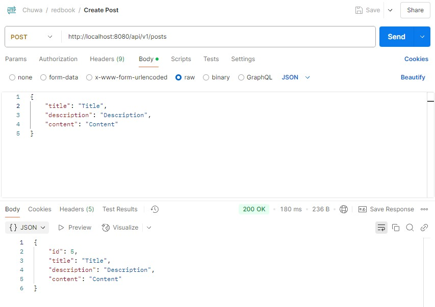
    2. Get All Posts: `GET` `/api/v1/posts`
    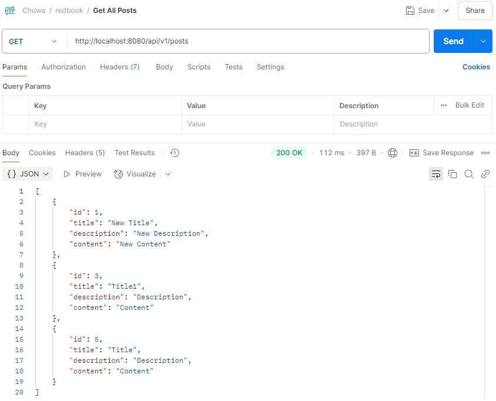
    3. Get Post by Id: `GET` `/api/v1/posts/{id}`
    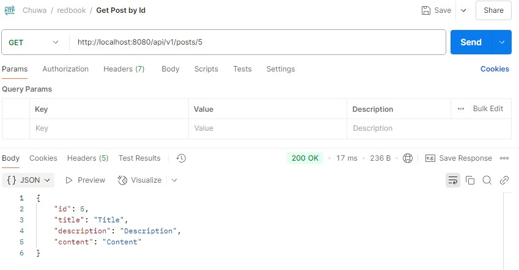
    4. Update Post: `PUT` `/api/v1/posts/{id}`
    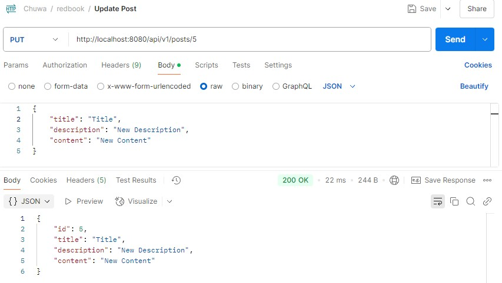
    4. Delete Post: `DELETE` `/api/v1/posts/{id}`
    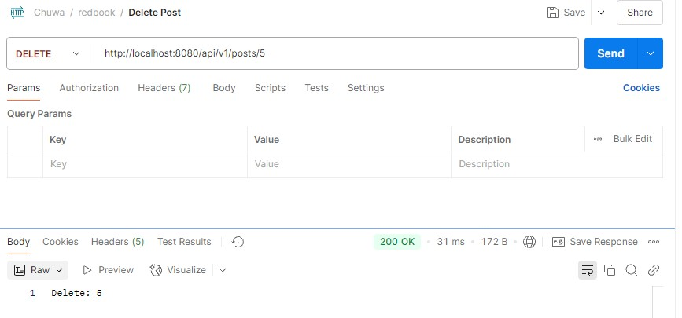
2. CommentController:
    1. Create Comment: `POST` `/api/v1/comments`
    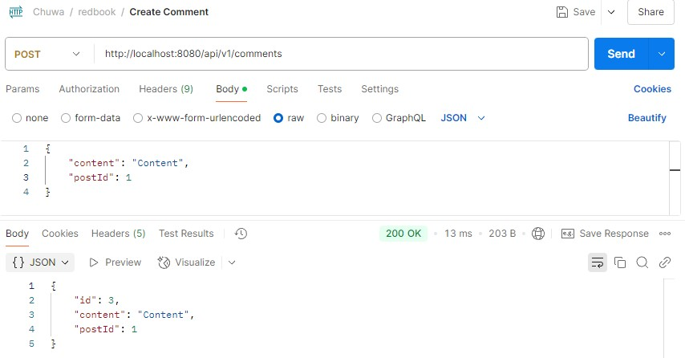
    2. Get All Comments: `GET` `/api/v1/comments`
    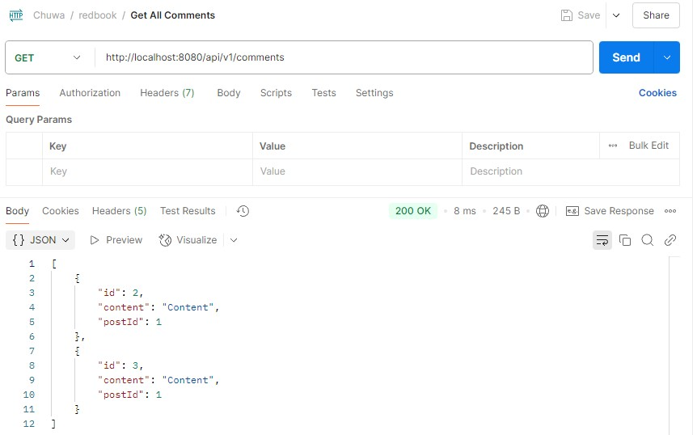
    3. Get Comment by Id: `GET` `/api/v1/comments/{id}`
    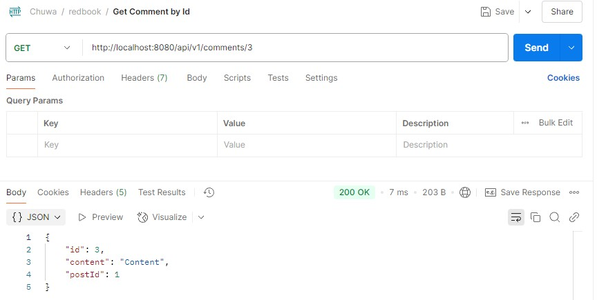
    4. Update Comment: `PUT` `/api/v1/comments/{id}`
    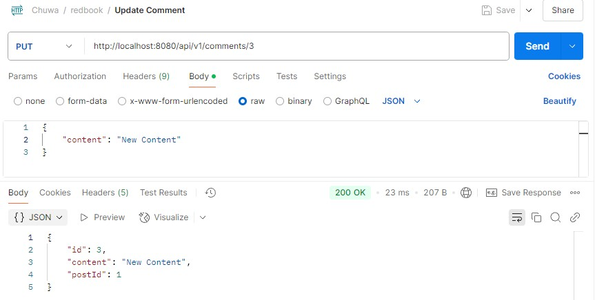
    4. Delete Comment: `DELETE` `/api/v1/comments/{id}`
    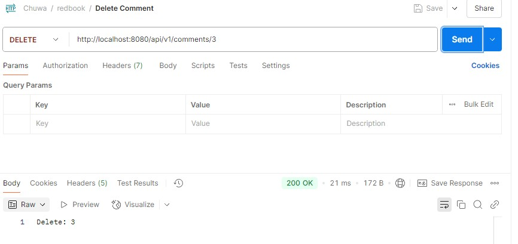
### 4. What is JPA? and what is Hibernate?
- **JPA (Java Persistence API)** is a **Java specification** (i.e., a set of interfaces and rules) for object-relational mapping (ORM) and managing data persistence in Java applications.
- **Hibernate** is a popular **implementation** of the JPA specification. It is a framework that actually implements all the behaviors JPA defines—and it even offers extra features beyond the JPA standard.
### 5. What is Hiraki? what is the benefits of connection pool?
- **Hikari** is a fast, lightweight, and reliable JDBC connection pool. It’s currently the default connection pool used by Spring Boot. A connection pool is a cache of database connections that your application can reuse instead of creating a new connection for every request.
- The benefits of connection pool:
    - **Faster response**: Reuses existing connections instead of creating new ones
    - **Saves resources**: Avoids frequent open/close operations on DB
    - **Improves performance**: Boosts throughput under high load
    - **Connection management**: Configures min/max pool size, idle time, timeouts, etc.
    - **Thread-safe**: Handles concurrent access safely
### 6. What is the `@OneToMany`, `@ManyToOne`, `@ManyToMany`? write some examples.
- These annotations are used in JPA/Hibernate to define relationships between entities.
- `@OneToMany` and `@ManyToOne` Example: One `Post` has many `Comment`s.
    Post.java:
    ```java
    @Entity
    public class Post {

        @Id
        @GeneratedValue(strategy = GenerationType.IDENTITY)
        private Long id;

        private String title;

        @OneToMany(mappedBy = "post", cascade = CascadeType.ALL)
        private List<Comment> comments = new ArrayList<>();
    }
    ```
- `@ManyToMany` Example: A `User` can have many `Role`s, and a `Role` can belong to many `User`s.
    User.java:
    ```java
    @Entity
    public class User {

        @Id
        @GeneratedValue(strategy = GenerationType.IDENTITY)
        private Long id;

        private String username;

        @ManyToMany
        @JoinTable(
            name = "user_roles",
            joinColumns = @JoinColumn(name = "user_id"),
            inverseJoinColumns = @JoinColumn(name = "role_id")
        )
        private Set<Role> roles = new HashSet<>();
    }
    ```
    Role.java:
    ```java
    @Entity
    public class Role {

        @Id
        @GeneratedValue(strategy = GenerationType.IDENTITY)
        private Long id;

        private String name;

        @ManyToMany(mappedBy = "roles")
        private Set<User> users = new HashSet<>();
    }
    ```
### 7. What is the `cascade = CascadeType.ALL, orphanRemoval = true`? and what are the other CascadeType and their features? In which situation we choose which one?
- `cascade` and `orphanRemoval` are powerful features in JPA that help manage related entities automatically — especially useful in parent-child relationships like Post and Comment.
- `orphanRemoval = true`: If a child is removed from the parent’s collection, and it is no longer referenced elsewhere, then it should be automatically deleted from the database.

| CascadeType | When to use it |
| --- | --- |
| CascadeType.PERSIST | When you want to automatically save child entities with parent |
| CascadeType.MERGE | When child updates should be merged during parent update |
| CascadeType.REMOVE | When deleting parent should also delete children |
| CascadeType.REFRESH | When you refresh parent, and want children to sync with DB |
| CascadeType.DETACH | When you detach parent from JPA context and want same for child |
| CascadeType.ALL | When you want all behaviors enabled |
### 8. What is the `fetch = FetchType.LAZY, fetch = FetchType.EAGER`? what is the difference? In which situation you choose which one?
- The `fetch` option controls how related entities are loaded from the database when the parent entity is fetched.
- The difference:
    - `FetchType.LAZY`: Fetch later (on demand, when accessed)
    - `FetchType.EAGER`: Fetch immediately (with the parent entity)
- When to use it:
    - For `@OneToMany` and `@ManyToMany` relationship, use `FetchType.LAZY`. The related entities are loaded only when you access them.
    - For `@ManyToOne` and `@OneToOne` relationship, use `FetchType.EAGER`. The related entity is loaded immediately when the parent is queried.
### 9. What is the rule of JPA naming convention? Shall we implement the method by ourselves? Could you list some examples?
- Basic structure: `[Action]By[Property][Operator][And/Or][OtherProperty][Operator]...`
- We don't need to implement the method by ourselves. Spring will auto-generate the method implementation at runtime.

| Method Name Keyword | SQL Equivalent | Example |
| --- | --- | --- |
| findBy | SELECT WHERE | findByUsername(String username) |
| findAllBy | SELECT * WHERE | findAllByAgeGreaterThan(int age) |
| countBy | COUNT WHERE | countByEmail(String email) |
| existsBy | EXISTS (boolean) | existsByUsername(String username) |
| deleteBy | DELETE WHERE | deleteByStatus(String status) |
| And, Or | Logical operators | findByNameAndAge(...) |
| Between | BETWEEN x AND y | findByAgeBetween(18, 30) |
| GreaterThan, LessThan | >, < | findByScoreGreaterThan(80) |
| Like, Containing | LIKE %...% | findByTitleContaining("Spring") |
| In, NotIn | IN (...) | findByIdIn(List<Long> ids) |
| OrderBy | ORDER BY | findByAgeGreaterThanOrderByAgeAsc() |
### 10. Try to use JPA advanced methods in your class project. In the repository layer, you need to use the naming convention to use the method provided by JPA.
CommentRepository:
```java
List<Comment> findByContentContainingIgnoreCase(String keyword);
```
CommentService:
```java
List<CommentDto> searchComments(String keyword);
```
CommentServiceImpl:
```java
@Override
public List<CommentDto> searchComments(String keyword) {
    List<Comment> comments = commentRepository.findByContentContainingIgnoreCase(keyword);
    return comments.stream().map(this::mapToDto).collect(Collectors.toList());
}
```
CommentController:
```java
@GetMapping("/search")
public ResponseEntity<List<CommentDto>> searchComments(@RequestParam String keyword) {
    return ResponseEntity.ok(commentService.searchComments(keyword));
}
```
Postman:  
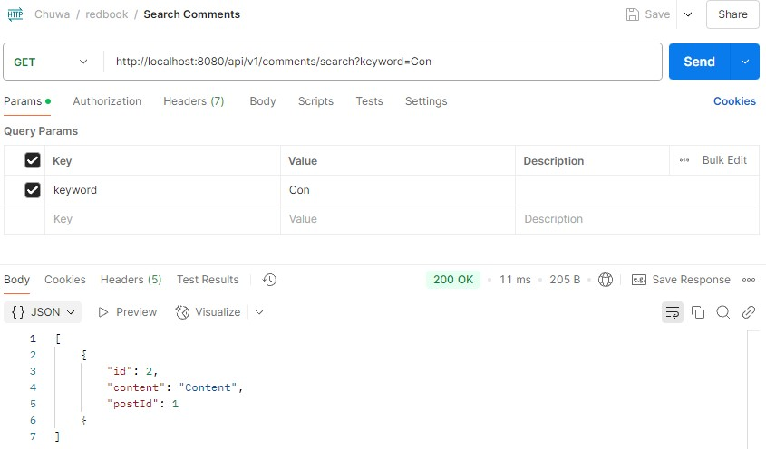
### 11. (Optional) Check out a new branch(https://github.com/TAIsRich/springboot-redbook/tree/hw02_01_jdbcTemplate) from branch 02_post_RUD, replace the dao layer using JdbcTemplate.
### 12. type the code, you need to checkout new branch from branch 02_post_RUD, name the new branch with https://github.com/TAIsRich/springboot-redbook/tree/hw05_01_slides_JPQL.
### 13. What is JPQL?
JPQL stands for Java Persistence Query Language. It is a query language used to write database queries against JPA entities, not directly on tables like in SQL.
```java
@Query("SELECT u FROM User u WHERE u.age > :age")
List<User> findUsersOlderThan(@Param("age") int age);
```
### 14. What is `@NamedQuery` and `@NamedQueries`?
- These are annotations in JPA used to define static, pre-defined JPQL queries, often directly inside the entity class.
- `@NamedQuery`: It defines a single named JPQL query.
    ```java
    @Entity
    @NamedQuery(
        name = "User.findByUsername",
        query = "SELECT u FROM User u WHERE u.username = :username"
    )
    public class User {
        @Id
        private Long id;
        private String username;
    }
    ```
- `@NamedQueries`: A container for multiple `@NamedQuery`s on the same entity.
    ```java
    @Entity
    @NamedQueries({
        @NamedQuery(
            name = "User.findByUsername",
            query = "SELECT u FROM User u WHERE u.username = :username"
        ),
        @NamedQuery(
            name = "User.findAllUsers",
            query = "SELECT u FROM User u"
        )
    })
    public class User {
        @Id
        private Long id;
        private String username;
    }
    ```
    ```java
    List<User> users = entityManager
        .createNamedQuery("User.findByUsername", User.class)
        .setParameter("username", "zeliang")
        .getResultList();
    ```
### 15. What is `@Query`? In which Interface we write the sql or JPQL?
`@Query` is a Spring Data JPA annotation used to write custom queries (either in JPQL or native SQL) directly inside a repository interface method.
```java
public interface UserRepository extends JpaRepository<User, Long> {
    
    @Query("SELECT u FROM User u WHERE u.username = :username")
    User findByUsername(@Param("username") String username);
}
```
### 16. What is HQL and Criteria Queries?
- HQL is very similar to JPQL, but it's specific to Hibernate. In practice, JPQL and HQL are almost the same, and you can use either when working with Hibernate + JPA.
    ```java
    String hql = "FROM User u WHERE u.age > :age";
    List<User> users = session.createQuery(hql, User.class)
                            .setParameter("age", 18)
                            .getResultList();
    ```
- Criteria API is a type-safe, programmatic way to build dynamic queries in JPA (instead of writing query strings manually).
    ```java
    CriteriaBuilder cb = entityManager.getCriteriaBuilder();
    CriteriaQuery<User> cq = cb.createQuery(User.class);
    Root<User> user = cq.from(User.class);

    cq.select(user).where(cb.greaterThan(user.get("age"), 18));

    List<User> result = entityManager.createQuery(cq).getResultList();
    ```
### 17. What is EnityManager?
The EntityManager is the main interface in JPA (Java Persistence API) that manages the persistence lifecycle of entities. Think of it as the bridge between your Java application and the database.
```java
User user = new User("zeliang", 25);

entityManager.getTransaction().begin();
entityManager.persist(user);  // Insert into User
entityManager.getTransaction().commit();
```
### 18. What is SessionFactory and Session?
- `SessionFactory` is a factory class in Hibernate that is responsible for creating `Session` objects. It's one of the core components of Hibernate's configuration and session management.
```java
Configuration configuration = new Configuration();
configuration.configure("hibernate.cfg.xml");
SessionFactory sessionFactory = configuration.buildSessionFactory();
```
- `Session` is the primary interface used by Hibernate to interact with the database. It represents a single unit of work in the Hibernate ORM framework and acts as a gateway to perform CRUD operations.
```java
Session session = sessionFactory.openSession();
Transaction transaction = session.beginTransaction();

User user = new User("zeliang", 25);
session.save(user);

transaction.commit();
session.close();
```
### 19. What is Transaction? how to manage your transaction?
- Transaction is a unit of work that is performed on the database. It ensures that a series of CRUD operations are executed in a consistent and reliable way.
- The basic workflow of a transaction involves:
    1. Start: Begin the transaction.
    2. Operations: Perform one or more database operations (e.g., saving, updating, deleting).
    3. Commit: If everything is successful, commit the transaction (making all changes permanent).
    4. Rollback: If there is an error, roll back the transaction to undo all changes.
### 20. What is hibernate Caching? Explain Hibernate caching mechanism in detail.
- Hibernate Caching refers to the ability of Hibernate to store data temporarily in memory (cache) to improve the performance of read-heavy operations.
- Hibernate's caching mechanism includes the First-Level Cache, Second-Level Cache, and Query Cache.
    - First-Level Cache (Session Cache): stores objects that are loaded or persisted within the session.
    - Second-Level Cache (Global Cache): stores entities, collections, and query results to avoid querying the database repeatedly.
    - Query Cache: If a query has been executed before and the underlying data hasn't changed, the result can be fetched from the cache instead of executing the query against the database again.
### 21. What is the difference between first-level cache and second-level cache?
| Feature | First-Level Cache | Second-Level Cache |
| --- | --- | --- |
| Scope | Per session (Session-level) | Shared across multiple sessions (SessionFactory-level) |
| Enabled By Default | Yes | No (must be configured explicitly) |
| Configuration Required | No | Yes (requires a cache provider like Ehcache, Redis) |
| Cache Location | Inside Hibernate Session | External provider or Hibernate-managed cache region |
| Lifecycle | Lives as long as the session is open | Lives until application shutdown or manual eviction |
| Caching Granularity | Individual entity instances loaded in one session | Entities, collections, and query results |
| Cache Invalidation | Automatically removed when session is closed | Needs manual or provider-managed invalidation |
| Usage | Prevents duplicate DB hits within one session | Prevents repeated DB hits across sessions |
| Best For | Short-term caching, unit of work pattern | Long-term caching of frequently accessed data |
### 22. How do you understand @Transactional? (https://github.com/TAIsRich/tutorial-transaction)
The `@Transactional` annotation in Spring is used to define the scope of a database transaction. When a method is annotated with `@Transactional`, Spring ensures that all the operations within that method either complete successfully as a unit or are rolled back in case of failure, preserving data integrity.